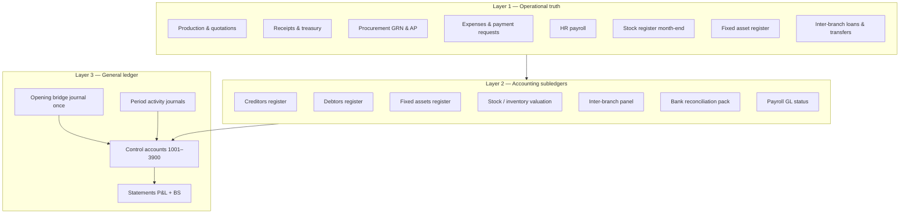
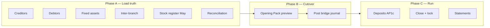

# Zarewa accounting system architecture (register-first)

**Status:** Design target for June 2026 go-live and beyond.  
**Principle:** ~95% of balance-sheet opening and ongoing GL control balances are **derived from operational modules**; the GL is a **posted summary**, not a data-entry form.

Cutover date: **`2026-06-01`** (`shared/lib/accountingCutover.js`).

---

## 1. Design principles

| # | Principle |
|---|-----------|
| 1 | **Single source of truth per balance type** — party-level detail lives in registers; GL holds control totals. |
| 2 | **No duplicate entry** — if a module already captures it, Opening must not ask for it again. |
| 3 | **Drill-down always** — every GL control line links back to register rows, assets, stock lines, or treasury accounts. |
| 4 | **Cutover is a workflow** — load subledgers → review Opening Pack → post one bridge journal → enable policy flags. |
| 5 | **Operational events post forward** — after cutover, receipts, GRNs, payroll, depreciation feed GL automatically; Opening is one-time. |
| 6 | **Branch + consolidated** — every rollup supports `branchScope` and company-wide views. |

---

## 2. Three-layer model



**Layer 1** = what staff already do in Operations, Cashier, Procurement, HR.  
**Layer 2** = Accounting Desk registers and month-end packs (read + limited legacy/manual lines).  
**Layer 3** = GL, statements, period lock — **posted**, auditable, period-scoped.

---

## 3. Source-of-truth matrix (~95% system-sourced)

Each GL control account has exactly one **primary feeder**. Manual entry is the exception.

| GL code | Name | Primary source (Layer 2) | Layer 1 inputs | Cutover method |
|---------|------|--------------------------|----------------|----------------|
| **1001+** | Cash per bank | Reconciliation pack + treasury accounts | Confirmed receipts, movements | Sum treasury balance per account at 31 May / 1 Jun after finance sign-off |
| **1200** | Trade receivable | **Creditors** → customer receivables + legacy inherited | Completed production, ledger | Legacy lines for pre-system AR; live rows from quotations post-cutover |
| **1300** | Raw materials inventory | **Stock register** closing (May) after procurement costing | Coil lots, GRN unit cost | `captureStockRegisterClosing` + costed register → inventory valuation rollup |
| **1398** | Accumulated depreciation | **Fixed assets** register | Asset cost & life | Opening acc dep optional; monthly runs from register |
| **1400** | Supplier prepayments | **Creditors** → supplier prepayments | Paid before GRN | Live + legacy inherited lines |
| **1500–1504** | PPE by category | **Fixed assets** register | Capex expenses, manual add | Sum `cost_ngn` by category/branch; land → 1501, no dep |
| **1800** | Due from branch | **Creditors** → inter-branch receivable | Inter-branch loans | `interBranchLoanBalances` + legacy |
| **2000** | Trade payables | **Debtors** → supplier payables | PO/AP sync on GRN | Legacy lines; enable `AP_RECEIVED_BASIS` post-cutover |
| **2100** | GRNI | AP2 GL alignment / inventory valuation | GRN not yet paid | Diagnostic tie-out; optional single opening line if immaterial |
| **2150** | Bank suspense | **Debtors** → unallocated / bank suspense | Unmatched deposits | Clear before lock; opening from register only |
| **2200–2400** | Payroll liabilities | **Payroll GL status** | Locked/unpaid runs | Accrual from last locked run if unpaid at cutover |
| **2500** | Customer deposits | **Debtors** → deposits + pre-production | Receipts pre-production | Ledger ADVANCE_IN + legacy lines |
| **2800** | Due to branch | **Debtors** → inter-branch payable | Inter-branch loans | Mirror of 1800 |
| **3100** | Owner's capital | **Manual (5%)** | Last audited accounts | HoA enters once |
| **3900** | Retained earnings | **Opening Pack plug** | — | Auto-computed balancing entry after all rollups |

### Intentionally not in Opening form

Do **not** type these on the Opening tab:

- 1200, 1400, 2000, 2500, 2150 (registers)
- 1300 (stock register)
- 1500–1504 (fixed assets)
- 1800, 2800 (inter-branch)
- Per-bank cash (treasury / reconciliation)

---

## 4. Opening Pack (new core service)

Replace the manual Opening journal UI as the **primary cutover path**.

### 4.1 API (proposed)

```
GET  /api/finance/opening-pack?asAt=2026-05-31&branchScope=ALL
POST /api/finance/opening-pack/post   (finance.post, idempotent)
GET  /api/finance/opening-pack/status
```

### 4.2 Response shape (conceptual)

```json
{
  "ok": true,
  "asAtISO": "2026-05-31",
  "entryDateISO": "2026-06-01",
  "readinessScore": 92,
  "sources": [
    {
      "id": "creditors_ar",
      "module": "creditors_register",
      "label": "Customer trade receivables",
      "glAccountCode": "1200",
      "side": "debit",
      "amountNgn": 12500000,
      "rowCount": 34,
      "drillDownPath": "/accounting?tab=creditors&section=customer_receivables",
      "status": "ok"
    }
  ],
  "proposedJournal": {
    "lines": [ "... balanced ..." ],
    "plugLine": { "accountCode": "3900", "side": "credit", "amountNgn": "..." }
  },
  "blockers": [],
  "warnings": ["May stock register BR-YL not procurement-costed"]
}
```

### 4.3 Builder modules (`server/accountingOpeningPackOps.js`)

| Builder function | Reads from |
|------------------|------------|
| `rollupCreditorsForOpening(db, asAt, scope)` | `buildCreditorsRegister` sections → 1200, 1400, 1800 |
| `rollupDebtorsForOpening(db, asAt, scope)` | `buildDebtorsRegister` → 2000, 2500, 2150, 2800 |
| `rollupFixedAssetsForOpening(db, asAt, scope)` | `listFixedAssets` → 1500–1504, 1398 |
| `rollupInventoryFromStockRegister(db, periodKey, scope)` | `stock_register_periods` + coil snapshots → 1300 |
| `rollupTreasuryCashForOpening(db, asAt, scope)` | Treasury balances + reconciliation confirmed → 1001+ |
| `rollupPayrollLiabilitiesForOpening(db, periodKey, scope)` | `payrollGlStatusForRun` on open runs → 2200–2400 |
| `rollupGrniDiagnostic(db, asAt, scope)` | `buildApInventoryGlAlignment` → 2100 (warn if mismatch) |
| `computeOpeningPlug(proposedLines)` | → 3900 (and validate 3100 if supplied) |

Post uses existing `postOpeningBalanceJournal` with `sourceId = OPENING_BALANCE_2026-06` and `sourceKind = OPENING_BALANCE`.

---

## 5. Accounting Desk UX (restructured)



### Tab roles (after redesign)

| Tab | Role |
|-----|------|
| **Overview** | Cutover checklist: which sources are green/red; links to blockers |
| **Creditors / Debtors** | **Data entry for inherited balances** + live subledger |
| **Fixed assets** | **Data entry for all PPE** at cutover |
| **Inter-branch** | **Data entry for branch balances** |
| **Opening** | **Opening Pack only** — preview, drill-down, post (no free-form 1200/2000) |
| **Reconciliation** | Confirm cash before Opening Pack includes 1001+ |
| **Close** | Verify Opening Pack posted + registers tie to GL + lock June |
| **Deposits / Costing / GL / Statements** | Unchanged operational/policy views |

Stock register stays under **Operations / Reports** but Opening Pack **pulls** May close automatically.

---

## 6. Ongoing GL (post-cutover) — event map

Opening Pack is one-time. After `2026-06-01`, Layer 1 events post to GL:

| Event | GL hook | Policy |
|-------|---------|--------|
| Customer receipt | Receipt GL (AP1c) | 2500 pre-prod / 1200 post-prod |
| Production complete | Production recognition | Release deposits, revenue |
| Coil GRN | `postCoilGrnGl` | Dr 1300 / Cr 2100 |
| Supplier payment | `tryPostSupplierPaymentGlTx` | Dr 2000 or 1400 / Cr 100x |
| Expense paid | `tryPostExpensePaymentGlTx` | Dr expense / Cr 100x |
| Payroll locked | `tryPostPayrollAccrualGlTx` | Dr 6000 / Cr 2200–2400 |
| Payroll paid | Net payment + remittance GL | Clear 2200–2400 |
| Depreciation month | `postDepreciationRun` | Dr 6100 / Cr 1398 (land excluded) |
| Fixed asset add | Optional capex from expense | Dr 150x / Cr 100x |

Registers **refresh from live data**; no second posting to Opening.

---

## 7. Tie-out & control

### 7.1 Register ↔ GL reconciliation (daily / month-end)

```
GET /api/finance/control-tie-out?period=2026-06
```

| Check | Rule |
|-------|------|
| Creditors AR total | Σ customer receivables ≈ GL 1200 balance |
| Debtors AP total | Σ supplier payables ≈ GL 2000 |
| Debtors deposits | Σ deposits ≈ GL 2500 |
| Fixed assets cost | Σ asset cost ≈ GL 150x (by category map) |
| Inventory | Stock register value ≈ GL 1300 |
| Cash | Treasury ≈ Σ 100x |
| Inter-branch | 1800 / 2800 ≈ loan balances |

Variance → **trial exception** + Close checklist blocker.

### 7.2 Period lock

June lock blocked until:

1. Opening Pack posted  
2. Control tie-out warnings below threshold (HoA configurable)  
3. May stock register costed and captured for all branches  
4. AP1c dry-run clear (if enabling receipt GL)

---

## 8. What stays manual (~5%)

| Item | Who | Why |
|------|-----|-----|
| Owner's capital (3100) | HoA | Not in operational modules |
| Retained earnings plug (3900) | System | Balancing entry after rollups |
| Legacy inherited register lines | HoA | Pre-system party balances without live transactions |
| Immaterial GRNI adjustment | HoA | Only if AP2 diagnostic shows small gap |
| Policy flag enablement | DevOps / HoA | Env flags after sign-off |

---

## 9. Implementation roadmap

| Phase | Deliverable | Depends on |
|-------|-------------|------------|
| **D1** | This doc + source matrix in `shared/lib/accountingSourceOfTruth.js` | — |
| **D2** | `accountingOpeningPackOps.js` read-only builders | Registers, stock, assets |
| **D3** | `GET /api/finance/opening-pack` + Overview cutover cards | D2 |
| **D4** | Opening tab → Opening Pack UI (replace quick-add lines) | D3 |
| **D5** | `POST` bridge journal + idempotency | Existing `postOpeningBalanceJournal` |
| **D6** | Control tie-out API + Close checklist integration | D5 |
| **D7** | Stock register → 1300 builder wired to May `2026-05` | Procurement costing complete |

---

## 10. Success criteria

| Metric | Target |
|--------|--------|
| Opening journal lines typed manually | ≤ 2 (3100 + review of 3900 plug) |
| GL control accounts with register drill-down | 100% |
| Cutover balances sourced from modules | ≥ 95% by amount |
| Opening Pack readiness score before post | ≥ 90% |
| Register ↔ GL variance at first month-end | ≤ 1% or HoA documented |

---

## 11. Relation to existing docs

| Doc | Role |
|-----|------|
| `ACCOUNTING_POLICIES.md` | Basis matrix (cash vs accrual labels) |
| `ACCOUNTING_POLICY_V1.md` + `AP1C` | Customer revenue & deposit GL (post-cutover) |
| `ACCOUNTING_POLICY_AP2.md` | Supplier AP on received basis |
| `ACCOUNTING_POLICY_AP3_COSTING.md` | Cost per metre (management, not opening) |
| **`ACCOUNTING_SYSTEM_ARCHITECTURE.md`** | **Register-first structure (this doc)** |

---

*Approved architecture should be referenced in cutover runbooks and Accounting Desk training.*
