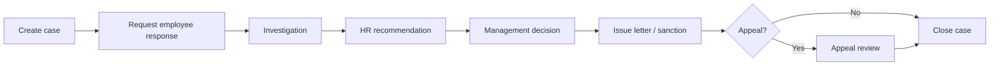

# HR Module — Phase 7 Completion Summary

**Scope:** Professional discipline case management, complete company letter system, policy acknowledgement gates, audit/compliance, reports, and UI/UX quality.

**Status:** Implemented (deploy after `npm run db:migrate`).

---

## Summary table

| Module | Feature | API / UI | Workflow | Status |
|--------|---------|----------|----------|--------|
| **Discipline cases** | Case initiation with auto case number | `POST /api/hr/discipline-cases` | Open case → assign type/severity | **Live** |
| | Case list + dashboard counts | `GET /api/hr/discipline-cases`, `/dashboard` | Filter by status/type/severity | **Live** |
| | Investigation + evidence | `POST .../evidence`, `PATCH` workflow | Upload evidence, assign officer | **Live** |
| | Employee response | `PATCH` with `employeeResponse` | Request → record response | **Live** |
| | HR recommendation | `PATCH` with `hrRecommendation` | HR review → mgmt queue | **Live** |
| | Management decision + sanction | `PATCH` with `managementDecision` | GM/MD decision → action issued | **Live** |
| | Witnesses | `POST .../witnesses` | Add witness statements | **Live** |
| | Appeals | `POST .../appeals` | File appeal → appealed status | **Live** |
| | Closure + audit | `PATCH` action `close`, `GET .../audit` | Close case, timeline + audit | **Live** |
| | Payroll blocks | `payrollBlockFlags` on case | Block promotion/salary change | **Live** (config per case) |
| | Notifications | `createHrNotification` on mutations | Bell alerts to stakeholders | **Live** |
| | Legacy discipline log | `GET/POST /api/hr/disciplinary-events` | Flat event register (Phase 5) | **Live** (parallel) |
| **Letters** | Full template catalog (A–I) | `buildHrLetterContent` + `generateHrLetterFromTemplate` | Select type → generate PDF | **Live** |
| | Discipline letters | query, warning, suspension, termination, hearing, investigation | Linked via `source_record_kind/id` | **Live** |
| | Transfer / leave / loan letters | Existing Phase 2–5 routes | Source-linked generation | **Live** |
| | Case-linked letters | `POST .../discipline-cases/:id/letters/:type` | Generate from case context | **Live** |
| | Letter hub UI | `/hr/documents?tab=letters` | Grouped categories, validation, preview | **Live** |
| | Draft → approve workflow | — | Full approval chain before PDF | **Deferred** |
| **Policy ack** | Expanded registry (9 policies) | `GET /api/hr/policy-requirements` | Handbook, IT, EEO, conduct, etc. | **Live** |
| | Leave approval gate | `PATCH .../hr-review` | Approver must ack policies | **Live** (needs user ack) |
| | Payroll recompute gate | `POST .../recompute` | Preparer must ack policies | **Live** |
| | PDF copy / witness / expiry | — | Re-ack schedule | **Deferred** |
| **Audit** | Global + per-case audit | `GET /api/hr/audit-events`, `GET .../cases/:id/audit` | All discipline/letter/policy actions | **Live** |
| **Reports** | Open / history / pending cases | Reports hub export CSV/XLSX/PDF | Deep-link to case detail | **Live** |
| | Letter issuance report | `letter-issuance-report` | Filter by date/branch | **Live** |
| | Legacy disciplinary events | `disciplinary-report` | JSON profile events | **Live** |
| **UI/UX** | Case management panel | `/hr/discipline-exit?tab=cases` | Modal detail, mobile cards | **Live** |
| | Teal/amber styling | HrDisciplineCasesPanel | Status pills, grouped forms | **Live** |
| **Permissions** | HR / GM / MD gates | `requireHrAny` on routes | Sensitive fields via redaction | **Live** |
| **Integrations** | Exit / transfer / payroll | Deep-links + block flags | Cross-module navigation | **Partial** |
| **Tests** | Backend unit tests | `hrDisciplineCases.test.js` | Constants, policy gates, reports | **Live** |
| | Frontend build | `npm run build` | Modal forms, deep-links | **Verify on CI** |
| | E2E discipline flow | `e2e/hr-smoke.spec.js` | Full workflow + notifications | **Needs MySQL** |

---

## Workflow (discipline case)

---

## Files added / changed

### Backend (new)

- `server/hrDisciplineCasesOps.js` — case CRUD, workflow, letters, payroll blocks
- `server/hrDisciplineCases.test.js`
- `docs/HR/PHASE-7-COMPLETION.md`

### Backend (modified)

- `server/migrate.js` — `migrateHrPhase7DisciplineLetters2026`
- `server/hrApi.js` — discipline case routes, policy gates
- `server/hrLetterTemplates.js` — discipline + compliance letter bodies
- `server/hrPolicy.js` — expanded registry + gated actions
- `server/hrReportsHub.js` — case + letter reports

### Frontend (new)

- `src/lib/hrDisciplineCases.js`
- `src/components/hr/HrDisciplineCasesPanel.jsx`

### Frontend (modified)

- `src/pages/hr/HrDisciplineExitHub.jsx` — Cases tab (default)
- `src/pages/hr/HrLetters.jsx` — expanded letter catalog
- `src/lib/hrReportDeepLinks.js`

---

## Deploy checklist

1. `npm run db:migrate` (backend) — Phase 7 columns + evidence/witness/appeal tables
2. Restart API — verify `/api/hr/health` ok
3. HR users acknowledge new policies (`/hr/my-profile/policies`)
4. Smoke: create case → add evidence → generate query letter → export report

---

## Deferred / configuration

| Item | Notes |
|------|--------|
| Letter draft → approve → issue | Letters issue immediately; **Phase 8** — see [PHASE-8-PLAN.md](./PHASE-8-PLAN.md) §B |
| Policy PDF archive / witness | Ack stored in DB; **Phase 8** §8 partial |
| Policy re-ack expiry | Version bumps require manual re-sign; Phase 8+ |
| Repeat offenders analytics | Phase 8+ / BI |
| Bulk old-staff Excel import | **Phase 8** §A — basic fields only |
| Letter reference reset | **Phase 8** §C |
| Staff ID reservation | **Phase 8** §D — separate from letter refs |

---

## Phase 7+ / Phase 8 placeholders

- Discipline analytics dashboard (trends, repeat offenders, branch heatmap) — Phase 8+
- Letter versioning and template admin UI — Phase 8+
- Automated escalation when response overdue — Phase 8 §10
- Employee self-service case response portal — **Phase 8 §9**

**Revised Phase 8 scope (operational go-live):** [PHASE-8-PLAN.md](./PHASE-8-PLAN.md) — basic bulk import, letter approval lock, reference numbering, staff ID reservation.
