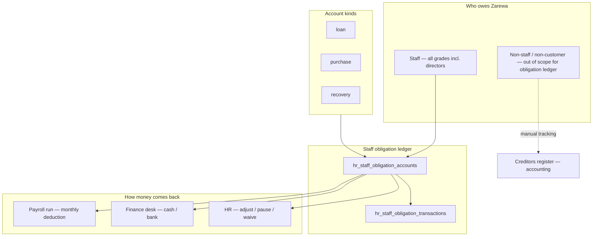
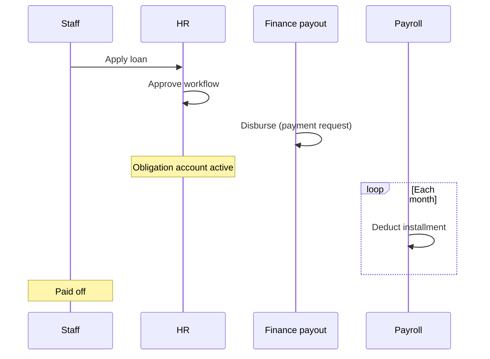
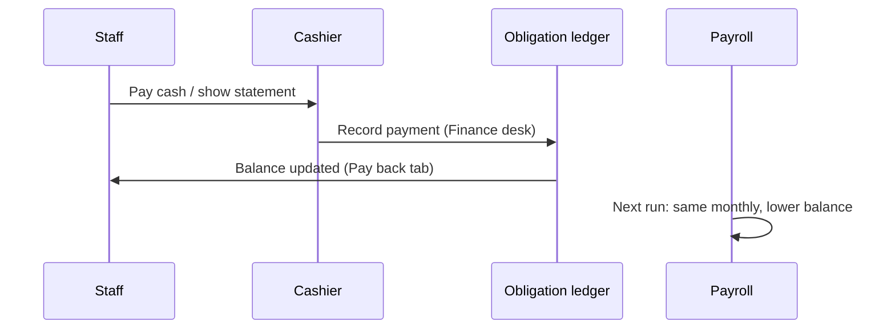
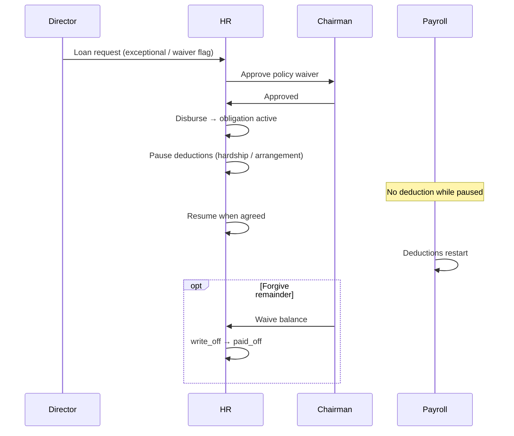

# Staff obligations, loans & repayment — unified architecture

**Status:** Living architecture (consolidates payback UX, Finance desk, HR controls, Chairman waiver)  
**Parent:** [HR-IMPLEMENTATION-PLAN.md](./HR-IMPLEMENTATION-PLAN.md) · [ZAREWA-COMPENSATION-AND-EXCEPTIONS.md](./ZAREWA-COMPENSATION-AND-EXCEPTIONS.md)  
**Last updated:** 2026-06-20

---

## 1. Purpose

Zarewa tracks money staff owe the company (loans, purchase credit, discipline recovery) in one **staff obligation ledger**. Repayment is primarily **payroll deduction**; **Finance** records cash/bank early payments; **HR** maintains schedules and pauses; **Chairman** waives policy exceptions or forgives balances when required.

**Design rule:** One system for all staff—including directors. Special treatment = **permissions + two controls** (pause, waive), not a separate product.

---

## 2. Principles

| # | Principle |
|---|-----------|
| 1 | **One ledger** — `hr_staff_obligation_accounts` + transactions for staff-linked debt |
| 2 | **Payroll default** — fixed monthly installment until balance is zero |
| 3 | **Finance collects** — cash/bank at branch desk posts to the same ledger |
| 4 | **HR owns terms** — change monthly amount, pause, close; audit everything |
| 5 | **Chairman for exceptions** — policy bypass on approval; balance waiver (write-off) |
| 6 | **Keep bulk pay simple** — lump sum reduces balance; monthly stays same unless HR adjusts |
| 7 | **Non-staff debt** — creditors register (manual) until a dedicated external flow is justified |

---

## 3. System context



---

## 4. Obligation kinds (existing)

| Kind | Source | Approval | Payroll? | Cash at Finance? |
|------|--------|----------|----------|------------------|
| **loan** | HR loan request → finance disbursement | HR + GM workflow | Yes | Yes |
| **purchase** | Sales quotation → staff purchase credit | MD | Yes | Yes |
| **recovery** | Discipline case → recovery schedule | HR sets amount | Optional | **Cashier only** (treasury + obligation) |
| **legacy** | HR register pre-ERP loan | HR | Yes | Yes |

**Recovery** uses a different cashier flow (treasury in + schedule). Loans and purchase credit share the same early-repay path.

---

## 5. Repayment mechanics

### 5.1 Default schedule (set at approval)

- **Staff loan:** `amountNgn`, `repaymentMonths`, `deductionPerMonthNgn`
- **Purchase credit:** `termMonths`, `installmentNgn` (ceil balance ÷ months)
- Stored on obligation: `installment_ngn`, `term_months`, `principal_outstanding_ngn`

### 5.2 Payroll deduction (automatic)

On each locked/paid payroll run, for each active account where `deductions_active = 1`:

```
deduction = min(installment_ngn, principal_outstanding_ngn)
```

- Posts `payroll_deduction` transaction
- Increments `months_paid`
- Stops when `principal_outstanding_ngn = 0` → status `paid_off`, `deductions_active = 0`

**Staff action required:** none each month.

### 5.3 Early / bulk payment (cash or bank)

Finance or HR posts `cash_repayment`:

| Effect | Behaviour |
|--------|-----------|
| Outstanding | Reduced by payment amount |
| Monthly installment | **Unchanged** (default) |
| Months remaining | **Fewer** — same ₦/month until cleared |
| Payroll | Continues at same rate until balance zero |

**Policy copy (staff-facing):** *Early payment reduces what you owe. Your monthly payroll deduction stays the same unless HR reschedules it.*

Optional later: HR chooses “recalculate monthly” after large payment — **not required for v1**.

### 5.4 Partial payment

Same as bulk: balance down, installment unchanged, next payroll deducts `min(installment, remaining)`.

---

## 6. Special controls (simple — same ledger)

Directors and exceptional cases use the **same account** with these levers:

### 6.1 Pause repayment

**Goal:** Stop payroll deductions temporarily; balance unchanged.

| Field | Implementation |
|-------|----------------|
| `deductions_active` | `0` while paused |
| `pause_until_iso` | Optional resume date (new column or `note` + JSON on account) |
| `pause_reason` | Required text |
| `paused_by_user_id` | Audit |

**UI:** HR → Loans → Record repayments → account detail → **Pause deductions** / **Resume**

**Staff sees:** Pay back tab — banner “Repayment paused until … — contact HR”

**Backend today:** `deductions_active` exists; `OBLIGATION_STATUS.SUSPENDED` reserved — prefer pause via flag + audit before new status logic.

### 6.2 Adjust schedule (HR)

**Goal:** Change monthly amount or term after disbursement.

| Action | API (exists) | UI (planned) |
|--------|--------------|--------------|
| Change monthly ₦ | `PATCH /api/hr/loans/:requestId` → `deductionPerMonthNgn` | HR maintenance form |
| Change term months | same → `repaymentMonths` | same |
| Close / pay off administratively | same → `closeLoan: true` → write-off remaining | same |

Syncs to linked `hr_staff_obligation_accounts` when `hr_request_id` present.

### 6.3 Chairman waiver

Two narrow uses — **not** a separate loan system:

| Waiver type | When | Who | Effect |
|-------------|------|-----|--------|
| **Policy waiver** | Loan exceeds service years / max amount / etc. | Chairman (or MD fallback) approves exceptional request | Loan proceeds as normal staff loan |
| **Balance waiver** | Forgive remaining debt | Chairman only (`chairman` / `*` + memo) | `write_off` tx → `paid_off`, deductions off |

**Routing:**

- HR ticks **Needs Chairman waiver** (or auto when `exceptionalLoan`) on application
- Executive queue: existing **Exceptional loans** + Chairman approve step
- Balance waiver: button on obligation detail — **Waive remaining balance** (permission-gated)

**Directors:** same loan form; HR flags waiver when board policy requires it. Compensation `director_emolument` stays on **pay profile**, not loans.

---

## 7. User journeys & UI map

### 7.1 Staff — My Profile → Loans & credit

| Tab | Purpose | Status |
|-----|---------|--------|
| **Pay back** | Balances, how to pay, pause banner, statement PDF | ✅ Shipped |
| **Staff loans** | Apply, track requests, eligibility | ✅ |
| **Purchase credit** | Quotations, request credit | ✅ |

**Pay back content:**

1. `StaffObligationPayGuide` — payroll default + Finance desk early pay
2. Balance cards per loan/purchase credit
3. Discipline recovery → separate cashier guide

### 7.2 Finance — Accounts → Desk

| Queue | Purpose | Status |
|-------|---------|--------|
| Staff recoveries | Discipline — treasury in | ✅ |
| **Staff loans & purchase credit** | Early repay — obligation ledger | ✅ |
| Receipts / payouts / etc. | Existing desk work | ✅ |

Modal: record full/partial payment, date, bank ref, print receipt PDF.

### 7.3 HR — Loans hub

| Section | Purpose | Status |
|---------|---------|--------|
| Loan requests | Approval pipeline | ✅ |
| **Record repayments** | List accounts, post cash/bank, statements | ✅ |
| Purchase credit | MD queue, staff customer link | ✅ |
| **Maintain schedule** | Pause, adjust monthly, close, waive | 🔲 Planned |
| Register legacy loan | Pre-ERP migration | ✅ |

### 7.4 Chairman / executive

| Surface | Purpose | Status |
|---------|---------|--------|
| Executive HR → Exceptional loans | Above-policy staff loans | ✅ Partial |
| Chairman approve on waiver-flagged loans | Policy waiver | 🔲 Planned |
| Waive balance on obligation | Forgive remainder | 🔲 Planned |

---

## 8. Data model (existing + minimal extensions)

### 8.1 Core tables (existing)

```
hr_staff_obligation_accounts
  id, user_id, branch_id, kind, origin, title
  principal_original_ngn, principal_outstanding_ngn
  installment_ngn, term_months, months_paid
  status, deductions_active
  hr_request_id, quotation_ref, recovery_schedule_id, ...
  note, created_at_iso, updated_at_iso

hr_staff_obligation_transactions
  id, account_id, type, amount_ngn
  principal_before_ngn, principal_after_ngn
  effective_at_iso, payment_reference, note, ...
```

### 8.2 Planned extensions (small)

| Addition | Purpose |
|----------|---------|
| `pause_until_iso` on account (nullable) | Auto-resume hint |
| `pause_reason`, `paused_at_iso`, `paused_by_user_id` | Audit |
| `chairman_waiver_at_iso`, `chairman_waiver_by_user_id` on `hr_requests.payload_json` | Policy waiver trail |
| Optional `needs_chairman_waiver` boolean on loan payload | Routing |

No second ledger for directors.

### 8.3 Non-staff / non-customer (out of scope for v1)

Use **Accounting → Creditors register** (`accounting_register_lines`, category `legacy` or custom). Manual collection; no payroll. Revisit dedicated **external loan** entity only if volume justifies it.

---

## 9. API surface

### 9.1 Existing (staff self-service & HR/Finance)

| Method | Path | Who |
|--------|------|-----|
| GET | `/api/hr/staff/:userId/money-summary` | Self / HR |
| GET | `/api/hr/staff/:userId/loan-schedule` | Self / HR |
| GET | `/api/hr/obligation-accounts` | HR / Finance (read) |
| GET | `/api/hr/obligation-accounts/:id` | HR / Finance / self (statement) |
| POST | `/api/hr/obligation-accounts/:id/repayments` | HR / Finance |
| GET | `/api/finance/staff-obligations-due` | Finance desk bootstrap |
| POST | `/api/finance/staff-obligations/:id/receive` | Finance desk |
| PATCH | `/api/hr/loans/:requestId` | HR maintain (`hr.loan_maintain`) |
| POST | `/api/hr/obligation-accounts/migrate` | Legacy loan register |

### 9.2 Planned

| Method | Path | Purpose |
|--------|------|---------|
| PATCH | `/api/hr/obligation-accounts/:id/pause` | Pause / resume deductions |
| POST | `/api/hr/obligation-accounts/:id/chairman-waive` | Write off remainder (Chairman) |
| PATCH | `/api/hr/requests/:id/chairman-approve` | Policy waiver on exceptional loan |

---

## 10. Permissions

| Permission | Role / use |
|------------|------------|
| Self | View own money summary, Pay back, statement PDF |
| `hr.loans.manage`, `hr.staff.manage` | Full HR obligation panel, legacy register |
| `hr.loan_maintain` | Adjust schedule, pause (planned UI) |
| `finance.post`, `finance.pay`, `cashier.desk.view` | Finance desk record repayment |
| `hr.exceptional_loan.approve` | GM / exec exceptional queue |
| `*` or `chairman` role | Chairman balance waiver (planned) |

**Recording repayments:** `actorMayRecordStaffRepayments` — HR + Finance + cashier.

---

## 11. End-to-end flows

### 11.1 Normal staff loan



### 11.2 Early payment at branch



### 11.3 Director with pause + Chairman waiver



---

## 12. Rollout phases (consolidated)

### Phase A — Done ✅

- Staff obligation ledger (loan, purchase, recovery)
- Payroll deduction integration
- **Pay back** tab + pay guide (staff)
- **Finance desk** queue for loans/purchase credit
- **HR Record repayments** panel
- Finance read/post permissions aligned

### Phase B — HR controls (next, ~1 sprint)

| Item | Deliverable |
|------|-------------|
| B1 | UI: **Pause / Resume** deductions on obligation account |
| B2 | UI: **Adjust monthly** + **Close loan** (wire `PATCH /api/hr/loans/:requestId`) |
| B3 | Staff Pay back: show **Paused until …** banner |
| B4 | Policy copy: bulk pay = finish early, same monthly |

### Phase C — Chairman waiver (~0.5 sprint)

| Item | Deliverable |
|------|-------------|
| C1 | **Needs Chairman waiver** flag on loan application |
| C2 | Chairman approve step on exceptional / waiver queue |
| C3 | **Waive remaining balance** (Chairman) → `write_off` + audit |
| C4 | Statement PDF notes waiver / write-off |

### Phase D — Optional later

| Item | When |
|------|------|
| Recalculate monthly after lump sum (HR choice) | If requested often |
| Auto-resume on `pause_until_iso` | After pause is live |
| External non-staff loan entity + Chairman workflow | If creditors register insufficient |
| Treasury line on staff loan cash repay (match recovery) | If finance needs bank reconciliation on staff loan receipts |

---

## 13. Policy defaults (recommended)

| Scenario | Default |
|----------|---------|
| Standard staff loan | Payroll monthly; max term per HR policy |
| Purchase credit | MD approve; payroll monthly |
| Early / bulk pay | Balance ↓; **same monthly**; finish sooner |
| Director loan | Same system; flag **Chairman waiver** when board policy says so |
| Hardship / arrangement | HR **pause** with reason + optional end date |
| Forgive debt | Chairman **waive balance** only, with memo |
| Non-staff debtor | Creditors register; Finance manual; no payroll |

---

## 14. Related code & docs

| Area | Location |
|------|----------|
| Ledger ops | `server/staffObligationOps.js` |
| Purchase credit | `server/staffPurchaseCreditOps.js` |
| Recovery cashier | `server/staffRecoveryCashierOps.js` |
| Loan maintenance | `server/hrOps.js` → `patchHrLoanMaintenance` |
| Staff Pay back UI | `src/pages/hr/MyLoans.jsx`, `StaffObligationPayGuide.jsx` |
| Finance desk UI | `StaffObligationRepaymentCashierPanel.jsx`, `Account.jsx` |
| HR repayments UI | `HrObligationAccountsPanel.jsx` |
| Compensation (not loans) | [ZAREWA-COMPENSATION-AND-EXCEPTIONS.md](./ZAREWA-COMPENSATION-AND-EXCEPTIONS.md) |
| Creditors register | `server/accountingSubledgerOps.js` |

---

## 15. Decision log

| Date | Decision |
|------|----------|
| 2026-06-20 | One ledger for all staff; directors not a separate product |
| 2026-06-20 | Bulk pay does not auto-recalculate monthly (HR adjusts if needed) |
| 2026-06-20 | Finance desk + HR both record cash repayments |
| 2026-06-20 | Pause + Chairman waive are the primary “special treatment” levers |
| 2026-06-20 | Non-staff debt stays on creditors register until proven otherwise |

---

*Document owner: HR + Finance product. Update when Phase B/C ship.*
