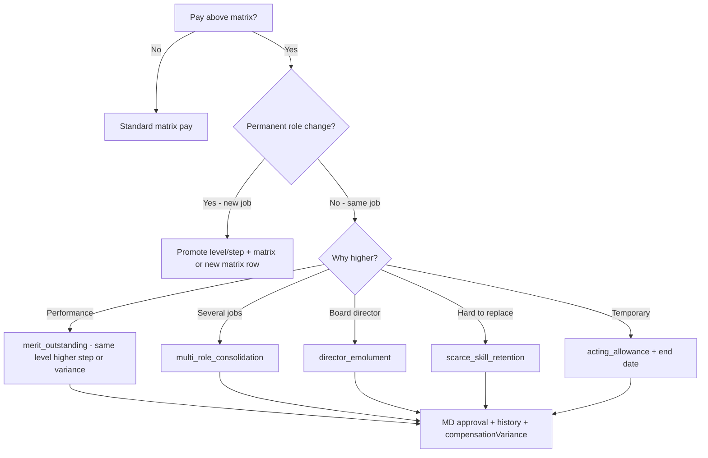

# Zarewa — Compensation, Matrix Automation & Pay Exceptions

**Status:** Policy reference (aligns with `hr_staff_profiles`, `hr_salary_matrix`, `hr_salary_history`)  
**Parent:** [ZAREWA-ORG-STRUCTURE-AND-TITLES.md](./ZAREWA-ORG-STRUCTURE-AND-TITLES.md)

---

## 1. Purpose

Zarewa uses a **fixed salary matrix** by payroll group, level, and step. Most staff should be paid automatically from that matrix.

This document explains:

- How automation should work
- What to do when pay is **higher than the matrix** (outstanding staff, retention, multi-role, directors)
- How to treat **one person with several hats** without breaking the grade ladder

---

## 2. Two layers of pay (keep both)

| Layer | What it is | Used for |
|-------|------------|----------|
| **Structural rank** | `salary_level` + `salary_step` + `payroll_group` | HR ladder, promotions, leave bands, reporting |
| **Standard matrix pay** | Lookup from `hr_salary_matrix` | Default base + housing + transport for level/step |
| **Pay addition** | `profile_extra_json.compensation.payAdditionNgn` | Manual top-up above matrix (multi-role, director, retention) |
| **Actual compensation** | Matrix + addition → stored on profile columns | **Payroll runs** (source of truth) |

**Formula:** `actual monthly pay = matrix total + pay addition`

### Payroll group matrix scales

All groups use the same level/step ladder; amounts differ by payroll group multiplier on the branch baseline:

| Payroll group | Scale | Use |
|---------------|-------|-----|
| `branch_ops` | 100% | Factory and branch staff |
| `hq_admin` | 100% | HQ central office |
| `mining_div` | 110% | Mining division hardship uplift |
| `scholarship` | 65% | Scholarship stipend band |
| `chairman_staffs` | 75% | Chairman domestic staff band |

Reload via **HR → Settings → Load standard catalog** after changing seed values in `server/hrOrgSeed.js`.

The ERP pays from the **staff profile** columns (`base_salary_ngn` includes addition on base). Use **HR Settings → Legacy pay backfill** to convert old inflated base pay into matrix + addition.

**Target automation flow:**

```
Designation → default level/step
     ↓
Matrix lookup (group, level, step) → standard pay
     ↓
Apply to profile + pay addition (0 if on matrix)
     ↓
If addition > 0 → document variance type + notes + history row
     ↓
Payroll computes from profile
```

---

## 3. Standard path (no exception)

| Event | Action |
|-------|--------|
| **New hire** | Set designation → level/step → pull matrix → write profile pay |
| **Step increment** | Same level, step +1 → matrix amount → history reason: `Annual step increment` |
| **Level promotion** | New level (step 1) → matrix amount → history reason: `Promotion to {title}` |
| **Matrix revision** | HQ updates `hr_salary_matrix` → optional bulk adjust profiles on effective date |

**Required:** Every compensation change writes **`hr_salary_history`** with a reason (minimum 3 characters — enforced by `applyHrSalaryIncrement`).

---

## 4. When actual pay exceeds the matrix

This is **normal** for a small company. Do **not** silently change level to match pay unless there is a real promotion.

### 4.1 Exception types

| Code | When to use | Approval | Level/step |
|------|-------------|----------|------------|
| `merit_outstanding` | Performance clearly above peers at same level | GM HR + MD (`hr.special_increment.approve`) | Unchanged or step bump |
| `scarce_skill_retention` | Hard-to-replace skill (e.g. sole accountant, ERP owner) | MD | Unchanged |
| `multi_role_consolidation` | One person covers 2+ jobs (BM + cashier + accountant) | MD | Primary job level only |
| `director_emolument` | Board-appointed director pay package | Board / MD | May differ from level |
| `acting_allowance` | Temporary acting role compensation | MD; time-bound | Revert when acting ends |
| `market_adjustment` | Matrix lagging market for role | MD + salary structure approval | Review level at next cycle |
| `special_occasion` | One-off adjustment (danger pay, relocation, etc.) | MD + written memo | Usually unchanged |

### 4.2 What to record on the staff file

| Field | Content |
|-------|---------|
| `base_salary_ngn` (etc.) | **Actual** pay |
| `salary_level` / `salary_step` | **Honest** rank (primary job) |
| `promotion_grade` | G-band — may follow **actual pay** via auto-derive or board assignment |
| `bonus_accrual_note` | Narrative welfare/bonus notes |
| `specialConditions` | Board letter, acting appointment, director terms |
| Salary history **reason** | e.g. `multi_role_consolidation: Acting BM Kaduna + Head Accountant + Director emolument` |
| `profile_extra_json.compensationVariance` | See schema below |

**Recommended `compensationVariance` object** (store in `profile_extra_json`):

```json
{
  "compensationVariance": {
    "type": "multi_role_consolidation",
    "matrixBaseNgn": 450000,
    "actualBaseNgn": 750000,
    "varianceNgn": 300000,
    "approvedByUserId": "USR-MD",
    "approvedAtIso": "2026-06-15",
    "reviewDueIso": "2027-06-15",
    "memoRef": "MD/HR/2026/014",
    "notes": "Acting BM Kaduna + cashier desk + Head Accountant + director emolument"
  }
}
```

### 4.3 Rules

1. **Never hide variance** — payroll uses actual pay; HR reports should show matrix vs actual.
2. **Do not inflate level** just to match pay — it breaks the ladder and unfair promotions.
3. **Prefer step bumps** before level jumps when merit is the only driver.
4. **Director pay ≠ Level 7** unless the person is MD or board sets executive level 7 package.
5. **Acting roles** — if acting allowance ends, **revert pay** or reclassify exception at review date.
6. **Outstanding staff** — renew exception annually; otherwise fold into step/level promotion or matrix update.

---

## 5. Variance vs promotion (decision tree)



---

## 6. Multi-role compensation (one person, many hats)

**Problem:** Head Accountant (Level 5) also Acting BM Kaduna + Cashier; pay reflects all three.

**Solution:**

| Element | Treatment |
|---------|-----------|
| Primary designation | Head Accountant |
| Level/step | 5 / 1 (accountant ladder — not BM level unless promoted) |
| Secondary roles | Document in `employmentMeta.secondaryRoles` — no separate payroll rows |
| Pay | Single consolidated `base_salary_ngn` = matrix base + justified variance |
| Variance type | `multi_role_consolidation` |
| Alternative (future) | Split: matrix base + fixed **role allowance** line in `profile_extra_json.allowances[]` |

**Do not** create three salary profiles for one user.

---

## 7. Director who is young / pay above level (worked example)

**Profile pattern** (e.g. system builder at Kaduna):

| Attribute | Value |
|-----------|-------|
| Primary title | Head Accountant |
| Tenure | 6 years |
| Corporate | Director (board — document in `specialConditions`) |
| Operational hats | Acting Branch Manager (Kaduna); Cashier (Kaduna) |
| Structural level | 5 / 1 or 5 / 2 |
| Actual salary | Above Level 5 matrix |
| Grade G-band | G5–G6 from **actual pay** or board letter — can exceed level number |
| Young director | Board appointment does not require age or Level 7 — **pay is board/MD decision** |

**Why level stays 5 (not 7):**

- Level 7 is MD executive band in the internal ladder.
- Director ≠ MD; honest reporting shows "Director / Head Accountant at Level 5 with approved variance."
- When Kaduna gets a permanent BM, **remove acting hat** and **review variance** (reduce if roles drop).

**App permissions:** `finance_manager` for accounting; branch approvals via `sales_manager` or admin overrides until permanent BM is hired.

---

## 8. Special occasions (one-off)

| Occasion | Treatment |
|----------|-----------|
| **Annual bonus** | Separate payroll bonus run or `bonus_ngn` on payroll line — not permanent base |
| **One-off thank-you** | Welfare payment / expense — not base salary |
| **Emergency advance** | Loan request workflow — not salary change |
| **Permanent raise** | `applyHrSalaryIncrement` + history + variance if above matrix |

---

## 9. Payroll and audit controls (existing system)

| Control | Implementation |
|---------|------------------|
| Salary change audit | `hr_salary_history` + `hr_audit_events` |
| Increment UI | HR staff profile → Salary increment panel |
| MD special increment | Permission `hr.special_increment.approve` |
| Salary hold | `profile_extra_json.employmentMeta.salaryStatus` = `held` |
| Payroll source | Profile `base_salary_ngn` on locked runs |

---

## 10. Reporting (recommended)

When matrix automation is fully wired, reports should show:

| Report | Columns |
|--------|---------|
| **Matrix compliance** | employee, level, step, matrix pay, actual pay, variance, variance type |
| **Acting roles expiring** | name, role, branch, end date |
| **Directors off-ladder** | name, level, grade, variance type, review due |

---

## 11. Implementation backlog (optional future code)

Implemented in app (2026-06-15):

- Auto-fill profile pay from matrix on hire / designation change (`applyMatrixPay`, `resolveStaffCompensationForSave`)
- Block save when actual pay exceeds matrix without variance documentation
- `GET /api/hr/reports/salary-variance`, matrix lookup, org seed endpoints
- HR staff form: secondary roles, corporate title, variance fields, supplemental permissions merge
- Idempotent seed: `seedZarewaOrgStandard()` + group-specific matrix scales
- Legacy pay backfill UI (HR Settings → Organization)
- Bulk staff import optional org/comp columns (designation code, level/step, pay addition)
- Payslip PDF/CSV shows matrix breakdown + pay addition line
- Demo multi-role profile seed for reference Head Accountant pattern
- Bulk matrix revision apply (`POST /api/hr/compensation/apply-matrix-revision`) with Settings UI

In-app only: acting-role and compensation alerts appear on **HR Dashboard** and the notification bell.

---

## 12. Quick reference card

| Situation | Level | Pay | Document |
|-----------|-------|-----|----------|
| Normal staff | From designation | Matrix | History on change |
| Outstanding same job | Same or +step | Above matrix | `merit_outstanding` |
| Accountant + BM + cashier | Primary job level | Consolidated high | `multi_role_consolidation` |
| Young director | Primary job level | Board package | `director_emolument` + board letter |
| Acting BM | Unchanged primary | +allowance optional | `acting_allowance` + end date |
| Real promotion | New level | New matrix row | `Promotion to {title}` |

---

*Document version: 2026-06-15*
