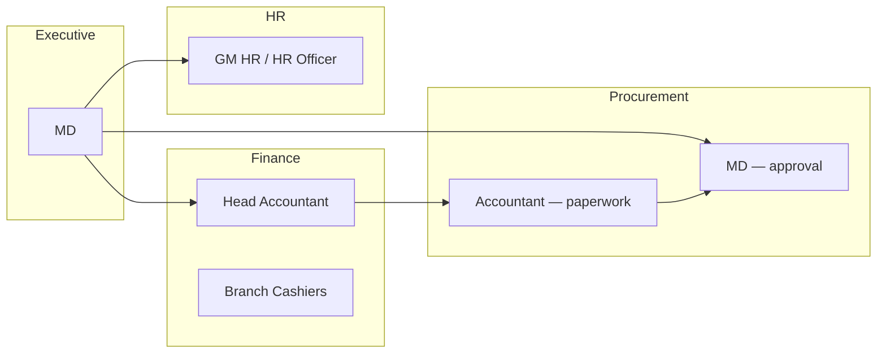
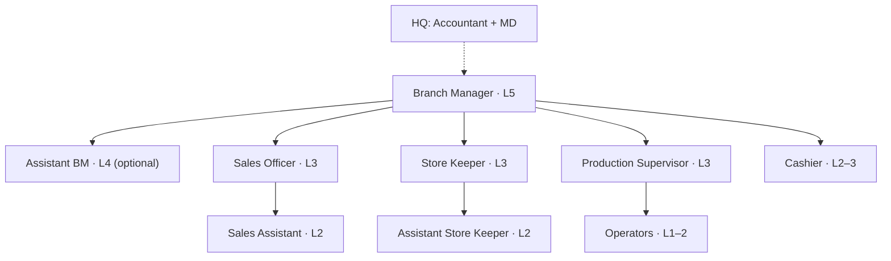

# Zarewa Aluminium & Plastics — Organisation, Titles & Compensation Policy

**Status:** Approved organisational reference (brainstorm consolidated)  
**Audience:** MD, GM HR, HR Admin, system builders  
**Related:** [HR-IMPLEMENTATION-PLAN.md](./HR-IMPLEMENTATION-PLAN.md), [HR-POLICY-PAYROLL.md](./HR-POLICY-PAYROLL.md), [HR-POLICY-EMPLOYEE-LIFECYCLE.md](./HR-POLICY-EMPLOYEE-LIFECYCLE.md)

---

## 1. Purpose

This document defines how Zarewa organises **sites**, **functional offices**, **job titles**, and **pay grades** for a **small company** where many departments have **one person** (or one person wearing several hats).

It is the reference for:

- HR staff registration and designation catalog
- Salary matrix defaults (level + step)
- Title rules (Officer vs Assistant vs Acting)
- Multi-role staff (e.g. accountant + cashier + acting branch manager)
- Salary above the standard matrix (outstanding staff, directors, special cases)

---

## 2. Company sites (physical offices)

| Branch ID | Code | Name | Role |
|-----------|------|------|------|
| `BR-KD` | KD | **Kaduna (HQ)** | Head office — executive, group finance, HR, procurement hub |
| `BR-YL` | YL | **Yola Factory** | Production + branch operations |
| `BR-MDG` | MDG | **Maiduguri Factory** | Production + branch operations |

**Not active in standard model:** Jalingo (legacy — do not register new staff there).

**Letterhead / public addresses** (quotations, invoices):

- Kaduna Head Office — A1 Kaduna–Zaria Road, Unguwan Gwari, Kawo
- Yola Factory — Yola Numan Road
- Maiduguri Factory — Airport Road, Bulunkutu

---

## 3. Functional offices (workflow desks)

These are **routing queues** for memos, work items, and approvals — not separate buildings.

| Office key | Standard name | Typical owner (small Zarewa) |
|------------|---------------|------------------------------|
| `executive` | Managing Director's Office | MD |
| `office_admin` | General Administration | Admin / HR assistant |
| `branch_manager` | Branch Manager's Office | Branch Manager (or acting) |
| `sales` | Sales & Customer Service | Sales Officer / Assistant |
| `operations` | Operations & Store | Store Keeper / Ops Officer |
| `procurement` | Procurement & Supply | **MD** (+ Accountant support) |
| `finance` | Finance & Treasury | Head Accountant (+ branch Cashiers) |
| `hr` | Human Resources | GM HR / HR Officer |
| `maintenance` | Maintenance | Outsourced or supervisor doubles |
| `reports` | Management Information | MD / Accountant |

**Small-company rule:** Procurement is **owned by MD**; the **Head Accountant** handles PO paperwork, supplier follow-up, and payment preparation — there is no separate Procurement Manager until headcount grows.

---

## 4. Design principles

1. **One structure, three sites** — same titles everywhere; scope changes (HQ vs branch).
2. **Four pillars of rank** (keep separate):

   | Pillar | Field(s) | Meaning |
   |---------|----------|---------|
   | **Pay rank** | `payroll_group`, `salary_level`, `salary_step` | Position on the salary ladder |
   | **Grade band** | `promotion_grade` (G1–G7) | Classification / promotion track |
   | **Authority title** | `job_title`, `designation_id` | What the person may decide |
   | **Tenure** | `date_joined_iso`, `hr_salary_history` | Years of service — gates titles and pay steps |

3. **Title ≠ app login** — `role_key` controls software permissions; HR title controls org chart and reporting.
4. **Assistant** = same desk, **lower grade or not yet qualified** for the full Officer title.
5. **Acting** = **temporary** authority with a written end date (max 6 months) — not a permanent substitute for qualification.
6. **Sole occupant OK** — one Sales Officer at Yola is normal; they are still an **Officer**, not a "Manager" because they are alone.

---

## 5. Pay ladder (levels 1–7)

Default payroll group for most staff: **`branch_ops`**.

| Level | Handbook band (seed label) | Typical grade | Leave band |
|-------|---------------------------|---------------|------------|
| 1 | Cleaners / security / factory workers | G1 | Junior |
| 2 | Assistants / operators | G1–G2 | Junior |
| 3 | Officers (sales, store, cashier, HR) | G2–G3 | Junior / standard |
| 4 | Senior officers / Assistant Branch Manager | G3–G4 | Senior |
| 5 | Branch Manager / Head Accountant | G4–G5 | Senior |
| 6 | GM HR / senior managers | G5–G6 | Senior / executive |
| 7 | Managing Director | G6–G7 | Executive |

**Steps:** Step 1 = entry to level; Step 2 = experienced; Step 3 = long service / merit within level (before promotion to next level).

**Other payroll groups** (when applicable): `hq_admin`, `mining_div`, `scholarship`, `chairman_staffs`.

---

## 6. Title decision rule

```
IF pay level below Officer threshold for that desk
  → use Assistant / Trainee title
ELSE IF qualified and sole person on desk
  → use Officer title (not Manager)
ELSE IF senior backup to Branch Manager
  → Assistant Branch Manager
ELSE IF temporary cover with MD letter
  → Acting ___ (with end date)
ELSE IF runs branch
  → Branch Manager (Level 5+)
```

**Officer thresholds (default):**

| Desk | Full title from | Assistant below |
|------|-----------------|-----------------|
| Sales | Level 3 | Level 1–2 |
| Store / Operations | Level 3 | Level 1–2 |
| Cashier | Level 2–3 (with training) | Level 1–2 |
| Accountant | Level 4 + qualification | Assistant Accountant |
| Branch Manager | Level 5 + MD appointment | ABM / Acting BM only |
| HR Officer | Level 3–4 | HR Admin Assistant |

---

## 7. Standard designation catalog (25 titles)

Use these in **HR Settings → Designations** and staff registration.

### Executive & HQ

| # | Designation | Lvl/Step | Grade | Site | Reports to |
|---|-------------|----------|-------|------|------------|
| 1 | Managing Director | 7/1 | G6–G7 | HQ | Board |
| 2 | General Manager – Human Resources | 6/1 | G5–G6 | HQ | MD |
| 3 | Head Accountant | 5/1 | G4–G5 | HQ | MD |
| 4 | HR Officer | 3–4/1 | G3–G4 | HQ | GM HR |
| 5 | Admin / Office Assistant | 1–2/1 | G1–G2 | HQ | GM HR or MD |

### Branch leadership

| # | Designation | Lvl/Step | Grade | Site | Reports to |
|---|-------------|----------|-------|------|------------|
| 6 | Branch Manager | 5/1 | G4–G5 | Branch | MD |
| 7 | Assistant Branch Manager | 4/1 | G3–G4 | Branch | Branch Manager |
| 8 | Acting Branch Manager | 4–5/1 | G3–G5 | Branch | MD (temporary) |

### Sales

| # | Designation | Lvl/Step | Grade | Site | Reports to |
|---|-------------|----------|-------|------|------------|
| 9 | Sales Officer | 3/1 | G2–G3 | Branch | BM |
| 10 | Sales Assistant | 2/1 | G1–G2 | Branch | Sales Officer or BM |
| 11 | Senior Sales Officer | 4/1 | G3–G4 | Branch | BM |
| 12 | Sales Trainee | 1/1 | G1 | Branch | Sales Officer |

### Operations & production

| # | Designation | Lvl/Step | Grade | Site | Reports to |
|---|-------------|----------|-------|------|------------|
| 13 | Store Keeper / Operations Officer | 3/1 | G2–G3 | Branch | BM |
| 14 | Assistant Store Keeper | 2/1 | G1–G2 | Branch | Store Keeper |
| 15 | Production Supervisor | 3/1 | G2–G3 | Branch | BM |
| 16 | Machine Operator | 1–2/1 | G1–G2 | Branch | Production Supervisor |
| 17 | Factory Assistant | 1/1 | G1 | Branch | Production Supervisor |
| 18 | Senior Store Keeper | 4/1 | G3–G4 | Branch | BM |
| 19 | Acting Store Keeper | 2–3/1 | G2–G3 | Branch | BM (temporary) |

### Finance (branch)

| # | Designation | Lvl/Step | Grade | Site | Reports to |
|---|-------------|----------|-------|------|------------|
| 20 | Cashier | 2–3/1 | G2–G3 | Branch | Head Accountant |
| 21 | Assistant Cashier | 1–2/1 | G1–G2 | Branch | Cashier |
| 22 | Branch Accountant | 4/1 | G3–G4 | Branch | Head Accountant |

### Support

| # | Designation | Lvl/Step | Grade | Site | Reports to |
|---|-------------|----------|-------|------|------------|
| 23 | Driver | 1–2/1 | G1–G2 | All | BM or Admin |
| 24 | Security Guard | 1/1 | G1 | All | BM |
| 25 | Cleaner | 1/1 | G1 | All | Admin or BM |

**Growth titles** (now in catalog): Procurement Officer, Maintenance Manager, Deputy Branch Manager, Customer Service Officer.

---

## 8. Multi-role staff (small company)

When one person does several jobs, record **one primary designation** plus **secondary roles** in HR notes.

| Pattern | Primary designation | Secondary hats (profile notes / app roles) |
|---------|---------------------|---------------------------------------------|
| MD + procurement | Managing Director | Procurement approval; `md` role |
| Accountant + procurement support | Head Accountant | PO follow-up; `finance_manager` |
| Accountant + Kaduna BM + cashier | Head Accountant | Acting Branch Manager (Kaduna); Cashier (Kaduna desk) |
| Store keeper + production lead | Store Keeper / Ops Officer | Production coordination |
| BM + sales lead | Branch Manager | May approve own branch sales (single person) |

**Fields to use:**

- `designation_id` / `job_title` → **primary** title only
- `profile_extra_json.employmentMeta.secondaryRoles` → array of `{ role, branchId, acting, endDateIso }`
- `specialConditions` → free-text board/MD letter summary
- App `role_key` → union of permissions needed (e.g. `finance_manager` + branch duties via `sales_manager` or custom overrides)

---

## 9. Organograms

### 9.1 Company (small Zarewa)

```mermaid
flowchart TB
  MD["Managing Director<br/>(Executive + Procurement owner)"]

  subgraph HQ["Kaduna Head Office"]
    GMHR["GM HR / HR Officer"]
    HOA["Head Accountant<br/>(Finance + procurement support)"]
    CSH["Cashier"]
    ADM["Admin / Office Assistant"]
  end

  subgraph BM_KD["Kaduna branch desk"]
    BM_K["Acting BM / senior staff"]
    SO_K["Sales Officer / Assistant"]
    OPS_K["Store / Ops Officer / Assistant"]
  end

  subgraph BM_YL["Yola Factory"]
    BM_Y["Branch Manager"]
    ABM_Y["Assistant BM (optional)"]
    SO_Y["Sales Officer / Assistant"]
    SK_Y["Store Keeper / Assistant"]
    OP_Y["Operators / Factory Assistants"]
    CS_Y["Cashier / Assistant"]
  end

  subgraph BM_MG["Maiduguri Factory"]
    BM_M["Branch Manager"]
    SO_M["Sales Officer / Assistant"]
    SK_M["Store Keeper / Assistant"]
    OP_M["Operators / Factory Assistants"]
    CS_M["Cashier / Assistant"]
  end

  MD --> GMHR
  MD --> HOA
  MD --> BM_K
  MD --> BM_Y
  MD --> BM_M
  HOA --> CSH
  HOA -.->|"PO support"| MD
  BM_Y --> ABM_Y
  BM_Y --> SO_Y
  BM_Y --> SK_Y
  BM_Y --> OP_Y
  BM_Y --> CS_Y
  BM_M --> SO_M
  BM_M --> SK_M
  BM_M --> OP_M
  BM_M --> CS_M
```



### 9.2 Functional desks (who owns what)



### 9.3 Typical factory branch (e.g. Yola)



---

## 10. Compensation model (summary)

Full detail: **[ZAREWA-COMPENSATION-AND-EXCEPTIONS.md](./ZAREWA-COMPENSATION-AND-EXCEPTIONS.md)**

| Layer | Source | Purpose |
|-------|--------|---------|
| **Salary matrix** | `hr_salary_matrix` | Standard pay for `(payroll_group, level, step)` |
| **Staff profile pay** | `base_salary_ngn`, allowances on `hr_staff_profiles` | **Payroll source of truth** |
| **Salary history** | `hr_salary_history` | Audit trail; every change needs a **reason** |
| **Variance** | Actual pay > matrix for same level/step | Documented exception (merit, multi-role, director, retention) |

**Automation (target behaviour):**

1. New hire: designation sets default **level/step** → matrix fills default pay unless MD/HR overrides.
2. Annual increment: move step or level → matrix amount applied → history row.
3. Exception: actual pay stays above matrix → **`compensationVariance`** recorded; do not inflate level unless promotion is real.

---

## 11. Example: builder / Head Accountant with multiple hats (Kaduna)

**Scenario:** Staff member is **Head Accountant** at HQ, **Acting Branch Manager** and **Cashier** at Kaduna (no permanent BM), **company Director** (board appointment), **6 years** service, **pay above Level 5 matrix** because of skill, multi-role, and director emolument.

| Field | Recommended value |
|-------|-------------------|
| **Primary designation** | Head Accountant |
| **Primary level/step** | 5 / 1 (or 5 / 2 with merit step — not Level 7 unless promoted to MD) |
| **Secondary roles** | Acting Branch Manager (`BR-KD`, acting, review date); Cashier (`BR-KD`, operational) |
| **Corporate title** | Director — in `profile_extra` / `specialConditions`; **board letter on file** |
| **promotion_grade** | Set from **actual pay** (e.g. G5–G6) or explicit board grade — may exceed level number |
| **Actual salary** | Above matrix → variance type **`multi_role_director`** (see compensation doc) |
| **App roles** | `finance_manager` + branch permissions (`sales_manager` or documented overrides) |
| **Line manager** | MD |
| **Leave band** | Senior |

**Principles:**

- **Director** is a **governance title**, not automatically Level 7 pay or Branch Manager grade.
- **Young director / high pay** is valid when board + MD document it — separate from "years of service" ladder.
- **Do not** use "Branch Manager" as primary title if primary employment is Accountant — use **Acting Branch Manager (Kaduna)** as secondary hat.
- **Salary** reflects combined responsibility; level stays honest for HR reporting.

---

## 12. Import template (designations)

CSV for HR master data load — see [zarewa-designations-template.csv](./zarewa-designations-template.csv).

Columns: `code`, `title`, `department_code`, `default_salary_level`, `default_salary_step`, `grade_category`, `seniority_band`, `site_scope`, `notes`.

---

## 13. System mapping (when implementing)

| Policy concept | Database / UI |
|----------------|---------------|
| Designation | `hr_designations` |
| Department | `hr_departments` |
| Staff level/step | `hr_staff_profiles.salary_level`, `salary_step` |
| Matrix | `hr_salary_matrix` |
| Pay on profile | `base_salary_ngn`, `housing_allowance_ngn`, `transport_allowance_ngn` |
| Grade | `promotion_grade` |
| History | `hr_salary_history` via increment panel |
| Special cases | `profile_extra_json`, `specialConditions`, salary change **reason** |
| Multi-role | `profile_extra_json.employmentMeta.secondaryRoles` |
| Payroll compute | `computePayrollRun` reads **profile** amounts |

---

## 14. Review cycle

- **Annually:** MD + GM HR review matrix and designation catalog.
- **On promotion:** Update level/step; apply matrix or documented exception.
- **On acting appointment:** Set end date; review before expiry.
- **On board director change:** Update `specialConditions`; compensation via MD/board approval.

---

*Document version: 2026-06-15 — consolidated from organisational design sessions.*
