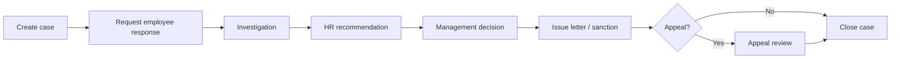

# Zarewa — Complete Documentation (Consolidated)

> Auto-generated consolidation of project markdown from Zarewa-backend and Zarewa-frontend.
> Do not edit this file directly — update source documents and re-run `scripts/consolidate-docs.py`.

**Generated:** 2026-06-07  |  **Sources:** 67 files

---

## Table of contents

1. [Zarewa-backend-main/README.md](#readmemd)
2. [Zarewa-backend-main/docs/OPERATIONS_MANUAL.md](#docs-operations_manualmd)
3. [Zarewa-backend-main/docs/ACCESS_CONTROL.md](#docs-access_controlmd)
4. [Zarewa-backend-main/docs/ACCOUNTING_POLICIES.md](#docs-accounting_policiesmd)
5. [Zarewa-backend-main/docs/ACCOUNTING_POLICY_AP1C.md](#docs-accounting_policy_ap1cmd)
6. [Zarewa-backend-main/docs/ACCOUNTING_POLICY_AP2.md](#docs-accounting_policy_ap2md)
7. [Zarewa-backend-main/docs/ACCOUNTING_POLICY_AP3_COSTING.md](#docs-accounting_policy_ap3_costingmd)
8. [Zarewa-backend-main/docs/ACCOUNTING_POLICY_V1.md](#docs-accounting_policy_v1md)
9. [Zarewa-backend-main/docs/API_GAP_WORKSPACE_OFFICE.md](#docs-api_gap_workspace_officemd)
10. [Zarewa-backend-main/docs/DEPLOYMENT.md](#docs-deploymentmd)
11. [Zarewa-backend-main/docs/DUAL_REPO_BACKEND.md](#docs-dual_repo_backendmd)
12. [Zarewa-backend-main/docs/ENVIRONMENT.md](#docs-environmentmd)
13. [Zarewa-backend-main/docs/EXEC_COMMAND_CENTRE.md](#docs-exec_command_centremd)
14. [Zarewa-backend-main/docs/FINANCE_STANDARD_REPORTS.md](#docs-finance_standard_reportsmd)
15. [Zarewa-backend-main/docs/FINANCE_WORK_ITEM_CONVENTIONS.md](#docs-finance_work_item_conventionsmd)
16. [Zarewa-backend-main/docs/HELP_ASSISTANT.md](#docs-help_assistantmd)
17. [Zarewa-backend-main/docs/HELP_INTELLIGENCE_PLAN.md](#docs-help_intelligence_planmd)
18. [Zarewa-backend-main/docs/HOSTING_DECISIONS.md](#docs-hosting_decisionsmd)
19. [Zarewa-backend-main/docs/HOSTINGER_API_RESTART.md](#docs-hostinger_api_restartmd)
20. [Zarewa-backend-main/docs/HR/HR-E2E-TESTING.md](#docs-hr-hr-e2e-testingmd)
21. [Zarewa-backend-main/docs/HR/HR-HANDBOOK-ACKNOWLEDGEMENT.md](#docs-hr-hr-handbook-acknowledgementmd)
22. [Zarewa-backend-main/docs/HR/HR-IMPLEMENTATION-PLAN.md](#docs-hr-hr-implementation-planmd)
23. [Zarewa-backend-main/docs/HR/HR-POLICY-ATTENDANCE.md](#docs-hr-hr-policy-attendancemd)
24. [Zarewa-backend-main/docs/HR/HR-POLICY-CONTROL-MATRIX.md](#docs-hr-hr-policy-control-matrixmd)
25. [Zarewa-backend-main/docs/HR/HR-POLICY-EMPLOYEE-LIFECYCLE.md](#docs-hr-hr-policy-employee-lifecyclemd)
26. [Zarewa-backend-main/docs/HR/HR-POLICY-LEAVE.md](#docs-hr-hr-policy-leavemd)
27. [Zarewa-backend-main/docs/HR/HR-POLICY-PAYROLL.md](#docs-hr-hr-policy-payrollmd)
28. [Zarewa-backend-main/docs/HR/HR-POLICY-RECRUITING.md](#docs-hr-hr-policy-recruitingmd)
29. [Zarewa-backend-main/docs/HR/HR-UAT-CUTOVER.md](#docs-hr-hr-uat-cutovermd)
30. [Zarewa-backend-main/docs/HR/HR-V2-FEATURES.md](#docs-hr-hr-v2-featuresmd)
31. [Zarewa-backend-main/docs/HR/PHASE-5-PLAN.md](#docs-hr-phase-5-planmd)
32. [Zarewa-backend-main/docs/HR/PHASE-6-COMPLETION.md](#docs-hr-phase-6-completionmd)
33. [Zarewa-backend-main/docs/HR/PHASE-7-COMPLETION.md](#docs-hr-phase-7-completionmd)
34. [Zarewa-backend-main/docs/HR/PHASE-7-PLAN.md](#docs-hr-phase-7-planmd)
35. [Zarewa-backend-main/docs/HR/PHASE-8-COMPLETION.md](#docs-hr-phase-8-completionmd)
36. [Zarewa-backend-main/docs/HR/PHASE-8-PLAN.md](#docs-hr-phase-8-planmd)
37. [Zarewa-backend-main/docs/HR/PHASE-9-COMPLETION.md](#docs-hr-phase-9-completionmd)
38. [Zarewa-backend-main/docs/MATERIAL_EXCEPTIONS_SOP.md](#docs-material_exceptions_sopmd)
39. [Zarewa-backend-main/docs/MONTH_END_CLOSE.md](#docs-month_end_closemd)
40. [Zarewa-backend-main/docs/OFFICE_OPERATIONS_RUNBOOK.md](#docs-office_operations_runbookmd)
41. [Zarewa-backend-main/docs/OPERATIONAL_CLICK_TESTING.md](#docs-operational_click_testingmd)
42. [Zarewa-backend-main/docs/PAYMENT_POSTING_RUNBOOK.md](#docs-payment_posting_runbookmd)
43. [Zarewa-backend-main/docs/PAYMENT_POSTING_SOP.md](#docs-payment_posting_sopmd)
44. [Zarewa-backend-main/docs/QA_GATES.md](#docs-qa_gatesmd)
45. [Zarewa-backend-main/docs/RBAC_FINANCE_DESK.md](#docs-rbac_finance_deskmd)
46. [Zarewa-backend-main/docs/RBAC_MATRIX.md](#docs-rbac_matrixmd)
47. [Zarewa-backend-main/docs/REFUND_OPERATIONS.md](#docs-refund_operationsmd)
48. [Zarewa-backend-main/docs/REGRESSION_ACCOUNT_FINANCE.md](#docs-regression_account_financemd)
49. [Zarewa-backend-main/docs/REPORT_PILOT_CERT.md](#docs-report_pilot_certmd)
50. [Zarewa-backend-main/docs/REPORT_PRINT_STANDARD.md](#docs-report_print_standardmd)
51. [Zarewa-backend-main/docs/ROLE_DASHBOARD_MATRIX.md](#docs-role_dashboard_matrixmd)
52. [Zarewa-backend-main/docs/SALARY/README.md](#docs-salary-readmemd)
53. [Zarewa-backend-main/docs/SPLIT_DEPLOYMENT_AND_MIGRATION.md](#docs-split_deployment_and_migrationmd)
54. [Zarewa-backend-main/docs/STAFF_APPROVALS.md](#docs-staff_approvalsmd)
55. [Zarewa-backend-main/docs/STAKEHOLDER_DEMO_PLAYBOOK.md](#docs-stakeholder_demo_playbookmd)
56. [Zarewa-backend-main/docs/STONE_ACCESSORY_IMPLEMENTATION_DEFAULTS.md](#docs-stone_accessory_implementation_defaultsmd)
57. [Zarewa-backend-main/docs/STRESS-DEDICATED-DB.md](#docs-stress-dedicated-dbmd)
58. [Zarewa-backend-main/docs/UAT_TRACKS_AG.md](#docs-uat_tracks_agmd)
59. [Zarewa-backend-main/docs/UX_STANDARDS.md](#docs-ux_standardsmd)
60. [Zarewa-backend-main/docs/WORKSPACE_OFFICE_OVERHAUL.md](#docs-workspace_office_overhaulmd)
61. [Zarewa-backend-main/docs/WORKSPACE_TESTS.md](#docs-workspace_testsmd)
62. [Zarewa-backend-main/scripts/deploy/README.md](#scripts-deploy-readmemd)
63. [Zarewa-frontend-main/README.md](#readmemd)
64. [Zarewa-frontend-main/docs/SYNC_FROM_BACKEND.md](#docs-sync_from_backendmd)
65. [Zarewa-frontend-main/docs/UI_REFERENCE_SEQUENCE_DASHBOARD.md](#docs-ui_reference_sequence_dashboardmd)
66. [Zarewa-frontend-main/docs/UNVEIL_MOBILE_CHECKLIST.md](#docs-unveil_mobile_checklistmd)
67. [Zarewa-frontend-main/docs/UX_STANDARDS.md](#docs-ux_standardsmd)

---

<a id="readmemd"></a>

# Source: `Zarewa-backend-main/README.md`

# Zarewa Backend

Backend API for **Zarewa** — an integrated operations platform for sales, procurement, production, inventory, customer finance (ledger, advances, refunds), general ledger, treasury controls, office workflows, HR, and executive reporting. This service is a **Node.js** application built with **Express 5** and **SQLite** (`better-sqlite3`), exposing a JSON **REST API** under `/api`.

---

## Table of contents

- [Architecture at a glance](#architecture-at-a-glance)
- [Prerequisites](#prerequisites)
- [Quick start](#quick-start)
- [Configuration](#configuration)
- [Project layout](#project-layout)
- [HTTP API overview](#http-api-overview)
- [Authentication and security](#authentication-and-security)
- [Database](#database)
- [Development workflows](#development-workflows)
- [Testing](#testing)
- [Scripts reference](#scripts-reference)
- [Deployment and operations](#deployment-and-operations)
- [Documentation index](#documentation-index)
- [Repository layout vs. monorepo](#repository-layout-vs-monorepo)

---

## Architecture at a glance

| Layer | Technology |
|--------|------------|
| HTTP server | Express 5 (`server/app.js`, `server/index.js`) |
| Persistence | SQLite with WAL, foreign keys (`server/db.js`) |
| Schema | Applied from `server/schemaSql.js`, evolved via migrations (`server/migrate.js`) |
| Auth | Cookie-backed sessions + CSRF for mutating requests; optional Firebase ID token login (`server/auth.js`) |
| AI (optional) | OpenAI-compatible chat when API keys are set (`server/aiAssist.js`) |

On startup the process creates the database file if needed, runs migrations, seeds baseline data (unless empty-seed mode), and optionally ensures a legacy demo pack for development. Static assets: if `dist/index.html` exists (or `ZAREWA_STATIC_DIR` points at a built SPA), the same process can serve the frontend and API on one origin.

**Shared domain logic** used by both the API and the SPA lives under [`shared/`](shared/) (ledger math, notifications helpers, refund stores, etc.). Dev and release tooling still expects a **sibling `frontend/`** package for Vite and `npm run verify:complete` — see [Repository layout vs. monorepo](#repository-layout-vs-monorepo).

---

## Prerequisites

- **Node.js** — Use a current LTS (production docs target **Node 20**; align with your CI or host image).
- **npm** — For installing dependencies and running scripts.
- **Native build toolchain** — `better-sqlite3` may compile on install; on Linux you may need `build-essential` (see [`docs/DEPLOYMENT.md`](docs/DEPLOYMENT.md)).

---

## Quick start

```bash
git clone <repository-url>
cd Zarewa-backend
npm install
npm run server
```

The server listens on **`http://127.0.0.1:8787`** by default (`PORT` overrides this). The default database file is **`data/zarewa.sqlite`** (created automatically).

**Smoke check:** `GET /api/health` returns **`200`** with **`ok: true`** when the database connected. If startup failed (for example MySQL not reachable), the API listens in **degraded** mode: **`/api/health`** still returns **`200`** but with **`ok: false`**, **`degraded: true`**, and **`bootError`** / **`mysqlTarget`** in the JSON; other `/api/*` routes return **`503`** until fixed.

---

## Configuration

Environment variables are documented in **[`docs/ENVIRONMENT.md`](docs/ENVIRONMENT.md)**. Highlights:

| Concern | Variables (examples) |
|--------|------------------------|
| Database | `ZAREWA_DB` — path to SQLite file or `:memory:` for tests |
| Listen | `PORT`, optional `ZAREWA_LISTEN_HOST` (e.g. `0.0.0.0` for LAN) |
| CORS / cookies | `CORS_ORIGIN`, `NODE_ENV`, `COOKIE_SECURE`, `ZAREWA_COOKIE_SAMESITE` |
| Static SPA | `ZAREWA_STATIC_DIR` — folder containing built `index.html` |
| AI assistant | `ZAREWA_AI_API_KEY` / `OPENAI_API_KEY`, optional `ZAREWA_AI_BASE_URL`, `ZAREWA_AI_MODEL` |
| Empty client DB | `ZAREWA_EMPTY_SEED` — minimal seed after wipe for UAT |
| E2E | `E2E_UI_PORT`, `E2E_API_PORT`, `E2E_REUSE_SERVER` |

Do not commit secrets; use your host environment or a local `.env` loaded by your process manager.

---

## Project layout

| Path | Role |
|------|------|
| [`server/`](server/) | Express app, HTTP routes (`httpApi.js`), auth, migrations, domain modules, `index.js` entry |
| [`shared/`](shared/) | Isomorphic helpers and constants shared with the frontend package |
| [`scripts/`](scripts/) | Dev stack, DB utilities, imports, stress tests, deploy helpers |
| [`e2e/`](e2e/) | Playwright end-to-end specs |
| [`data/`](data/) | Default SQLite path (`zarewa.sqlite`); often gitignored for real data |
| [`docs/`](docs/) | Environment, access control, deployment, finance, HR, and runbooks |

---

## HTTP API overview

All application routes are prefixed with **`/api`**. Implementation is centralized in [`server/httpApi.js`](server/httpApi.js). The surface area is large; below is a **domain-oriented** map (not an exhaustive path list).

### Public / bootstrap

- **`GET /api/health`** — Liveness (same JSON on **`/api/readyz`**, **`/api/livez`**, **`/api/status`**, **`/health`**, **`/healthz`**, **`/livez`**, **`/readyz`**, **`/status`** for probes / load balancers).
- **`GET /api/bootstrap`** — Workspace bootstrap payload (branches, permissions context, etc.; used by the SPA).
- **`GET /api/session`** — Current session (or anonymous).

### Session and identity

- Password login, logout, forgot/reset password, change password, profile and dashboard preferences.
- **`POST /api/session/firebase`** — Exchange Firebase ID token for a server session (when configured).
- Workspace/branch selection on the session.

### Administration and RBAC

- User listing and creation, role and permission patches, workspace department hooks, org setup targets.
- Role definitions and permission checks are implemented in [`server/auth.js`](server/auth.js); matrices and policies are described in **[`docs/RBAC_MATRIX.md`](docs/RBAC_MATRIX.md)** and **[`docs/ACCESS_CONTROL.md`](docs/ACCESS_CONTROL.md)**.

### Sales, customers, and ledger

- Customers, quotations, cutting lists, customer ledger entries, advances, receipts, refunds, refund intelligence, audit logs.
- Branch-scoped enforcement for ledger posting ([`server/branchScope.js`](server/branchScope.js)).

### Procurement and inventory

- Suppliers, transport agents, purchase orders (including transport, GRN, supplier payments), stone inventory and receipts, stock views.

### Production

- Cutting-list and production-job flows: allocations, start/complete, conversion preview, manager review, cancellations.

### Finance and control

- GL accounts, trial balance, journals, journal posting, reports, executive summary.
- Treasury, payment/refund requests, accounting period locks, bank reconciliation import paths, inter-branch loans (where exposed).

### Pricing

- Price list and material pricing sheet maintenance (permission-gated, including MD price-exception flows).

### Office and work management

- Office threads, messages, directory, filing, AI-assisted memo polish / filing (when AI is enabled), compose templates, inter-branch requests, unified **work items** and material requests.

### Other

- Workspace search, dashboard summaries, management targets/reviews, MD operations pack report, optional **`/api/ai/*`** routes for assistant status and chat.

For deep behavior (refunds, accounting policies, office runbooks), use the [documentation index](#documentation-index).

---

## Authentication and security

- **Sessions** — Opaque tokens stored server-side; cookies used for browser clients. Mutating requests expect **CSRF** token alignment (see comments in `server/auth.js` and tests in `server/csrfEnforcement.test.js`).
- **Permissions** — Route handlers use `requirePermission(...)` with fine-grained keys (sales, finance, production, HR, etc.).
- **CORS** — Configured in [`server/app.js`](server/app.js); production should use an explicit allowlist (`CORS_ORIGIN`), not `*`.
- **Headers** — Security headers (CSP, frame denial, nosniff, referrer policy) are set in `app.js`.
- **Rate limiting** — Ledger-related POST rate limits are configurable via `ZAREWA_LEDGER_POST_MAX` and `ZAREWA_LEDGER_POST_WINDOW_MS` (see `docs/ENVIRONMENT.md`).

---

## Database

- **Default file:** `data/zarewa.sqlite` (override with `ZAREWA_DB`).
- **Modes:** WAL journaling, foreign keys enabled.
- **Migrations:** Run automatically on open; manual CLI: **`npm run db:migrate`**.
- **Wipe local DB:** **`npm run db:wipe`** (destructive; development).
- **Empty-client seed:** after wipe, **`ZAREWA_EMPTY_SEED=1`** with a fresh DB gives minimal data — see `docs/ENVIRONMENT.md`.
- **Backups:** For production, schedule file-level backups of the SQLite file (and `-wal`/`-shm` sidecars if present).

---

## Development workflows

### API only

```bash
npm run server
# or
node server/index.js
```

### API + Vite (full UI stack)

From this repo, with a **`frontend/`** sibling (or **`ZAREWA_FRONTEND_ROOT`** set):

```bash
npm run dev:stack
```

This starts the API (default `0.0.0.0` for LAN-friendly dev) and the Vite dev server. See [`scripts/dev-stack.mjs`](scripts/dev-stack.mjs).

### LAN / device testing

Use **`npm run start:lan`** or set `ZAREWA_LISTEN_HOST=0.0.0.0` so phones on the same Wi‑Fi can reach the API; CORS in development can allow private LAN origins when enabled in `app.js`.

---

## Testing

| Command | Purpose |
|---------|---------|
| **`npm run lint`** | ESLint across the repo |
| **`npm test`** | Vitest — `server/**/*.test.js`, `shared/**/*.test.js` |
| **`npm run test:watch`** | Vitest watch mode |
| **`npm run test:e2e`** | Playwright — starts API + UI via `scripts/e2e-web.mjs` and runs `e2e/` |
| **`npm run test:all`** | Vitest + Playwright |

Focused suites (examples from `package.json`): `test:transactions`, `test:operations`, `test:financial`, `test:critical-workflows`, `verify:ci` (lint + transaction tests).

**E2E database:** Playwright uses `data/playwright.sqlite` by default. Reset only that file: **`npm run wipe:e2e-db`**. Port conflicts: set `E2E_UI_PORT` / `E2E_API_PORT` per `docs/ENVIRONMENT.md`.

**Full release gate (requires sibling frontend):** **`npm run verify:complete`** — production frontend build, full Vitest, full Playwright.

---

## Scripts reference

Beyond tests and the server, notable `npm` scripts include:

- **Imports / data:** `hr:import-staff`, `import:access-sales`, `import:access-staging`, `import:access-finance`, `import:validate`, and related merge/legacy helpers.
- **Stress / QA:** `stress:api`, `stress:lifecycle`, `stress:qa-mega`, `stress:finance100`, etc.
- **Maintenance:** `retention:prune`, `bench:dashboard`.
- **Verification:** `verify:split-deploy`, `verify:complete`.

See [`package.json`](package.json) for the full list and exact command names.

---

## Deployment and operations

- **[`docs/DEPLOYMENT.md`](docs/DEPLOYMENT.md)** — Checklist, HTTPS, cookies, Ubuntu/systemd notes.
- **[`scripts/deploy/README.md`](scripts/deploy/README.md)** — Automated server setup path.
- **[`docs/SPLIT_DEPLOYMENT_AND_MIGRATION.md`](docs/SPLIT_DEPLOYMENT_AND_MIGRATION.md)** — API and static UI on different hosts.
- **Post-deploy smoke:** `npm run verify:split-deploy` with `ZAREWA_VERIFY_API_ORIGIN` (see `docs/ENVIRONMENT.md`).

---

## Documentation index

| Topic | Document |
|-------|----------|
| **Operations & IT manual (full system)** | [`docs/OPERATIONS_MANUAL.md`](docs/OPERATIONS_MANUAL.md) |
| Environment variables | [`docs/ENVIRONMENT.md`](docs/ENVIRONMENT.md) |
| Access control | [`docs/ACCESS_CONTROL.md`](docs/ACCESS_CONTROL.md) |
| RBAC matrix | [`docs/RBAC_MATRIX.md`](docs/RBAC_MATRIX.md) |
| Deployment | [`docs/DEPLOYMENT.md`](docs/DEPLOYMENT.md) |
| Split deploy / migration | [`docs/SPLIT_DEPLOYMENT_AND_MIGRATION.md`](docs/SPLIT_DEPLOYMENT_AND_MIGRATION.md) |
| Refunds | [`docs/REFUND_OPERATIONS.md`](docs/REFUND_OPERATIONS.md) |
| Accounting policies | [`docs/ACCOUNTING_POLICIES.md`](docs/ACCOUNTING_POLICIES.md) |
| QA gates | [`docs/QA_GATES.md`](docs/QA_GATES.md) |
| Office operations | [`docs/OFFICE_OPERATIONS_RUNBOOK.md`](docs/OFFICE_OPERATIONS_RUNBOOK.md) |
| HR policies | [`docs/HR/`](docs/HR/) |
| Backend-only / monorepo | [`docs/DUAL_REPO_BACKEND.md`](docs/DUAL_REPO_BACKEND.md) |

---

## Repository layout vs. monorepo

- **Shared code** for API + UI lives in **`shared/`** in this tree.
- **Frontend dev and full verification** expect the Vite app in a sibling directory: **`../frontend`**, unless **`ZAREWA_FRONTEND_ROOT`** points elsewhere ([`scripts/frontendPaths.mjs`](scripts/frontendPaths.mjs)).
- If you maintain **only** this backend repository, read **[`docs/DUAL_REPO_BACKEND.md`](docs/DUAL_REPO_BACKEND.md)** for integration options (sibling clone, submodule, or future packaging of shared modules).

---

## License / support

Package **`@zarewa/backend`** is marked **private** in `package.json`. For internal policies, stakeholder demos, and staff-facing summaries, see additional materials under `docs/` (for example `STAKEHOLDER_DEMO_PLAYBOOK.md`, `STAFF_APPROVALS.md`).


---

<a id="docs-operations_manualmd"></a>

# Source: `Zarewa-backend-main/docs/OPERATIONS_MANUAL.md`

# Zarewa Operations & IT Manual

**Version:** 1.0  
**Scope:** Full system — business operations and IT administration  
**Audience:** Branch staff, finance, operations, HR, executives, and system administrators  

This is the **consolidated master manual** for Zarewa. It describes how the live system behaves (UI, API, permissions, and controls). Domain-specific deep dives remain in linked documents under `docs/` — this manual ties them together.

---

## Table of contents

1. [System overview](#1-system-overview)
2. [Architecture](#2-architecture)
3. [Daily use — sign-in and navigation](#3-daily-use--sign-in-and-navigation)
4. [Roles, permissions, and segregation of duties](#4-roles-permissions-and-segregation-of-duties)
5. [Cross-cutting rules](#5-cross-cutting-rules)
6. [Module procedures — business operations](#6-module-procedures--business-operations)
   - [6.1 Dashboard and workspace](#61-dashboard-and-workspace)
   - [6.2 Sales and customers](#62-sales-and-customers)
   - [6.3 Quotations, cutting lists, and pricing](#63-quotations-cutting-lists-and-pricing)
   - [6.4 Customer finance — receipts, advances, corrections](#64-customer-finance--receipts-advances-corrections)
   - [6.5 Customer refunds](#65-customer-refunds)
   - [6.6 Procurement and suppliers](#66-procurement-and-suppliers)
   - [6.7 Operations, inventory, and production](#67-operations-inventory-and-production)
   - [6.8 Material exceptions and offcuts](#68-material-exceptions-and-offcuts)
   - [6.9 Finance, treasury, and GL](#69-finance-treasury-and-gl)
   - [6.10 Office, work items, and edit approvals](#610-office-work-items-and-edit-approvals)
   - [6.11 Reports and analytics](#611-reports-and-analytics)
   - [6.12 Human resources](#612-human-resources)
   - [6.13 Settings and master data](#613-settings-and-master-data)
   - [6.14 Executive views](#614-executive-views)
7. [IT operations](#7-it-operations)
   - [7.1 Prerequisites and repositories](#71-prerequisites-and-repositories)
   - [7.2 Environment configuration](#72-environment-configuration)
   - [7.3 Deployment models](#73-deployment-models)
   - [7.4 Database, migrations, and seeding](#74-database-migrations-and-seeding)
   - [7.5 Backup and recovery](#75-backup-and-recovery)
   - [7.6 Health checks and degraded mode](#76-health-checks-and-degraded-mode)
   - [7.7 Updates and release verification](#77-updates-and-release-verification)
   - [7.8 Security hardening](#78-security-hardening)
   - [7.9 Scripts and maintenance tools](#79-scripts-and-maintenance-tools)
   - [7.10 Testing and QA gates](#710-testing-and-qa-gates)
   - [7.11 Incident response](#711-incident-response)
8. [Appendix A — Role quick reference](#appendix-a--role-quick-reference)
9. [Appendix B — Application route map](#appendix-b--application-route-map)
10. [Appendix C — Related documents index](#appendix-c--related-documents-index)

---

## 1. System overview

**Zarewa** is an integrated operations platform for a multi-branch roofing / building-materials business. It covers:

| Domain | Primary users | What the system tracks |
|--------|---------------|------------------------|
| Sales | Sales officers, branch managers | Customers, quotations, cutting lists |
| Customer finance | Sales, cashier, finance | Receipts, advances, ledger, refunds |
| Procurement | Operations, MD, finance | Suppliers, POs, GRN, supplier payments |
| Production & inventory | Operations, storekeepers | Coil register, jobs, deliveries, stock |
| Finance & GL | Finance manager, cashier | Treasury, journals, bank reconciliation, period locks |
| Office | All staff with `office.use` | Threads, memos, payment/material requests, filing |
| HR | HR admin, GM HR, staff | Profiles, leave, loans, payroll, attendance |
| Reporting | Managers, finance, MD | Registers, month-end packs, MD operations pack |

**Technology stack**

- **Frontend:** React (Vite SPA) — routes in `Zarewa-frontend-main/src/App.jsx`
- **Backend:** Node.js + Express 5 — entry `server/index.js`, routes `server/httpApi.js`
- **Persistence:** SQLite file (default `data/zarewa.sqlite`) or MySQL when configured; migrations run on startup
- **Auth:** Server-side session cookies + CSRF on mutating requests; optional Firebase login
- **Shared logic:** `shared/` — ledger math, report cores, constants used by API and UI

**Branches**

- Each user works in a **workspace branch** (default Kaduna `BR-KD`).
- Document IDs embed branch codes, e.g. **QT-KD-26-0001** (quotation, Kaduna, year 26, sequence 0001).
- Suppliers and transport agents are **company-wide** (not branch-scoped).
- Most operational data (customers, quotations, coils, receipts) is **branch-scoped** unless the role has org-wide read (`hq.view_all_branches`).

---

## 2. Architecture

```
┌─────────────────────────────────────────────────────────────┐
│  Browser (React SPA)                                        │
│  Routes: /sales, /procurement, /operations, /accounts, …    │
│  Session: cookie + CSRF token                               │
└──────────────────────────┬──────────────────────────────────┘
                           │ HTTPS  /api/*
┌──────────────────────────▼──────────────────────────────────┐
│  Node.js API (Express)                                      │
│  auth.js · httpApi.js · domain ops modules · migrate.js     │
└──────────────────────────┬──────────────────────────────────┘
                           │
┌──────────────────────────▼──────────────────────────────────┐
│  Database (SQLite or MySQL)                                 │
│  Single file / schema with migrations + audit tables        │
└─────────────────────────────────────────────────────────────┘
```

**Deployment options**

| Model | When to use | Key settings |
|-------|-------------|--------------|
| **Combined** | Simplest production | API serves built `dist/` from same origin; `ZAREWA_STATIC_DIR` |
| **Split** | UI on CDN/static host, API on VM | `VITE_API_BASE`, `CORS_ORIGIN`, cookie SameSite rules |
| **Dev stack** | Local development | `npm run dev:stack` — API + Vite proxy |

See [SPLIT_DEPLOYMENT_AND_MIGRATION.md](./SPLIT_DEPLOYMENT_AND_MIGRATION.md) and [DEPLOYMENT.md](./DEPLOYMENT.md).

**Bootstrap model**

On login the SPA loads **`GET /api/bootstrap`** — a filtered snapshot of branches, permissions, master data, and lists the user may see. Direct API calls still enforce permissions; bootstrap filtering is not a security boundary.

---

## 3. Daily use — sign-in and navigation

### 3.1 Sign in

1. Open the Zarewa URL provided by IT.
2. Enter **username** and **password**, or use **Google sign-in** if Firebase is configured.
3. On success the app routes you by role:
   - **CEO** → `/exec` (executive summary only)
   - **MD / branch manager / finance / sales / operations / HR** → department home or dashboard
4. First login may require **password change** or **onboarding** steps.

**Forgot password:** use the reset flow on the login screen (token emailed or distributed per your IT policy).

### 3.2 Workspace branch

- Switch branch from the workspace header when your role allows multiple branches.
- Posting receipts, creating quotations, and most writes use the **current workspace branch**.
- Finance with `finance.cross_branch_post` may post to other branches under controlled rules.

### 3.3 Main navigation (SPA routes)

| Route | Module | Typical users |
|-------|--------|---------------|
| `/` | Home / dashboard | All |
| `/workspace/monitoring` | Workspace monitoring | Admin, managers |
| `/exec` | CEO executive dashboard | CEO |
| `/sales` | Sales desk | Sales, managers |
| `/customers`, `/customers/:id` | Customer CRM | Sales |
| `/procurement` | Procurement hub | Operations, MD, finance |
| `/operations` | Store & production | Operations |
| `/operations/material-exceptions` | Material incidents | Operations, managers |
| `/accounts` | Finance & accounts | Finance, cashier |
| `/accounts/bank-reconciliation` | Bank rec | Finance |
| `/reports` | Management reports | Managers, finance, MD |
| `/analytics` | Business intelligence | Management |
| `/office` | Office desk | All with `office.use` |
| `/edit-approvals` | Pending edit approvals | Managers |
| `/settings/*` | Administration | Admin, MD, finance |
| `/manager` | Branch manager dashboard | Branch managers |
| `/my-profile/*` | HR self-service | Staff |
| `/team-hr/*` | Team HR (managers) | Line managers |
| `/hr/*` | HR administration | HR admin, GM HR |
| `/price-list`, `/pricing-policy` | Pricing admin | MD, pricing roles |

Unauthorized routes redirect to `/` with a denial message.

### 3.4 Offline / degraded behaviour

If the API stops responding:

- The UI may show **“System offline”** with last synced workspace data.
- **Nothing new can be saved** until the API reconnects.
- Use **Try reconnect** or refresh after IT confirms the server is healthy.

---

## 4. Roles, permissions, and segregation of duties

### 4.1 Built-in roles

| Role key | Label | Summary |
|----------|-------|---------|
| `admin` | Administrator | Full access (`*`) |
| `md` | Managing Director | Org-wide strategic control, approvals, pricing, HR exec |
| `finance_manager` | Finance manager | Finance, treasury, GL, cross-branch posting, reports |
| `cashier` | Cashier | Receipts, treasury, payouts, limited approvals |
| `sales_manager` | Branch manager | Sales, operations, production, refunds approve, material incidents |
| `sales_staff` | Sales officer | Customers, quotations, receipts, refund requests |
| `operations_officer` | Operations officer | Procurement, inventory, production, material incident create |
| `hr_admin` | HR / Admin | HR directory, payroll prep, attendance |
| `gmhr` | GM HR | Org-wide HR, final leave/loan approvals |
| `ceo` | Chief Executive Officer | Executive dashboard and reports only — no line-level sales/finance |
| `viewer` | Read-only viewer | Dashboard view only |

Canonical permission lists: `server/auth.js` → `ROLE_DEFINITIONS`.  
Module visibility: [RBAC_MATRIX.md](./RBAC_MATRIX.md).

### 4.2 Segregation of duties (critical paths)

| Process | Create / request | Approve / confirm | Pay / execute |
|---------|------------------|-------------------|---------------|
| Customer refund | Sales (`refunds.request`) | Branch manager, MD, or finance (`refunds.approve` / `finance.approve`) | Finance (`finance.pay`) |
| Customer receipt | Sales / cashier (`receipts.post`) | Finance clearance / bank confirmation | Finance |
| Payment request (office) | Requester | Branch manager (≤ threshold) or MD (> threshold) | Finance pays approved request |
| Below-floor quotation → production | Branch manager records exception | MD confirms after production | — |
| Material incident | Operations creates | Branch manager approves & posts | — |
| Payroll lock | HR prepares run | MD sign-off required | HR locks & exports |
| Staff leave / loan | Employee self-service | HR → branch endorsement → GM HR | — |
| Bank reconciliation | Finance imports lines | Finance matches & posts | — |

Staff-facing summary: [STAFF_APPROVALS.md](./STAFF_APPROVALS.md).  
Technical matrix: [ACCESS_CONTROL.md](./ACCESS_CONTROL.md).

### 4.3 Demo accounts

Development databases ship seeded users (e.g. `admin`, `md`, `finance.manager`). **Change every password before production.** Never use demo credentials in live environments.

---

## 5. Cross-cutting rules

### 5.1 Document numbering

Operational IDs follow **PREFIX-BRANCH-YY-NNNN** (assigned in `server/humanId.js`):

| Prefix | Entity |
|--------|--------|
| `QT-` | Quotation |
| `CL-` | Cutting list |
| `RCP-` / ledger refs | Receipt |
| `PO-` | Purchase order |
| `MEX-` | Material exception |
| `ZR/` | Office filing reference |

With **`ZAREWA_EMPTY_SEED=1`** on a fresh database, numbering starts at **0001** per branch/year — recommended for production cutover.

### 5.2 Approval thresholds (office)

Configurable under **Settings → Governance → Office approval thresholds**:

- **Payment requests:** branch manager approves up to expense threshold (default **₦200,000**); above requires MD/admin.
- **Refunds:** executive sign-off above refund threshold (default **₦1,000,000**).

### 5.3 Filing references

On approval of payment/refund work items the API may issue **`ZR/{branch}/{domain}/{year}/{seq}`** into `work_item_filing`.

### 5.4 Accounting period locks

Back-dating into locked periods is blocked when period lock rules apply. Finance manages locks via `period.manage`.

### 5.5 Audit trail

Sensitive actions write to audit logs (refund create/review/pay, receipt reversals, material incident voids, HR changes). Use **Settings** or report exports for review.

### 5.6 Rate limits

Authenticated ledger money POSTs (receipt, advance, refund-advance) are rate-limited per user (default 45/minute). Configure via `ZAREWA_LEDGER_POST_MAX` and `ZAREWA_LEDGER_POST_WINDOW_MS`.

---

## 6. Module procedures — business operations

### 6.1 Dashboard and workspace

**Purpose:** Personal task queue, office desk, notifications, and cross-module search.

**Who:** All users with `dashboard.view`; office features need `office.use`.

**Procedure — daily workspace check**

1. Sign in and confirm **workspace branch** is correct.
2. Open **Office** (`/office`) or home dashboard.
3. Review **inbox / task queue** — payment requests, material requests, unfiled items.
4. Clear **Unfiled** items by attaching filing references after completion.
5. Use **workspace search** (authenticated; results filtered by permission) to find customers, quotations, coils.

**Office desk operations**

- Create office records (memos, payment requests, material requests) via wizard or compose templates.
- **Inter-branch requests:** branch managers create via API/UI; tracked as work items.
- **AI assist** (optional): memo polish and filing extract when `ZAREWA_AI_API_KEY` is set; works from local knowledge base without AI.

**Runbook:** [OFFICE_OPERATIONS_RUNBOOK.md](./OFFICE_OPERATIONS_RUNBOOK.md)

---

### 6.2 Sales and customers

**Purpose:** Maintain customer master data and sales pipeline entry point.

**Permissions:** `sales.view`, `customers.manage`, `quotations.manage`

**Procedure — new customer**

1. Go to **Sales** or **Customers**.
2. Create customer with legal name, phone (used as dedupe key), branch, and contact details.
3. Verify no duplicate phone exists (system warns on duplicates).

**Procedure — customer dashboard**

1. Open customer from list → `/customers/:customerId`.
2. Review quotations, ledger balance, advances, and refund history.
3. Use customer context when creating new quotations or receipts.

**Controls**

- Customer data is branch-scoped for most roles.
- CEO role cannot access customer line screens (executive summary only).

---

### 6.3 Quotations, cutting lists, and pricing

**Purpose:** Commercial offer → production release → delivery tracking.

**Permissions:** `quotations.manage`, `production.manage`, `production.release`, `deliveries.manage`

**Procedure — create quotation**

1. From Sales, select customer → **New quotation**.
2. Add line items (product, gauge, colour, metres, pricing).
3. System validates against **price list** and **material pricing workbook** floors.
4. Save quotation → receives ID e.g. `QT-KD-26-0042`.

**Procedure — cutting list**

1. From quotation, create **cutting list** when customer payment threshold met (branch `cutting_list_min_paid_fraction`, default 70%).
2. Cutting list date drives **production-attributed revenue** in reports.
3. Operations uses cutting list for coil allocation and job creation.

**Below-floor pricing exception**

1. If quotation is below floor, save is **allowed** with a warning.
2. **Managing Director or administrator** records approval (`md.price_exception.approve`).
3. **Cutting list** and **production** may proceed after MD approval.

**Substitution / accessory rules**

- Substitution credits require correct FG product, gauge/colour, and price list resolution.
- Accessory shortfalls appear in refund preview logic.

**Pricing admin**

- **Price list:** `/price-list` — requires `pricing.manage` (typically MD).
- **Pricing policy:** `/pricing-policy` — `pricing.policy.manage`.

---

### 6.4 Customer finance — receipts, advances, corrections

**Purpose:** Record money in, maintain customer ledger, align with treasury.

**Permissions:** `receipts.post`, `finance.post`, `finance.pay`, `finance.reverse`

**Standard posting flow**

1. Open quotation in Sales or Finance.
2. Review **blue history section** — already-posted receipts are **read-only**.
3. Enter **only new money** in editable lines (today's bank/cash inflow).
4. Add specific reference text (transfer ref, POS slip, deposit detail).
5. **Post receipt** → system creates ledger entry and treasury movement (pending clearance).
6. Confirm receipt ID and amount match physical evidence.

**Finance clearance**

1. Finance opens **Finance & accounts → Receipts**.
2. Each new receipt posts as **Pending clearance** until Finance saves settlement with **bank/cash received** amount.
3. Refunds on a quotation are **blocked** until all receipts on that quote are **Cleared**.

**High-value control**

- Payments **≥ ₦100,000** require amount typed twice (confirm amount) in Sales.

**Correction workflow (wrong or duplicate posting)**

1. Detect issue from **Reports → exception queue** (receipt/treasury mismatch, paid discrepancy).
2. Gather bank/cash evidence.
3. **Reverse** the mistaken posting (do not overwrite history).
4. Verify treasury net corrected for that source.
5. **Re-post** only the true new amount.
6. Confirm quotation `paidNgn` and balance due match expected values.
7. Close queue item with note and owner initials.

**Duplicate override**

- System blocks duplicate-like posts by default.
- Override only with valid business reason and **audit-captured override reason**.

**Deep references**

- [PAYMENT_POSTING_SOP.md](./PAYMENT_POSTING_SOP.md)
- [PAYMENT_POSTING_RUNBOOK.md](./PAYMENT_POSTING_RUNBOOK.md)
- [ACCOUNTING_POLICIES.md](./ACCOUNTING_POLICIES.md) — revenue vs cash definitions

**Cadence**

| Frequency | Action |
|-----------|--------|
| Daily | Clear new payment exceptions |
| Weekly | Finance lead reviews aged exceptions (> 7 days) |
| Month-end | Unresolved queue zero or approved carry-forward notes |

---

### 6.5 Customer refunds

**Purpose:** Return customer money with approval chain and treasury payout.

**Permissions:** `refunds.request`, `refunds.approve`, `finance.pay`

**Procedure — request refund**

1. From quotation or customer dashboard, open **Refund request**.
2. Select category (overpayment, unproduced metres, substitution, transport/installation, order cancellation, etc.).
3. Review system-suggested lines — **starting points only**; verify against evidence.
4. Submit → status **Pending**.

**Procedure — approve refund**

1. Approver (branch manager, MD, or finance with approve permission) opens pending refund.
2. Complete **Approver checklist:**
   - Quote total matches commercial agreement.
   - Paid amount + advance matches receipts/ledger (use **Sync paid from receipts** if needed).
   - Produced metres and deliveries match customer claim.
   - Read **System audit flags** and **Logic & integrity warnings**.
   - Calculated total aligns with requested/approved amount.
   - Evidence on file (notes, photos, signed acknowledgements).
3. Save decision → **Approved**.

**Procedure — pay refund**

1. Finance executes payout via treasury (`finance.pay`).
2. Payout cannot exceed approved balance; staged payouts allowed.
3. Verify treasury movement (`REFUND` / `REFUND_PAYOUT` sources) matches bank records.

**Blocked scenarios**

- Order cancellation **after delivery** is blocked by design.
- Duplicate **same category** on same quote rejected.

**Governance defaults**

| Topic | Baseline |
|-------|----------|
| Single approval cap | Escalate to MD above **₦500,000** (adjust locally) |
| Second pair of eyes | Finance pays only after approval |
| High-value sample | Monthly reconcile all refunds **> ₦1,000,000** |

**Deep reference:** [REFUND_OPERATIONS.md](./REFUND_OPERATIONS.md)

---

### 6.6 Procurement and suppliers

**Purpose:** Source materials, manage PO lifecycle, receive goods, pay suppliers.

**Permissions:** `procurement.view`, `purchase_orders.manage`, `suppliers.manage`, `inventory.receive`

**Procedure — purchase order**

1. Open **Procurement** → create PO for supplier (company-wide master).
2. Add line items (coil, stone, transport, accessories — line types in `poLineTypes`).
3. Submit / approve per local policy.
4. PO ordered value = line qty × agreed prices.

**Procedure — goods receipt (GRN)**

1. On physical receipt, post **GRN** against PO lines.
2. System records `received_at_iso`, derives **landed cost** and **unit cost per kg**.
3. Coil lots enter branch inventory register.

**Procedure — supplier payment**

1. Finance posts supplier payment linked to PO/treasury.
2. Three-way match for month-end: **ordered vs received vs paid**.

**Transport agents**

- Managed at `/procurement/transport-agents/:agentId` — company-wide.

**Stone / accessory procurement**

- Separate flows for stone POs and accessory fulfillment; operations receives into stock.

**Reports**

- Purchases register supports cut by **received**, **ordered**, or **paid** date — see [FINANCE_STANDARD_REPORTS.md](./FINANCE_STANDARD_REPORTS.md).

---

### 6.7 Operations, inventory, and production

**Purpose:** Coil control, production jobs, deliveries — **authoritative operational truth**.

**Permissions:** `operations.view`, `operations.manage`, `production.manage`, `production.release`, `deliveries.manage`, `inventory.receive`, `inventory.adjust`

**Procedure — coil register**

1. Open **Operations** → coil register / coil detail (`/operations/coils/:coilNo`).
2. Track kg, metres, colour, gauge, reservation, and control events.
3. GRN posts increase stock; production consumption decreases.

**Procedure — production job**

1. From cutting list or production queue, create/start job.
2. **Allocate** coil metres to job lines.
3. **Start** production → record progress.
4. On **complete**, record produced metres; offcut/incident metres may be sourced from material exception pool.
5. **Manager review** where policy requires before release.

**Procedure — delivery**

1. Operations confirms delivery / produced status — **not Sales**.
2. Sales sees status read-only where enforced.
3. Delivery truth affects refund eligibility (cancellation after delivery blocked).

**Coil import**

- Settings → Coil register import for bulk opening balances or migrations.

**Controls**

- Coil movements audited via `coil_control_events`.
- Reservation reconciliation scripts available for IT (`db:reconcile-coil-reservation`).

---

### 6.8 Material exceptions and offcuts

**Purpose:** Control stain, production error, customer return, yard offcut, supplier defect with manager approval before stock posts.

**Permissions:** `material_incidents.create`, `material_incidents.approve`

**Workflow**

1. **Operations → Material exceptions → New incident**
2. Enter type, coil/quotation/job links, roll lines, before/after kg, storekeeper + operator names.
3. **Save draft** → **Print** (draft watermark) for yard file if needed.
4. **Submit** → branch manager queue.
5. **Approve & post** → coil kg reduced (if applicable), metres added to incident pool.
6. **Production** picks incident(s) when using offcut stock; completion shows “supplied from offcut”.
7. **Customer return:** choose sellable FG or offcut pool; optional **Create refund request**.

**Anti-theft controls**

- No delete — **void** with reason (manager).
- Pool balance = posted metres minus issues.
- Edit after post requires manager unlock + audit log.

**Deep reference:** [MATERIAL_EXCEPTIONS_SOP.md](./MATERIAL_EXCEPTIONS_SOP.md)

---

### 6.9 Finance, treasury, and GL

**Purpose:** Company money control, GL, bank reconciliation, period close.

**Permissions:** `finance.view`, `finance.post`, `finance.pay`, `finance.approve`, `finance.reverse`, `treasury.manage`, `period.manage`

**Treasury**

- All disbursements require approved payment request or refund (cashier cannot pay without approval).
- Receipt posting creates treasury movements; finance clears against bank.

**Bank reconciliation**

1. **Finance & accounts → Bank reconciliation**
2. Import via **CSV** or **JSON** (up to 500 lines per batch).
3. Match lines to receipts, expenses, supplier payments.
4. Review unmatched items weekly; executive summary shows lines in **Review** status.

**General ledger**

- Chart of accounts seeded; journals posted with `period_key` = `YYYY-MM`.
- GRN with landed cost may auto-post **Dr Inventory, Cr GRNI**.
- Payroll locked runs export **GL journal CSV** for salary expense, PAYE, pension, net pay.

**Inter-branch loans**

- MD approval for inter-branch loan requests (`inter_branch_loan.md_approve`).

**Accounting policies**

- Revenue recognition, AR, purchases, expenses — [ACCOUNTING_POLICIES.md](./ACCOUNTING_POLICIES.md)

**Payment request execution**

1. Requester creates in Office or expenses module.
2. Approver per threshold (branch manager / MD).
3. Finance pays approved request — records treasury outflow.

---

### 6.10 Office, work items, and edit approvals

**Purpose:** Internal correspondence, structured requests, and controlled edits to locked records.

**Office threads**

- Create thread → add messages → convert to payment/material request where applicable.
- AI polish/filing when configured.
- Clear **Unfiled** queue after attaching filing reference.

**Edit approvals**

- Route: `/edit-approvals`
- When a locked field needs change, submit edit approval; authorized manager approves/rejects.

**Filing format:** `ZR/{branch}/{domain}/{year}/{seq}`

**Runbook:** [OFFICE_OPERATIONS_RUNBOOK.md](./OFFICE_OPERATIONS_RUNBOOK.md)

---

### 6.11 Reports and analytics

**Purpose:** Management reporting, month-end packs, exception detection.

**Permissions:** `reports.view` + management role for `/api/reports/*` (see `userMayViewManagementReports` in `server/auth.js`). `finance_manager` included.

**Key reports**

| Report / endpoint | Use |
|-------------------|-----|
| Receipts register | Cash in by date |
| Revenue / production | Production completion attribution |
| AR as-at | Outstanding by quotation |
| Sales bridge | Receipts + production cutoff |
| Expenses pack | Posted expenses |
| Refunds pack | Paid vs pipeline |
| Purchases (ordered/received/paid) | Procurement three-way |
| Stock coil as-at | Inventory snapshot |
| MD operations pack | Monthly exception counts for MD |

**Coil snapshot**

- Finance/report role captures point-in-time coil register: `POST /api/reports/coil-snapshot-capture` with `{ asAtISO }`.

**Exception queues (operational priority)**

1. Receipt/treasury mismatches
2. Quotation paid discrepancies
3. Material incidents pending approval
4. Bank rec lines in Review
5. Payroll drafts without MD sign-off

**Deep reference:** [FINANCE_STANDARD_REPORTS.md](./FINANCE_STANDARD_REPORTS.md), [REPORT_PRINT_STANDARD.md](./REPORT_PRINT_STANDARD.md)

**Analytics**

- `/analytics` — Business intelligence dashboards (management permissions).

---

### 6.12 Human resources

**Purpose:** Employee lifecycle, leave, loans, payroll, attendance, discipline, recruiting.

**Module routes**

- `/my-profile/*` — self-service (leave, loans, payslips where eligible)
- `/team-hr/*` — line manager team view
- `/hr/*` — HR administration
- `/careers` — public job listings (no auth)

**Leave / loan workflow**

| Step | Actor | Permission |
|------|-------|------------|
| Draft / submit | Employee | Self-service + own HR file |
| HR triage | HR officer | `hr.requests.hr_review` |
| Branch endorsement | Branch manager | `hr.branch.endorse_staff` |
| GM HR final | GM HR | `hr.requests.gm_approve` |

**Payroll**

1. HR prepares draft run (`hr.payroll.manage`).
2. **MD must sign off** draft (`hr.payroll.md_approve`) before lock.
3. HR locks run → export payslips / GL journal CSV.
4. GM HR may also approve via `hr.payroll.gm_approve` where configured.

**Attendance**

- Upload and daily roll marking per branch (`hr.attendance.upload`, `hr.daily_roll.mark`).

**HR policies (detailed)**

- [HR/HR-POLICY-LEAVE.md](./HR/HR-POLICY-LEAVE.md)
- [HR/HR-POLICY-PAYROLL.md](./HR/HR-POLICY-PAYROLL.md)
- [HR/HR-POLICY-ATTENDANCE.md](./HR/HR-POLICY-ATTENDANCE.md)
- [HR/HR-POLICY-RECRUITING.md](./HR/HR-POLICY-RECRUITING.md)
- [HR/HR-POLICY-EMPLOYEE-LIFECYCLE.md](./HR/HR-POLICY-EMPLOYEE-LIFECYCLE.md)
- [HR/HR-UAT-CUTOVER.md](./HR/HR-UAT-CUTOVER.md)

---

### 6.13 Settings and master data

**Purpose:** Users, roles, governance, branches, templates, imports.

**Permissions:** `settings.view`, `period.manage`, `*` for full admin

**Key settings areas**

| Area | Content |
|------|---------|
| Users & roles | Create users, assign `role_key`, reset passwords |
| Governance | Office approval thresholds, branch policies |
| Branches | Active branches, cutting list paid fraction |
| Master data workbench | Products, colours, gauges, templates |
| Coil register import | Opening balances / migration |
| Zare intelligence | AI assistant configuration panel (UI); keys in env |
| Accounting periods | Lock/unlock periods |

**Production cutover checklist**

1. Set `ZAREWA_EMPTY_SEED=1` for fresh DB (no demo inflation).
2. Change all seeded passwords.
3. Import master data (staff, opening coils, legacy packs if needed).
4. Run smoke login per critical role.
5. Run `npm run verify:complete` on staging.

---

### 6.14 Executive views

**CEO (`/exec`)**

- Org-wide aggregate counts via `GET /api/exec/summary`.
- Requires `exec.dashboard.view`.
- **No** customer line detail, sales posting, or finance line screens.

**Managing Director**

- Full strategic modules, MD operations pack, price exceptions, payroll sign-off, high-value approvals.
- Reports: `GET /api/reports/md-operations-pack?month=YYYY-MM`

**Branch manager (`/manager`)**

- Branch KPIs, quotation intel, activity timeline, quick actions.

---

## 7. IT operations

### 7.1 Prerequisites and repositories

| Item | Requirement |
|------|-------------|
| Node.js | LTS (Node 20 recommended — match CI) |
| npm | Package install and scripts |
| Database | SQLite file path or MySQL instance |
| Build toolchain | `build-essential` on Linux if native modules compile |
| Frontend | Sibling `Zarewa-frontend-main` or `ZAREWA_FRONTEND_ROOT` |

**Repositories**

- **Backend:** `Zarewa-backend-main` — API, shared logic, docs, e2e
- **Frontend:** `Zarewa-frontend-main` — React SPA

**Quick start (development)**

```bash
# Backend
cd Zarewa-backend-main
npm install
npm run server          # http://127.0.0.1:8787

# Full stack (API + Vite UI)
npm run dev:stack       # requires frontend sibling or ZAREWA_FRONTEND_ROOT
```

Default API port: **8787** (`PORT` env overrides).

---

### 7.2 Environment configuration

Full variable reference: [ENVIRONMENT.md](./ENVIRONMENT.md).

**Production minimum**

| Variable | Example | Purpose |
|----------|---------|---------|
| `NODE_ENV` | `production` | Cookie Secure default, CORS strictness |
| `PORT` | `8787` | Listen port |
| `ZAREWA_DB` | `/var/lib/zarewa/zarewa.sqlite` | Database path |
| `CORS_ORIGIN` | `https://zarewa.example.com` | Allowed SPA origin(s) |
| `COOKIE_SECURE` | `1` | HTTPS cookies |
| `ZAREWA_EMPTY_SEED` | `1` | Clean production seed (recommended) |

**Split deploy additions**

| Variable | Purpose |
|----------|---------|
| `VITE_API_BASE` | Frontend build — API origin |
| `ZAREWA_COOKIE_SAMESITE` | `strict` / `lax` / `none` for cross-site |
| `ZAREWA_COOKIE_DOMAIN` | e.g. `.example.com` for sibling subdomains |

**Optional AI**

| Variable | Purpose |
|----------|---------|
| `ZAREWA_AI_API_KEY` or `OPENAI_API_KEY` | LLM features |
| `ZAREWA_AI_BASE_URL`, `ZAREWA_AI_MODEL` | Provider config |

Never commit `.env` files or secrets to git.

---

### 7.3 Deployment models

#### Combined (single host)

1. Build frontend → copy/serve as `dist/`
2. Set `ZAREWA_STATIC_DIR` if not default
3. Run `node server/index.js`
4. Put nginx/Caddy in front for TLS (recommended)

**systemd example:** see [DEPLOYMENT.md](./DEPLOYMENT.md).

#### Split (UI + API separate)

1. Build frontend with `VITE_API_BASE=https://api.example.com`
2. Deploy `dist/` to static hosting (SPA fallback to `index.html`)
3. Deploy API to VM/container with persistent `ZAREWA_DB` volume
4. Set `CORS_ORIGIN` to exact UI origin(s)
5. Verify cookies and CSRF — see [SPLIT_DEPLOYMENT_AND_MIGRATION.md](./SPLIT_DEPLOYMENT_AND_MIGRATION.md)

**Post-deploy smoke**

```bash
ZAREWA_VERIFY_API_ORIGIN=https://your-api-host npm run verify:split-deploy
# With CORS check:
ZAREWA_VERIFY_API_ORIGIN=https://api.example.com \
ZAREWA_VERIFY_UI_ORIGIN=https://app.example.com \
npm run verify:split-deploy
```

**Automated Ubuntu setup:** `scripts/deploy/setup-ubuntu.sh` — see `scripts/deploy/README.md`.

---

### 7.4 Database, migrations, and seeding

**SQLite (default)**

- File: `data/zarewa.sqlite` (override `ZAREWA_DB`)
- WAL mode, foreign keys enabled
- Migrations run **automatically on startup** via `server/migrate.js`

**Manual migration**

```bash
npm run db:migrate
```

**Fresh empty client database**

```bash
npm run db:fresh-empty
# or wipe + ZAREWA_EMPTY_SEED=1
```

**MySQL**

- Configure `ZAREWA_MYSQL_*` in `.env` (see `.env.example`)
- Smoke test: `npm run mysql:smoke`
- E2E uses separate `zarewa_e2e` database

**Legacy / demo data**

- `npm run db:legacy-demo` — development demo pack only; not for production

**Destructive wipes (development only)**

| Command | Effect |
|---------|--------|
| `npm run db:wipe` | Wipe local MySQL dev data |
| `npm run db:wipe-empty-client` | Wipe to empty client seed |
| `npm run wipe:e2e-db` | Reset Playwright DB only |

---

### 7.5 Backup and recovery

**SQLite production**

1. Schedule **file-level backups** of `ZAREWA_DB`
2. Include `-wal` and `-shm` sidecar files if present
3. Store off-site copies — HR and finance audit data lives in the same file
4. **Stop the service** or use consistent snapshot method before copy on busy systems

**Recovery**

1. Stop API service
2. Restore database file (+ WAL/SHM if applicable)
3. Run `npm run db:migrate` if restoring older backup to newer code version
4. Start service; verify `GET /api/health` → `ok: true`

**RPO/RTO:** Set backup cadence to match business tolerance (daily minimum for active production).

---

### 7.6 Health checks and degraded mode

**Healthy startup**

```bash
curl -sS http://127.0.0.1:8787/api/health
# Expect: { "ok": true, "service": "zarewa-api", "database": true, ... }
```

**Probe paths (all return same JSON shape)**

- `/api/health`, `/api/readyz`, `/api/livez`, `/api/status`
- `/health`, `/healthz`, `/livez`, `/readyz`, `/status`

**Degraded mode** (database connection failed at boot)

- API still listens; health returns HTTP **200** with `ok: false`, `degraded: true`, `bootError`
- All other `/api/*` routes return **503**
- JSON includes `mysqlTarget` and `fixHint` when MySQL expected

**Typical fixes**

1. Start MySQL / verify SQLite path writable
2. Check `ZAREWA_MYSQL_*` or `ZAREWA_DB` in `.env`
3. Run `npm run mysql:smoke`
4. Review server logs for migration errors

**Frontend behaviour in degraded mode**

- Users see offline banner; no saves until API recovers

---

### 7.7 Updates and release verification

**Production update procedure**

```bash
sudo systemctl stop zarewa
cd /opt/zarewa/app
git pull
npm ci
npm run build          # if serving combined SPA
export $(grep -v '^#' .env | xargs)
npm run db:migrate
sudo systemctl start zarewa
curl -sS http://127.0.0.1:8787/api/health
```

**Pre-release verification**

| Command | Scope |
|---------|-------|
| `npm run lint` | Static analysis |
| `npm run test:critical-workflows` | Core regression |
| `npm run verify:ci` | Lint + transaction tests |
| `npm run verify:complete` | Full build + Vitest + Playwright |
| `npm run test:e2e:ops-finance` | Operations + finance E2E |
| `npm run test:e2e:hr` | HR E2E |

See [QA_GATES.md](./QA_GATES.md).

**Go-live checklist:** [DEPLOYMENT.md](./DEPLOYMENT.md)

---

### 7.8 Security hardening

**Before production**

- [ ] Replace all demo passwords; restrict user creation to admins
- [ ] HTTPS everywhere; `COOKIE_SECURE=1`
- [ ] Explicit `CORS_ORIGIN` — never `*` in production
- [ ] Review [ACCESS_CONTROL.md](./ACCESS_CONTROL.md) — login as each critical role, confirm 403s
- [ ] Rotate API keys (AI, Firebase) via environment — not in repo
- [ ] Firewall SSH/admin access
- [ ] Enable ledger rate limits (defaults on; do not set `ZAREWA_TEST_SKIP_RATE_LIMIT` in prod)

**Session security**

- Opaque server-side tokens (not JWT in env)
- CSRF required on mutating requests
- Security headers set in `server/app.js` (CSP, frame denial, nosniff)

**Privileged roles**

- `admin`, `md` — limit active accounts; audit changes

---

### 7.9 Scripts and maintenance tools

| Script | Purpose |
|--------|---------|
| `npm run server` / `start` | Start API |
| `npm run dev:stack` | API + Vite dev |
| `npm run start:lan` | Listen on 0.0.0.0 for LAN testing |
| `npm run db:migrate` | Apply migrations |
| `npm run mysql:smoke` | Test MySQL connectivity |
| `npm run db:sync-opening-coils` | Sync opening coil register |
| `npm run db:reconcile-coil-reservation` | Fix reservation mismatches |
| `npm run import:access-sales` | Legacy sales import pack |
| `npm run import:access-finance` | Legacy finance import pack |
| `npm run hr:import-staff` | Staff XLSX import |
| `npm run retention:prune` | Prune old retention-eligible rows |
| `npm run verify:split-deploy` | Post-deploy API smoke |
| `npm run verify:complete` | Full release gate |

Stress/QA scripts (`stress:*`, `bench:dashboard`) — non-production load testing only.

---

### 7.10 Testing and QA gates

**Layers**

1. **Lint** — `npm run lint`
2. **Unit/integration** — `npm test` (Vitest, `server/**/*.test.js`, `shared/**/*.test.js`)
3. **E2E** — `npm run test:e2e` (Playwright; auto-starts API + UI)
4. **SOP matrix** — `npm run test:e2e:sop-matrix-500` (500-click operational matrix)

**E2E prerequisites (MySQL setups)**

- MySQL on `127.0.0.1:3306`
- `.env` from `.env.example`
- `ZAREWA_FRONTEND_ROOT` pointing to frontend repo

See [OPERATIONAL_CLICK_TESTING.md](./OPERATIONAL_CLICK_TESTING.md).

**Recommended before merge**

```bash
npm run lint
npm run test:critical-workflows
npm run verify:ci
```

---

### 7.11 Incident response

| Symptom | Likely cause | Action |
|---------|--------------|--------|
| Health `ok: false`, `degraded: true` | DB down / bad credentials | Fix DB; restart service |
| Login works, mutations fail 403 | CSRF / cookie SameSite | Check HTTPS, `CORS_ORIGIN`, `ZAREWA_COOKIE_SAMESITE` |
| Login fails entirely | Wrong origin / CORS | Verify UI URL in `CORS_ORIGIN` |
| “System offline” in browser | API unreachable | Check process, firewall, proxy |
| Wrong paid amounts | Posting error | Follow [PAYMENT_POSTING_RUNBOOK.md](./PAYMENT_POSTING_RUNBOOK.md) — reverse, re-post |
| Stuck refunds | Missing clearance | Clear all quotation receipts first |
| Migration error on boot | Schema drift | Restore backup; run `db:migrate` on copy; contact dev |
| AI features 503 | No API key | Set `ZAREWA_AI_API_KEY` or use offline knowledge base |

**Escalation**

1. IT checks health endpoint and logs
2. Finance lead for money discrepancies
3. Branch manager / MD for approval blocks
4. Development team for code defects — attach audit log IDs and reproduction steps

---

## Appendix A — Role quick reference

| I need to… | Who acts |
|------------|----------|
| Approve customer refund | Branch manager, MD, or admin; finance may record approval |
| Pay approved refund | Finance (treasury) |
| Post customer receipt | Sales officer or cashier |
| Clear receipt / confirm bank deposit | Finance or cashier with `finance.pay` |
| Fix wrong receipt | Finance reverses → Sales re-posts correct amount |
| Approve payment request ≤ threshold | Branch manager |
| Approve payment request > threshold | MD |
| Pay approved expense | Finance |
| Receive goods (GRN) | Operations |
| Approve material incident | Branch manager |
| Mark production / delivery complete | Operations |
| Approve below-floor price for production | Managing Director or administrator |
| Lock payroll | HR after MD payroll sign-off |
| Approve leave / loan | HR queue → branch endorsement → GM HR |
| Import bank statement lines | Finance |
| Change list prices | MD / pricing permission |
| Create users / change roles | Administrator |
| View company-wide exec summary only | CEO |

Full table: [STAFF_APPROVALS.md](./STAFF_APPROVALS.md)

---

## Appendix B — Application route map

| SPA route | API domain (representative) |
|-----------|----------------------------|
| `/sales`, `/customers/*` | `/api/customers`, `/api/quotations`, `/api/sales-receipts` |
| `/procurement/*` | `/api/suppliers`, `/api/purchase-orders`, `/api/stone-*` |
| `/operations/*` | `/api/coil-*`, `/api/production-*`, `/api/material-incidents` |
| `/accounts/*` | `/api/ledger-*`, `/api/treasury-*`, `/api/bank-reconciliation`, `/api/gl-*` |
| `/reports` | `/api/reports/*` |
| `/office` | `/api/office/*`, `/api/work-items/*` |
| `/hr/*`, `/my-profile/*` | `/api/hr/*` |
| `/settings/*` | `/api/users`, `/api/settings/*`, `/api/branches` |
| `/exec` | `/api/exec/summary` |
| Session / bootstrap | `/api/session`, `/api/bootstrap`, `/api/health` |

Complete route list: `server/httpApi.js` (~100 endpoints).

---

## Appendix C — Related documents index

| Topic | Document |
|-------|----------|
| **This manual** | `OPERATIONS_MANUAL.md` |
| Environment variables | [ENVIRONMENT.md](./ENVIRONMENT.md) |
| Deployment | [DEPLOYMENT.md](./DEPLOYMENT.md) |
| Split deploy | [SPLIT_DEPLOYMENT_AND_MIGRATION.md](./SPLIT_DEPLOYMENT_AND_MIGRATION.md) |
| Access control | [ACCESS_CONTROL.md](./ACCESS_CONTROL.md) |
| RBAC / module visibility | [RBAC_MATRIX.md](./RBAC_MATRIX.md) |
| Staff approvals summary | [STAFF_APPROVALS.md](./STAFF_APPROVALS.md) |
| Payment posting | [PAYMENT_POSTING_SOP.md](./PAYMENT_POSTING_SOP.md), [PAYMENT_POSTING_RUNBOOK.md](./PAYMENT_POSTING_RUNBOOK.md) |
| Refunds | [REFUND_OPERATIONS.md](./REFUND_OPERATIONS.md) |
| Material exceptions | [MATERIAL_EXCEPTIONS_SOP.md](./MATERIAL_EXCEPTIONS_SOP.md) |
| Office operations | [OFFICE_OPERATIONS_RUNBOOK.md](./OFFICE_OPERATIONS_RUNBOOK.md) |
| Accounting policies | [ACCOUNTING_POLICIES.md](./ACCOUNTING_POLICIES.md) |
| Finance reports | [FINANCE_STANDARD_REPORTS.md](./FINANCE_STANDARD_REPORTS.md) |
| HR policies | [HR/](./HR/) |
| QA gates | [QA_GATES.md](./QA_GATES.md) |
| UX standards | [UX_STANDARDS.md](./UX_STANDARDS.md) |
| UAT tracks | [UAT_TRACKS_AG.md](./UAT_TRACKS_AG.md) |

---

*Document generated from codebase analysis of Zarewa backend (`server/`, `shared/`, `docs/`) and frontend (`src/App.jsx`, module guards). Update this manual when material workflow or deployment behaviour changes.*


---

<a id="docs-access_controlmd"></a>

# Source: `Zarewa-backend-main/docs/ACCESS_CONTROL.md`

# Access control (Zarewa)

This document summarizes how roles, API routes, and the workspace bootstrap relate. For the canonical permission matrix, see `ROLE_DEFINITIONS` in `server/auth.js`. Phase 10 role→dashboard map: [ROLE_DASHBOARD_MATRIX.md](./ROLE_DASHBOARD_MATRIX.md).

## Phase 10 hardening (summary)

- **Accountant** — role key `finance_manager`, label **Accountant / Head of Accounts**; narrowed default perms (no branch ops/sales/settings).
- **Branch manager** — no main `/hr`, no `/accounting`, no broad `/accounts`; Team HR at `/team-hr` with dashboard landing.
- **Cashier / Accountant segregation** — desk route guards + legacy tab RBAC + GL API enforcement (`server/legacyAccountsAccess.js`).
- **MD HR** — Executive HR nav (`/hr/executive`); main HR admin shell requires HR operations perms (not `hr.payroll.md_approve` alone).
- **Custom overrides** — `GET /api/admin/permission-overrides-audit` (settings); audited on `PATCH /api/users/:id/permissions`.
- **Delivery gate** — env `DELIVERY_PAYMENT_GATE` (`off` | `warn` | `enforce`); exposed on `/api/health` and Management dashboard.

## Roles

Each user has a `role_key` mapped to a label and a list of permission strings. `admin` has `*` (all permissions). Other roles combine granular strings such as `sales.view`, `finance.post`, `hr.directory.view`, etc.

Non-technical staff summary: **[STAFF_APPROVALS.md](./STAFF_APPROVALS.md)**.

Demo accounts ship with the dev database; change passwords before any production use. The read-only demo user is **`viewer`** / **`Viewer@123456!`** (role `viewer`: `dashboard.view`, `reports.view` only).

## Bootstrap (`GET /api/bootstrap`)

The SPA loads a single snapshot. Row-level lists are **filtered by role** in `server/bootstrap.js` using helpers in `server/workspaceAccess.js`. Sensitive domains (customers, finance, procurement, operations, etc.) are omitted unless the user has a matching permission. Treasury **movements** stay finance-only; treasury **account names** are included for roles that post receipts or request refunds (cash/bank pickers).

## Read APIs

`GET` handlers under `/api` that return business data use `requirePermission(...)` (or internal checks) so empty bootstrap cannot be bypassed by calling the API directly. Examples: customers and quotations require sales-domain permissions; ledger and advances require ledger-related permissions; suppliers require procurement-domain permissions.

`GET /api/exec/summary` returns **org-wide aggregates** for executive dashboards. It requires `exec.dashboard.view` (CEO and similar). It is intentionally narrow — not a substitute for line-level sales or finance APIs. The payload includes queue-style counts such as **payroll drafts without MD sign-off** and **bank reconciliation lines in `Review`**, when the underlying tables exist.

`GET /api/reports/summary` returns **counts only** (no row payloads) for anyone with `reports.view`, respecting branch scope. The Reports page uses this when the user has reports access but no line-level snapshot data.

`GET /api/inventory/snapshot` mirrors bootstrap with the same filtering; it still requires an authenticated session.

## Role highlights (current model)

- **Finance cross-branch posting** (`finance.cross_branch_post`): held by **finance manager** (and `admin` via `*`). Without it, ledger receipt/advance/apply-advance/refund-advance endpoints require the customer’s `branch_id` to match the signed-in user’s **current workspace branch** (prevents mis-booking when read scope is org-wide).
- **CEO** (`ceo`): `exec.dashboard.view` and `dashboard.view` only — minimal exec UI; no `*` wildcard. The SPA routes CEOs to `/exec` and hides broad module nav that depended on `sales.view` / `finance.view`.
- **Managing Director** (`md`): strategic approvals including `hr.payroll.md_approve`, `pricing.manage`, and `md.price_exception.approve`. **Customer refund approval** uses `refunds.approve` (same as branch manager) in addition to `finance.approve` on the decision endpoint.
- **Branch manager** (role key still `sales_manager`): label and permissions updated for branch duties; holds `refunds.approve` for refund decisions alongside MD and **admin** (`*`).
- **Receipt bank confirmation**: `PATCH /api/sales-receipts/:receiptId/bank-confirmation` with `{ confirmed: boolean }` — requires `finance.pay` or `receipts.post`; audited as `receipt.bank_confirmation`.
- **Payroll**: draft runs record `md_approved_at_iso` / `md_approved_by_user_id` via `POST /api/hr/payroll-runs/:runId/md-approve` (permission `hr.payroll.md_approve`). HR cannot **lock** a draft until MD approval is recorded.
- **Price list & production**: canonical rows in `price_list_items` and material pricing workbook floors; **cutting lists and production** are blocked when a quotation is below floor until **MD or administrator** records approval (`PATCH /api/quotations/:id/md-price-exception-approve` with `md.price_exception.approve`). Quotation saves below floor are allowed with warnings.
- **HR self-service**: staff profiles include `selfServiceEligible`; leave/loan self-apply on **My profile** is gated on that flag (and the user matching their HR record).

## HR

- Directory, payroll, attendance, and salary snapshots use explicit HR permissions.
- `GET /api/hr/requests` scopes results by query (`mine`, `hr_queue`, `exec_queue`, `all`) with permission checks on non-mine scopes.
- `GET /api/hr/employment-letters` requires `hr.self`, `hr.staff.manage`, or `hr.letters.generate` (admin passes via `*`).

### Leave & loan request workflow (permissions)

| Step | API (typical) | Permission |
|------|----------------|------------|
| Employee draft / submit | `POST /api/hr/requests`, `PATCH …/submit` | Self-service + own HR file |
| HR officer triage | `PATCH …/hr-review` | `hr.requests.hr_review` |
| Branch manager endorsement | `PATCH …/branch-endorse` | `hr.branch.endorse_staff` |
| GM HR final (incl. loan provisioning) | `PATCH …/gm-hr-review` | `hr.requests.gm_approve` (legacy `hr.requests.final_approve` still accepted where mapped) |
| Staff file edits, discipline cases, payroll manage | Various `/api/hr/staff/*`, `/api/hr/discipline/*`, payroll routes | `hr.staff.manage`, `hr.payroll.manage`, etc. |

## Phase 11A — Refund dual control & MD gate

- **Self-approval blocked**: a user cannot approve a refund they requested (`server/refundHandlers.js` → `decideRefundRequest` in `server/controlOps.js`). **Administrator** (`admin` / `*`) may still request → approve → pay during trial; each bypass is logged to `audit_log` (`refund.dual_control.admin_trial`) and `approval_actions` (`dual_control_bypass`).
- **Approver ≠ payer**: when `ENFORCE_DUAL_CONTROL_PAYMENTS=1`, the user who approved a refund cannot execute treasury payout for that refund (`payRefundEntry` in `server/writeOps.js`). Set this flag **on in production** once finance desk staffing supports dual control.
- **MD high-value gate**: refund approvals **strictly above** `refundExecutiveThresholdNgn` (default ₦1,000,000) require **MD/CEO** (or administrator). Branch managers and finance desk roles with `refunds.approve` / `finance.approve` cannot approve above the threshold (`actorMayApproveRefundAmount` in `shared/workspaceGovernance.js`).
- **Cashier**: role `cashier` holds `refunds.request` and `finance.pay` only — **`refunds.approve` removed** (Phase 11A). Cashiers may pay approved refunds from Cashier desk / Accounts disbursements; approval is blocked server-side even if `finance.approve` remains for payment-request workflows.
- **Audit columns**: `customer_refunds.approved_by_user_id` and `paid_by_user_id` support reliable segregation checks (legacy rows fall back to name matching).
- **Manager UI**: Management → Refunds inbox shows MD-threshold badge, payment %, delivery gate context, multi-category overlap warnings, partial production flags, and prior refunds on the same quotation (`RefundManagerApprovalPreview.jsx`).

## Approvals and segregation (quick reference)

| Area | Who requests / creates | Who approves / confirms | Notes |
|------|-------------------------|-------------------------|--------|
| Customer refund | Sales-facing roles (`refunds.request`) | Branch manager or **MD** (`refunds.approve`), or **finance** (`finance.approve` on the same decision API), or **admin** (`*`) | **Phase 11A**: requester ≠ approver; approver ≠ payer when `ENFORCE_DUAL_CONTROL_PAYMENTS=1`; amounts **> ₦1M** need MD/CEO; **cashier pays only**. Finance executes payout (`finance.pay` / treasury). Operational checklist: [REFUND_OPERATIONS.md](./REFUND_OPERATIONS.md). |
| Payment request / expense payout | Requesters per module | `finance.approve` / manager flows | Cashier / finance executes pay after approval. |
| Payroll lock → export | HR (`hr.payroll.manage`) | GM HR (`hr.payroll.gm_approve`) **or** MD (`hr.payroll.md_approve`) | Draft run must have `gm_approved_at_iso` **or** `md_approved_at_iso` before lock (unless `admin` `*`). See `patchPayrollRun` in `server/hrOps.js`. |
| Staff loan agreement PDF | HR (`hr.letters.generate` or `hr.loans.manage`) | — | Only for **approved** loan requests: `POST /api/hr/loan-requests/:requestId/agreement-letter`. |
| Public careers | — | — | `GET/POST /api/public/careers/*` — no session; registered before auth middleware. |
| Below floor price → production | Branch manager or **administrator** (`refunds.approve` + `sales_manager` / `branch_manager` / `admin` role) | MD confirms after production (`md.price_exception.approve`) | BM/admin approval unblocks production; MD confirm required before refund. Approval is available on the quotation and in **Operations → production register**. |
| Delivery / produced (authoritative) | — | Operations (`deliveries.manage`, `production.manage`, …) | Sales sees status read-only where enforced. |
| Bank statement lines | Finance post (`finance.post`) | Same role matches lines | `GET /api/bank-reconciliation` is `finance.view`; bulk paste: `POST /api/bank-reconciliation/import`. |
| Receipt vs bank | Cashier / poster | `PATCH /api/sales-receipts/:id/bank-confirmation` | `finance.pay` or `receipts.post`. |

## Bank reconciliation API

- `GET /api/bank-reconciliation` — list lines for current branch scope (`finance.view`).
- `POST /api/bank-reconciliation` — single line (`finance.post`).
- `POST /api/bank-reconciliation/import` — up to 500 lines in one request; body `{ lines: [{ bankDateISO, description, amountNgn, … }] }` (`finance.post`).
- `POST /api/bank-reconciliation/import-csv` — body `{ csvText }` with optional header row `bankDateISO,description,amountNgn`; quoted descriptions may contain commas (`finance.post`).
- `PATCH /api/bank-reconciliation/:lineId` — update match / status (`finance.post`).

## Other hardened reads

- `GET /api/advance-deposits` requires the same permission set as ledger-related reads (`LEDGER_RELATED_PERMS` in `server/workspaceAccess.js`), not anonymous access.
- `GET /api/workspace/search` requires a signed-in session (`requireAuth`); results are still filtered by entity-level permissions inside the handler.

## Hardening checklist for production

- Replace demo passwords and restrict who can create users.
- Serve the API over HTTPS and set `COOKIE_SECURE` appropriately (see `docs/ENVIRONMENT.md`).
- Review new `GET` routes and add `requirePermission` aligned with `workspaceAccess.js`.
- Run `npm run test` and `npm run test:e2e` in CI.

## E2E (`npm run test:e2e`)

Playwright starts `server/playwrightServer.js` (deletes and recreates `data/playwright.sqlite` each time) on port **8787** and Vite on **5173**. Free those ports locally, or stop any other Zarewa API using 8787. `e2e/access-control.spec.js` covers viewer, procurement, **CEO** (exec summary + forbidden customers + empty search), **MD** (customers + search), **branch manager** (refunds list), **sales** (forbidden delivery confirm), **HR** (payroll lock without MD), and related API assertions.

## API test suite note

`server/api.test.js` uses `describe.sequential('Zarewa API', …)` so its cases run one after another and avoid flaky interactions with other Vitest workers (including occasional `404` / shared timing issues on accounting routes when the suite was fully parallel).

## Related files

| Area | File |
|------|------|
| Roles & session | `server/auth.js` |
| Domain helpers | `server/workspaceAccess.js` |
| Bootstrap builder | `server/bootstrap.js` |
| HTTP routes | `server/httpApi.js` |
| Refund segregation (Phase 11A) | `server/refundHandlers.js`, `server/controlOps.js`, `server/writeOps.js` |
| Aggregate report counts | `server/readModel.js` → `workspaceReportAggregateCounts` |


---

<a id="docs-accounting_policiesmd"></a>

# Source: `Zarewa-backend-main/docs/ACCOUNTING_POLICIES.md`

# Zarewa accounting policies (Phase 0 + Policy v1)

This document is the **single reference** for how operational data in Zarewa should be interpreted for management reporting, month-end packs, and (where implemented) general-ledger posting. Finance and operations should use the same vocabulary.

**Approved customer revenue timing:** see **`docs/ACCOUNTING_POLICY_V1.md`** (production completion = earn; pre-production payments = deposits).

## Basis matrix (use these labels in exports)

| Layer | Customer revenue / balance | Reports / API |
|-------|---------------------------|---------------|
| **Policy v1 (target)** | Earn at **production job completion**; deposits until earned; AR after production | `revenue-production`, `ar-as-at`, `paymentPolicy` on quotations |
| **Management order book** | Quotation **date** and **total** (pipeline / booked orders) | Sales dashboard `salesMtdNgn`, quotation-date filters |
| **Management production KPI** | Metre-allocated value from **cutting list dates** (proxy) | Legacy production-attributed KPIs — label as proxy |
| **GL (current live)** | Mixed: receipt may hit **1200** at payment; earn posts at completion | Trial diagnostics when `ACCOUNTING_POLICY_V1_DIAGNOSTICS=1`; AP1c dry-run: `docs/ACCOUNTING_POLICY_AP1C.md`, `GET /api/finance/ap1c-dry-run` |
| **Cash** | Receipt / treasury movement date | Receipts register, reconciliation pack |

## Revenue (management reporting)

- **Order register / quotation revenue:** **Quotation date** (`quotations.date_iso`) — label **Management order book (quotation date)**. Not Policy v1 earned revenue.
- **Policy v1 revenue:** **Production completion date** — report `GET /api/reports/revenue-production` and GL `PRODUCTION_RECOGNITION_GL` when posted.
- **Production-attributed revenue (cutting list):** Metre share by **cutting list date** — **management proxy** only; not cash, not Policy v1 official, not delivery/tax basis unless MD signs otherwise.
- **Official board / tax definition:** Finance + MD sign-off required beyond Policy v1 management rules.

## Cash vs accounts receivable

- **Cash receipts (customer):** Use **sales receipts** and **treasury movements** tied to customer collections where applicable. The **customer ledger** (`ledger_entries`) is the subledger for types such as `RECEIPT`, `ADVANCE_IN`, `ADVANCE_APPLIED`, `RECEIPT_REVERSAL`, etc.
- **AR / outstanding:** Open quotations are valued using **ledger rules** in `customerLedgerCore` (quotation `paidNgn` vs ledger-attributed payments). “Sales” for P&amp;L (when GL is used) may still be on a different basis than cash.

## Purchases and inventory inflow

- **Goods received:** **GRN / coil receipt date** (`coil_lots.received_at_iso`) drives the **GRN register** and inventory inflow narrative.
- **PO ordered vs received vs paid:** **Ordered** = PO line quantities × agreed prices; **received** = `qty_received` × line price (see procurement reports); **paid** = `supplier_paid_ngn` and treasury — three-way bridge for month-end.
- **Landed cost:** On GRN, the system derives **landed_cost_ngn** and **unit_cost_ngn_per_kg** from PO line pricing (per-kg price preferred when present, else metres × unit price, else received qty × unit price). Legacy lots may have null costs until backfilled.

## Expenses and payables

- **Posted expenses:** **Expense recognition date** = `expenses.date` in expense reports.
- **Payment requests:** **Accrued expense helper** — approved requests with **outstanding unpaid amount** (`amount_requested_ngn` − `paid_amount_ngn`) appear in the accrued payables export for period cut-off; payout is recognised when treasury pays.

## Payroll and GL bridge

- **Payroll journal template:** After a run is **locked** or **paid**, HR Payroll exposes a **GL journal CSV** (Dr salary expense, Cr PAYE, Cr pension, Cr net pay payable) for import or posting into the in-app GL. Account codes in the CSV match seeded `gl_accounts` where applicable.

## General ledger

- **Period:** Journal `period_key` is `YYYY-MM` from `entry_date_iso`. **Period locks** (`accounting_period_locks`) should block back-dating when enforced by control ops.
- **Posting examples:** GRN with landed cost posts **Dr Inventory (raw materials), Cr GRNI** automatically (one entry per coil). Other events may be posted manually via the GL API until further automation is added.

---

*Signed-off policy version should be referenced in internal audit and training materials.*


---

<a id="docs-accounting_policy_ap1cmd"></a>

# Source: `Zarewa-backend-main/docs/ACCOUNTING_POLICY_AP1C.md`

# Accounting Policy v1 — AP1c (Receipt & production GL)

**Status:** AP1c-0 through AP1c-4 implemented; posting flags default **off**. Legacy journals are never reclassified.

## AP1c-4 — Receipt reversal & refund GL hardening

### Receipt reversal (`tryPostCustomerReceiptReversalGl`)

Uses `resolveReceiptReversalAccountFromMetaOrJournalLines`:

| Priority | Source | Dr account |
|----------|--------|------------|
| 1 | `gl_receipt_policy_meta.credited_account_code` | 2500 or 1200 |
| 2 | Original `CUSTOMER_RECEIPT_GL` journal lines | Inferred Cr account |
| 3 | AP1c flags **off** | Legacy default **1200** (with warning) |
| Fail | AP1c flags **on** and cannot resolve | Error — manual HoA review |

- Pre-production Policy v1 receipt (Cr **2500**) → reversal Dr **2500** / Cr **1000**
- Post-production receipt (Cr **1200**) → reversal Dr **1200** / Cr **1000**
- Legacy pre-prod Cr **1200** → reversal Dr **1200** (unchanged journals)

### Refund payout GL (`tryPostCustomerRefundPayoutGlTx`)

| Situation | GL (AP1c-4) | Revenue reversal |
|-----------|-------------|------------------|
| Refund before production on quote | Dr **2500** / Cr **1000** | Not automated |
| Overpayment / advance refund | Dr **2500** / Cr **1000** | Not automated |
| Refund after production (revenue recognized) | Dr **2500** / Cr **1000** + audit warning | **Manual** — no automatic Dr **4000** |

Treasury refund flow unchanged; ledger `REFUND_ADVANCE` / `REFUND_OVERPAY` still reduce subledger pools.

### Diagnostics (`GET /api/finance/ap1c-dry-run`)

Counts: reversals missing resolvable meta, refund payouts needing revenue review, deposit refunds pre-production, legacy reversal review, mixed legacy/AP1c refund risk.

Health: `accountingPolicyV1Ap1cReversal: enabled`.

## AP1c-2 — Receipt GL basis (flag: `ACCOUNTING_POLICY_V1_RECEIPT_GL`)

When **on**, `tryPostCustomerReceiptGl` credits:

| Production at receipt | Credit |
|---------------------|--------|
| Not complete | **2500** |
| Complete | **1200** |

When **off**, legacy behaviour remains Cr **1200** always. Existing journals are never modified.

See **AP1c-4** for reversal rules.

## AP1c-3 — Production deposit release (flags)

When `ACCOUNTING_POLICY_V1_PRODUCTION_RELEASE=1`:

- `release2500 = min(earned, policyDeposits + advanceApplied)` from receipt meta (Cr 2500) + `ADVANCE_APPLIED`
- `legacyBridgeApplied = min(legacyBridge, earned − release2500)` when `ACCOUNTING_POLICY_V1_LEGACY_BRIDGE=1`
- `arPart = max(0, earned − release2500 − legacyBridgeApplied)`
- Cumulative revenue per quotation capped at quote total
- COGS journal unchanged

When flags **off**, legacy production recognition (advance-only release) applies.

## AP1c-1 — Receipt GL metadata (`gl_receipt_policy_meta`)

Each `CUSTOMER_RECEIPT_GL` journal can have one metadata row recording:

| Field | Purpose |
|-------|---------|
| `policy_basis` | `legacy_ar_at_receipt`, `policy_v1_deposit_before_production`, `policy_v1_ar_after_production`, `unknown` |
| `credited_account_code` | Actual Cr account from journal lines (`1200` or `2500`) |
| `production_completed_at_receipt` | Inferred from quotation production completion vs receipt date |
| `quotation_ref`, `ledger_entry_id`, `receipt_id` | Links for reversal and dry-run |

- Boot migration creates the table and **backfills** existing receipt journals (no line changes).
- `tryPostCustomerReceiptGl` writes metadata after each post.
- Dry-run prefers metadata; falls back to journal-line inference when missing.
- Health: `accountingPolicyV1Ap1cMetadata: enabled`.

Management-approved customer GL timing under Policy v1. AP1a (labels/diagnostics) and AP1b (delivery payment gate warn/enforce) are already live without changing receipt or production journals.

## Journal rules (target state — AP1c-1+)

### Customer receipts (treasury posted)

| Timing | Debit | Credit | Basis |
|--------|-------|--------|--------|
| Payment **before** production completion | 1000 Cash | **2500** Customer deposits / unearned revenue | Deposit on account |
| Payment **after** production completion | 1000 Cash | **1200** Accounts receivable | Reduces post-production receivable |

Reversals must mirror the original credit account (2500 vs 1200) once AP1c-4 is enabled.

### Production completion recognition

When a production job completes (metres-based earn, capped at quotation total):

1. **Release deposits** — Dr **2500**, amount = `min(earnedNgn, policyDepositsNgn + advanceAppliedNgn)` where `policyDepositsNgn` is cash attributed to the quote that should sit in 2500 under Policy v1.
2. **Recognize revenue** — Cr **4000** for full `earnedNgn`.
3. **Post-production AR** — Dr **1200** only for `arPart = max(0, earnedNgn − release2500Ngn − legacyBridgeNgn)`.

**Current production GL (pre-AP1c):** releases only `ADVANCE_APPLIED` from 2500; `arPart = earned − min(earned, advanceApplied)`. Receipts that credited **1200** before production are not bridged — risk of AR overstatement at production.

## Legacy bridge

Receipts posted **before AP1c** that credited **1200** while production was **not** complete:

- Under Policy v1 they should have credited **2500**.
- At production, that amount must **not** create a second Dr **1200** (legacy bridge reduces `arPart`).
- AP1c-0 **does not** reclassify historical journals. Bridge amounts appear in dry-run only.

## Dry-run before enablement (AP1c-0)

- `GET /api/finance/ap1c-dry-run` — read-only aggregates and capped samples (no customer names).
- Simulators in `shared/lib/ap1cSimulator.js` — pure functions, no DB writes.
- Enable posting only after **Head of Accounts** and **MD** review dry-run summary.

**AP1c-0 explicitly excludes:**

- Changes to `tryPostCustomerReceiptGl`, `tryPostProductionRecognitionGlTx`, or receipt reversal posting.
- Reclassification journals (`RECLASS_PRE_PRODUCTION_RECEIPTS` stays off).
- Delivery enforcement changes.

## Feature flags (all default `0`)

| Variable | Phase | Effect |
|----------|-------|--------|
| `ACCOUNTING_POLICY_V1_RECEIPT_GL` | AP1c-2 | Status-dependent receipt Cr 2500 / 1200 |
| `ACCOUNTING_POLICY_V1_PRODUCTION_RELEASE` | AP1c-3 | Full deposit release at production |
| `ACCOUNTING_POLICY_V1_LEGACY_BRIDGE` | AP1c-3 | Reduce production Dr 1200 for legacy pre-prod receipts |
| `RECLASS_PRE_PRODUCTION_RECEIPTS` | AP1c-5+ | Optional one-off reclass (not AP1c-0) |
| `ACCOUNTING_POLICY_V1_DIAGNOSTICS` | AP1a | UI + trial-exceptions AP1c summary |

Health: `accountingPolicyV1Ap1c: "dry-run-v1"` when AP1c-0 module is deployed.

## Sign-off

Before enabling `ACCOUNTING_POLICY_V1_RECEIPT_GL` or `ACCOUNTING_POLICY_V1_PRODUCTION_RELEASE` on production:

1. Head of Accounts reviews dry-run counts and samples.
2. MD confirms trial impact and rollback plan.
3. Document exceptions (quotes with mixed legacy/new receipts).

## Remaining phases

| Phase | Scope |
|-------|--------|
| AP1c-0 | Dry-run diagnostics (this document) |
| AP1c-1 | Receipt policy metadata for reversals |
| AP1c-2 | Receipt GL by production status |
| AP1c-3 | Production release + legacy bridge posting |
| AP1c-4 | Reversal account selection from metadata |
| AP1c-5/6 | Reports, optional reclass |

See `docs/ACCOUNTING_POLICY_V1.md` for revenue timing and delivery gate.


---

<a id="docs-accounting_policy_ap2md"></a>

# Source: `Zarewa-backend-main/docs/ACCOUNTING_POLICY_AP2.md`

# Accounting Policy — AP2 (Supplier, GRN, Payables & Inventory)

## AP2a (current) — diagnostics only

Read-only management reports. **No** changes to:

- `syncAccountsPayableFromPurchaseOrder`
- `accounts_payable` balances
- Supplier payment posting
- Inventory / coil cost logic
- GL journals

### Expected AP (received basis)

For each purchase order:

- **Ordered value** — Σ ordered qty × unit price (commitment only).
- **Received value** — coil `landed_cost_ngn` when present; else estimated from received qty × PO unit price (flagged estimated).
- **Supplier paid** — `purchase_orders.supplier_paid_ngn` (treasury movements noted when they differ).
- **Current AP** — `accounts_payable.amount_ngn` as stored today.
- **Expected AP** — `max(received − paid, 0)`.
- **AP difference** — `current AP − expected AP`.

### Risk flags

| Flag | Condition |
|------|-----------|
| Supplier advance | paid > received |
| Received not paid | received > paid |
| Payable without GRN | AP > 0 and (no received, or AP ≫ received) |
| GRN without payable | received > 0, expected AP > 0, current AP = 0 |
| Missing cost | coil / line without unit or landed cost |

### API

`GET /api/finance/ap2-supplier-diagnostics` — finance_manager, Head of Accounts, MD/admin, `finance.view`, `accounting.reconciliation.view`, `procurement.view` (not cashier-only).

### UI

- **Accounting Desk** → tab **Supplier & AP**
- **Executive Command Centre** — compact exposure strip
- **Reports** — AP2a report cards (link to Accounting Desk)
- **Procurement** — compact diagnostic card (optional)

Head of Accounts must review diagnostics before any AP basis change in **AP2b**.

## AP2b (current) — received-basis correction with approval

### Feature flags (default off)

| Flag | Purpose |
|------|---------|
| `AP_RECEIVED_BASIS_ENABLED=0` | When `1`, `syncAccountsPayableFromPurchaseOrder` uses received goods value for `AP-PO-%` rows. |
| `AP_RECEIVED_BASIS_REBUILD_ENABLED=0` | When `1`, allows `POST /api/finance/ap2-ap-rebuild` after preview hash + HoA note. |

### API

- `GET /api/finance/ap2-ap-rebuild-preview` — SELECT-only preview + `previewHash`
- `POST /api/finance/ap2-ap-rebuild` — updates only `AP-PO-%` rows; manual AP untouched

### Audit actions

- `ap.received_basis.previewed`
- `ap.received_basis.rebuilt`

### Rules

- `amount_ngn` on rebuild/sync (received basis) = received value, or `0` if paid > received or no receipt
- Supplier advance journals **not** created in AP2b (AP2c)
- No rebuild on app boot

## AP2c (current) — advances, valuation, GL alignment

### Feature flags

| Flag | Default | Purpose |
|------|---------|---------|
| `SUPPLIER_ADVANCE_ACCOUNTING_ENABLED` | `0` | Optional GL for prepayment (not wired to Treasury payments) |
| `INVENTORY_VALUATION_REPORTS_ENABLED` | `1` | Coil accounting value reports |
| `AP_GL_ALIGNMENT_DIAGNOSTICS_ENABLED` | `1` | Management tie-out warnings |

### APIs (read-only)

- `GET /api/finance/supplier-advance-report`
- `GET /api/finance/inventory-valuation-report`
- `GET /api/finance/ap-inventory-gl-alignment`

### Settlement classes

`normal_payable`, `fully_paid`, `supplier_advance`, `partially_received_advance`, `missing_grn`, plus `missing_cost` label.

### GL account 1400

Seeded as **Supplier advances / prepayments** when missing. Posting only via explicit helper when flag on — no retroactive supplier payment reclassification.


---

<a id="docs-accounting_policy_ap3_costingmd"></a>

# Source: `Zarewa-backend-main/docs/ACCOUNTING_POLICY_AP3_COSTING.md`

# AP3 — Costing policy & cost per metre (roadmap)

## Purpose

AP3 builds the foundation for **true profit**, **cost per metre**, **COGS**, **gross profit**, and **branch production efficiency** without replacing legacy Finance/Treasury (`/accounts`).

| Phase | Scope |
|-------|--------|
| **AP3a** (this doc) | Read-only data readiness audit + proposed costing policy. No GL, inventory, payroll, or AP changes. |
| **AP3b** | Material cost per metre from actual coil consumption (branch / product family). |
| **AP3c** | Labour, diesel, production overhead allocated by branch monthly production metres; branch contribution / P&L views. |

## Business goals (MD)

- True profit and proper accounting
- Cost per metre with fraud/error prevention
- Branch performance visibility
- Costing visible to MD, Head of Accounts, finance manager — not general staff

## Material cost basis (proposal)

- **Primary:** actual coil consumption on completed production jobs (`production_job_coils` × `coil_lots` unit/landed cost).
- **Fallback order:** `unit_cost_ngn_per_kg` → `landed_cost_ngn / weight` → missing (flagged, not guessed).
- **Not in AP3a final cost:** labour, diesel, machine overhead, transport allocation, HQ/admin/selling/owner drawings.

## Labour, diesel, overhead (proposal)

Until job-level time/fuel meters exist:

| Element | Proposed allocation (AP3c) |
|---------|----------------------------|
| Production labour | Branch monthly production metres |
| Diesel / fuel | Branch monthly production metres |
| Production overhead (repairs, consumables, etc.) | Branch monthly production metres |

## Excluded from cost per metre (initially)

- HQ / shared costs
- Admin / office expenses
- Selling / marketing
- Owner drawings / chairman withdrawal

These belong in **branch P&L / contribution** reports later, not in factory cost per metre.

## Costing dimensions

| Start (AP3b) | Later |
|--------------|-------|
| Branch | Gauge / colour |
| Product family (material type) | Quotation / job |

## AP3a readiness requirements (before AP3b/AP3c)

1. Completed jobs with **actual metres** in period
2. **Coil consumption rows** linked to jobs
3. **Coil unit or landed cost** on consumed coils
4. Expenses classified (Wages, Fuel & lubricant, Maintenance, etc.) via `shared/expenseCategories.js`
5. Expenses **branch-tagged** where branch allocation is required
6. Payroll/HR: branch on staff profiles and locked payroll runs (when using payroll for labour)

## API (read-only)

### AP3a — readiness

`GET /api/finance/ap3-costing-readiness`

Query: `branchId`, `period` (YYYY-MM), `materialFamily`, `gauge`, `colour`

### AP3b — material cost per metre

`GET /api/finance/ap3-material-cost-report`

Query: `branchId`, `period`, `materialFamily`, `gauge`, `colour`, `trustFilter` (`trusted`|`partial`), `limitJobs`

Response `status`: `material_cost_only`. **Trusted** totals include only jobs with metres, coil consumption, and full coil unit/landed cost.

Flag: `AP3_MATERIAL_COST_REPORT_ENABLED=1` (default on).

Permissions: same tier as AP1c dry-run (MD, HoA, finance_manager, `accounting.reconciliation.view`, `finance.view` — not cashier-only).

## Approval

The **proposed costing policy** returned by the API is a draft. It requires **MD and Head of Accounts approval** before enabling AP3b/AP3c allocation or any GL impact.

## Safety (AP3a / AP3b)

- No GL posting
- No customer receipt/revenue changes
- No AP/payables or supplier payment changes
- No inventory/coil cost writes
- No payroll changes
- No overhead allocation journals
- No selling-below-cost blocking
- Legacy Treasury UI unchanged

## Environment

AP3a has no feature flags — endpoint is read-only whenever finance desk permissions allow.


---

<a id="docs-accounting_policy_v1md"></a>

# Source: `Zarewa-backend-main/docs/ACCOUNTING_POLICY_V1.md`

# Zarewa Accounting Policy v1 (approved)

Management-approved policy for customer revenue, deposits, receivables, and delivery release. **AP1a** adds documentation and read-only labels; GL and enforcement follow in AP1b–f.

## Revenue

1. **Revenue is recognized when a production job is completed** (metres-based earn, capped at quotation total).
2. **Delivery is operational tracking** — not the primary revenue trigger.

## Customer payments

3. **Payments before production completion** are **deposits / advances on account** until earned.
4. **Customer debt (accounts receivable)** begins **after production completion**.
5. Any **unpaid balance after production** is due immediately unless **approved credit terms / exception** exist.

## Delivery release

6. **Delivery / release** should be blocked unless the customer has **fully paid** or a valid **credit / exception** is approved (enforcement phased in AP1b–e).

## Credit

7. **Credit approval limits** are MD policy decisions; branch managers may approve within MD limits.

## Trial / onboarding

8. **Trial mode remains active** — exception panels and diagnostics are **warnings only** until strict flags are deliberately enabled.

## Reporting basis matrix

| View | Basis | Label in app (AP1a+) |
|------|--------|----------------------|
| Order book / pipeline | Quotation date & total | **Management order book (quotation date)** |
| Revenue (Policy v1) | Production completion | **Revenue at production completion** |
| Cash collected | Receipt / treasury date | **Cash receipts register** |
| AR as-at | Balance due after completed production | **Receivable (post-production)** |
| Pre-production balance | Total − paid on quote | **Deposit pending** (not receivable) |

## GL target state (AP1c — dry-run in AP1c-0; posting in AP1c-2+)

See **`docs/ACCOUNTING_POLICY_AP1C.md`** and `GET /api/finance/ap1c-dry-run` (when `ACCOUNTING_POLICY_V1_DIAGNOSTICS=1`).

- Customer cash on quote **before production** → liability **2500** (customer deposits).
- Earn at production → release deposit, credit **4000**, debit **1200** only for true post-production balance.
- See `docs/ACCOUNTING_POLICIES.md` for legacy Phase 0 notes superseded by this document for customer revenue timing.

### Delivery credit exceptions (AP1d)

- **Credit does not clear debt** — receivable stays until cash is received.
- **Credit allows delivery** when an approved exception covers the outstanding balance on the quotation.
- Workflow: request → approve (branch limit or MD per `CREDIT_*` env / org policy KV) → optional revoke.
- APIs: `GET/POST /api/credit-exceptions`, `POST .../decision`, `POST .../revoke`, `GET /api/quotations/:id/credit-status`.
- Delivery gate (`payment-release-check`) returns credit status; hard block remains **AP1e** (`DELIVERY_PAYMENT_GATE=enforce`).

### Receipt reversal & refunds (AP1c-4)

- **Reversal** mirrors the original receipt credit: Dr **2500** or **1200**, Cr **1000**, resolved from `gl_receipt_policy_meta` then journal-line inference; legacy default **1200** only when AP1c posting flags are off.
- **Refund payout** (treasury): Dr **2500** / Cr **1000** for deposit and overpayment refunds; **no automatic Dr 4000** for post-production revenue correction — flagged for Head of Accounts review when production revenue was recognized.
- Detail: **`docs/ACCOUNTING_POLICY_AP1C.md`** (AP1c-4 section).

## Environment flags

| Variable | Default | Effect |
|----------|---------|--------|
| `ACCOUNTING_POLICY_V1_LABELS` | `0` | UI/report policy labels via API fields |
| `ACCOUNTING_POLICY_V1_DIAGNOSTICS` | `0` | Extra counts on Finance trial-exceptions API + AP1c dry-run UI |
| `ACCOUNTING_POLICY_V1_RECEIPT_GL` | `0` | AP1c-2: status-dependent receipt GL (not in AP1c-0) |
| `ACCOUNTING_POLICY_V1_PRODUCTION_RELEASE` | `0` | AP1c-3: full deposit release at production |
| `ACCOUNTING_POLICY_V1_LEGACY_BRIDGE` | `0` | AP1c-3: legacy pre-prod 1200 bridge at production |
| *(no new flag)* | — | AP1c-4 reversal/refund hardening follows AP1c-2/3 flags; unresolvable reversals fail when any AP1c posting flag is on |
| `CREDIT_BRANCH_MANAGER_LIMIT_NGN` | *(unset)* | Branch manager may approve credit up to this amount |
| `CREDIT_MD_REQUIRED_ABOVE_NGN` | *(unset)* | Amounts above require MD/admin approval |
| `CREDIT_DEFAULT_TERMS_DAYS` | `14` | Default payment terms on new requests |
| `CREDIT_MAX_TERMS_DAYS` | `90` | Maximum terms days |
| `RECLASS_PRE_PRODUCTION_RECEIPTS` | `0` | AP1c-5+: optional reclass journals |
| `DELIVERY_PAYMENT_GATE` | `0` | `0/off` = off; `1`/`warn` = warn on confirm; `enforce` = block confirm (AP1e) |
| `DELIVERY_PAYMENT_GATE_STRICT_FINANCE` | `0` | When on, unpaid + uncleared receipts add to gate message |
| `ALLOW_MD_DELIVERY_OVERRIDE` | `0` | MD/Admin may pass `mdOverride` + reason on confirm (AP1e) |

## AP1b — Delivery payment gate (warn mode)

- **Check:** `GET /api/deliveries/:id/payment-release-check`
- **Confirm:** `POST /api/deliveries/:id/confirm` (calls `confirmDelivery` in `writeOps.js`)
- **List/create:** `GET /api/deliveries`, `POST /api/deliveries`
- When `DELIVERY_PAYMENT_GATE=1` (warn): unpaid quotations still confirm delivery but write audit `delivery.payment_gate_warning` and return `deliveryGateWarning` in JSON.
- When `DELIVERY_PAYMENT_GATE=enforce`: confirm returns `403` with `DELIVERY_PAYMENT_GATE_BLOCKED`.

---

*Signed-off internally as Policy v1 — reference in month-end and training materials.*


---

<a id="docs-api_gap_workspace_officemd"></a>

# Source: `Zarewa-backend-main/docs/API_GAP_WORKSPACE_OFFICE.md`

# API gap — Online Office Workspace

## Implemented / extended in overhaul

| Area | Endpoint / module |
|------|-------------------|
| BM edit versions | `PATCH /api/office/threads/:id` + `office_record_versions` |
| Filing numbers | `POST /api/office/threads/:id/file` + `filingNumberOps.js` |
| Official notices | `/api/official-notices/*` |
| Office forum | `/api/forum/*` |
| Approval routing | `shared/lib/officeApprovalRouting.js` |
| Staff create | `office.record.create` on `POST /api/office/threads` |

## Reused (no new tables)

- `office_threads`, `office_messages`, `work_items`
- `convert-payment-request`, `convert-material-request`
- `GET /api/work-items/:id/timeline`, `/related`
- Bootstrap + branch scope unchanged


---

<a id="docs-deploymentmd"></a>

# Source: `Zarewa-backend-main/docs/DEPLOYMENT.md`

# Production deployment checklist

Use this as a cutover guide; adjust host names, secrets, and backup strategy to your environment.

## Before go-live

1. **Node** — Use the same major Node version as CI (see `.github/workflows/ci.yml`) to avoid subtle build/runtime differences.
2. **Environment** — Set variables documented in [ENVIRONMENT.md](./ENVIRONMENT.md): database path, `CORS_ORIGIN` for your public URL, cookie flags for HTTPS, and any branch/workspace defaults.
3. **Database** — Run migrations on the production DB (`npm run db:migrate` or your orchestration equivalent). Take a **backup** before migrating live data.
4. **Build** — `npm ci` and `npm run build`; run `node server/index.js` (or your process manager). If `dist/index.html` exists, the server serves the SPA and `/api` on the **same origin**; you can still put nginx/Caddy in front for TLS only.
5. **HTTPS** — Session cookies should be `Secure` in production; align `SameSite` with how the UI and API share a domain.
6. **Secrets** — Do not commit `.env`; rotate any demo or shared passwords before real users log in.
7. **Smoke** — Log in as each critical role (CEO exec view, MD, branch manager, finance, HR) and confirm expected routes and 403s match [ACCESS_CONTROL.md](./ACCESS_CONTROL.md).

## After go-live

- Monitor API logs and disk use (SQLite file growth, WAL if enabled).
- Schedule backups of the SQLite file (and WAL/shm if present) on a cadence that matches your RPO.

## Release verification (local or staging)

```bash
npm run verify:complete
```

This runs a production build, the full Vitest suite, and all Playwright specs under `e2e/`.

---

## Ubuntu VM (trial or production)

**Automated path (recommended):** on the server, clone the repo and run `sudo -E bash scripts/deploy/setup-ubuntu.sh` with `ZAREWA_PUBLIC_URL` set — see [scripts/deploy/README.md](../scripts/deploy/README.md).

Prerequisites: **Node 20** (match CI), `build-essential` if `better-sqlite3` must compile on your arch, outbound HTTPS for `npm ci`.

### 1. Deploy user and app directory

```bash
sudo adduser --disabled-password --gecos "" zarewa
sudo mkdir -p /opt/zarewa && sudo chown zarewa:zarewa /opt/zarewa
sudo -u zarewa -H bash -c '
  cd /opt/zarewa
  git clone <YOUR_REPO_URL> app
  cd app
  npm ci
  npm run build
'
```

### 2. Database and migrations

```bash
sudo install -d -o zarewa -g zarewa /var/lib/zarewa
sudo -u zarewa -H bash -c '
  cd /opt/zarewa/app
  export ZAREWA_DB=/var/lib/zarewa/zarewa.sqlite
  npm run db:migrate
'
```

Copy an existing SQLite file into `/var/lib/zarewa/` if you are restoring a backup instead of a fresh DB.

### 3. Environment file (not committed)

Create `/opt/zarewa/app/.env` owned by `zarewa` (mode `600`):

```bash
NODE_ENV=production
PORT=8787
ZAREWA_DB=/var/lib/zarewa/zarewa.sqlite
# Public URL users type in the browser (no trailing slash). Required for CORS when using TLS + hostname.
CORS_ORIGIN=https://zarewa.example.com
COOKIE_SECURE=1
```

Sessions are opaque tokens stored in the database (not JWT env vars). Rotate **user passwords** after go-live; see [ENVIRONMENT.md](./ENVIRONMENT.md) for optional toggles.

Load it in systemd (below) with `EnvironmentFile=` or export variables in the service. See [ENVIRONMENT.md](./ENVIRONMENT.md) for the full list.

### 4. systemd unit (Node serves UI + API)

When `dist/index.html` exists, `server/app.js` serves the Vite build from `dist/` and keeps `/api` on the same origin—no separate static server.

`/etc/systemd/system/zarewa.service`:

```ini
[Unit]
Description=Zarewa API + web UI
After=network.target

[Service]
Type=simple
User=zarewa
Group=zarewa
WorkingDirectory=/opt/zarewa/app
EnvironmentFile=/opt/zarewa/app/.env
ExecStart=/usr/bin/node server/index.js
Restart=on-failure
RestartSec=5

[Install]
WantedBy=multi-user.target
```

```bash
sudo systemctl daemon-reload
sudo systemctl enable --now zarewa
sudo systemctl status zarewa
```

Smoke: `curl -sS http://127.0.0.1:8787/api/health`

### 5. HTTPS reverse proxy (recommended)

Expose **nginx** or **Caddy** on ports 80/443 and proxy to `127.0.0.1:8787`. Example **nginx** server block:

```nginx
server {
  listen 443 ssl http2;
  server_name zarewa.example.com;
  # ssl_certificate / path from certbot or your CA

  location / {
    proxy_pass http://127.0.0.1:8787;
    proxy_http_version 1.1;
    proxy_set_header Host $host;
    proxy_set_header X-Forwarded-For $proxy_add_x_forwarded_for;
    proxy_set_header X-Forwarded-Proto $scheme;
  }
}
```

After TLS is in front of the app, keep `CORS_ORIGIN` aligned with `https://` + that hostname and `COOKIE_SECURE=1`.

### 6. Updates

```bash
sudo systemctl stop zarewa
sudo -u zarewa -H bash -c '
  cd /opt/zarewa/app
  git pull
  npm ci
  npm run build
  export $(grep -v "^#" .env | xargs)
  npm run db:migrate
'
sudo systemctl start zarewa
```

### 7. Trial hygiene

Rotate seeded passwords, restrict SSH and firewall to admin IPs if possible, and back up `/var/lib/zarewa/zarewa.sqlite` (and any `-wal` / `-shm` files if present) on a schedule appropriate for the trial.


---

<a id="docs-dual_repo_backendmd"></a>

# Source: `Zarewa-backend-main/docs/DUAL_REPO_BACKEND.md`

# Backend-only Git repository

The API imports several modules from **`frontend/src/lib/`** (for example `customerLedgerCore.js`, `moduleAccess.js`). In the **npm workspaces** layout, `frontend/` sits next to `backend/` so those relative imports resolve.

If you clone **only** the backend repository:

1. **Short term:** Add the frontend repo as a sibling directory named `frontend/` (same layout as this monorepo), or set `NODE_PATH` / use a git submodule at `../frontend` from `backend/`.
2. **Long term:** Move the imported files into `shared/` (or a private `@zarewa/shared` package) and change `server/*.js` imports to that module so the backend tree has no dependency on React/Vite code paths.

Current imports (search `frontend/src/lib` under `server/`):

- `customerLedgerCore.js`, `productionTransactionReportCore.js`, `coilSpecVersusProduct.js`
- `moduleAccess.js`, `workspaceNotifications.js`, `quotationLifecycleUi.js`, `salesCuttingListMaterialReadiness.js`, `liveAnalytics.js`, `refundsStore.js`


---

<a id="docs-environmentmd"></a>

# Source: `Zarewa-backend-main/docs/ENVIRONMENT.md`

# Environment variables (Zarewa API)

Use these when deploying or running automated tests. There is no committed `.env` in the repo; set values in your host environment or your deployment platform.

| Variable | Purpose |
|----------|---------|
| `VITE_API_BASE` | **Frontend (build-time).** Public origin of the API, no trailing slash (example: `https://api.example.com`). When unset, the SPA uses relative `/api` URLs (Vite dev proxy to `127.0.0.1:8787`, or same-origin when the API serves `dist/`). Set this for **split static + API** production builds. |
| `NODE_ENV` | Set to `production` in live environments. Affects cookie `Secure` flag (see below) and CORS defaults in `server/app.js`. |
| `COOKIE_SECURE` | If `1` or `true`, session and CSRF cookies use the `Secure` attribute. If unset, `Secure` is enabled when `NODE_ENV=production`. Set **`0` or `false`** to force **no** `Secure` flag (e.g. HTTP trial by IP); use HTTPS and `1` for real deployments. |
| `ZAREWA_DB` | Path to the SQLite database file (or `:memory:` for tests). Playwright uses `data/playwright.sqlite` via `server/playwrightServer.js`. |
| `E2E_UI_PORT` | Optional. Vite port for Playwright (default **5180**). Set when **5180 is already in use** (e.g. a leftover `e2e-web` process) so `npm run test:e2e` can start: `E2E_UI_PORT=5182 E2E_API_PORT=8789 npm run test:e2e`. |
| `E2E_API_PORT` | Optional. API port paired with `E2E_UI_PORT` (default **8788**). |
| `E2E_REUSE_SERVER` | When `1`, Playwright does not spawn `scripts/e2e-web.mjs` and expects a stack already listening on the configured ports — use only when you intentionally reuse a running dev server. |
| `PORT` | HTTP listen port (default from `server/index.js` / Playwright server). |
| `CORS_ORIGIN` | Comma-separated allowed origins for the SPA. Do not use `*` in production (`server/app.js`). |
| `ZAREWA_COOKIE_SAMESITE` | Session + CSRF cookie SameSite: `strict` (default), `lax`, or `none`. Use **`none`** only when the UI and API are **different sites** (unrelated registrable domains); the server then sends **`SameSite=None; Secure`** (HTTPS required). For typical `app.*` + `api.*` on the same company domain, `strict` or `lax` is usually enough. See `docs/SPLIT_DEPLOYMENT_AND_MIGRATION.md`. |
| `ZAREWA_COOKIE_DOMAIN` | Optional cookie domain override (example: `.example.com`) so the SPA host can read `zarewa_csrf` when UI/API run on sibling subdomains (for example `app.example.com` + `api.example.com`). Leave unset for same-origin deploys. |
| `ZAREWA_TEST_ENFORCE_CSRF` | When `1`, API tests enforce CSRF on mutating routes (optional stricter CI). |
| `ZAREWA_EMPTY_SEED` | When `1` or `true`, a **new** database gets schema, migrations, default users, master templates, one zero-balance treasury account, and HR profile stubs — **no** demo customers, quotations, receipts, procurement, or legacy demo pack. Use after `npm run db:wipe` (or `db:wipe-empty-client`) for client UAT. **Recommended for production cutover** so live document numbers are not inflated by demo data; first quotation is then `QT-{branch}-YY-0001` (see below). |
| *(built-in)* | **Document numbering:** quotations, ledger receipts, cutting lists, and most operational ids use **PREFIX-BRANCH-YY-NNNN** assigned in [`server/humanId.js`](../server/humanId.js). Example: **QT-KD-26-0001** (quotation, Kaduna branch code from [`branches`](../server/migrate.js), year **26**, sequence **0001**). The user’s **workspace branch** (`req.workspaceBranchId`, default Kaduna `BR-KD`) selects the branch segment. |
| `ZAREWA_STATIC_DIR` | Optional absolute path to the Vite `dist` folder. Defaults to `dist` under the current working directory. If `index.html` exists there, the API process also serves the SPA and client routes (same origin as `/api`). |
| `ZAREWA_AI_API_KEY` | Optional. API key for **Zare** help chat, memo polish, and the general AI dock (OpenAI-compatible). If unset, `OPENAI_API_KEY` is used. When neither is set, Zare still works from the local knowledge base; LLM polish and `/api/ai/chat` return 503. |
| `OPENAI_API_KEY` | Fallback API key when `ZAREWA_AI_API_KEY` is not set. |
| `ZAREWA_AI_BASE_URL` | Optional. Provider base URL, default `https://api.openai.com/v1`. **Gemini (OpenAI-compatible):** `https://generativelanguage.googleapis.com/v1beta/openai/` with a Google AI API key. **Ollama:** `http://127.0.0.1:11434/v1`. **Azure OpenAI:** your resource URL + `/openai/v1`. |
| `ZAREWA_AI_MODEL` | Optional. Default chat model for all AI features when help/polish models are unset. Defaults: `gpt-4o-mini` (OpenAI), `gemini-2.0-flash` (Google base URL), `llama3.2` (Ollama port 11434). |
| `ZAREWA_AI_HELP_MODEL` | Optional. Model for **Zare** `/api/help/chat` (RAG + generation). Example: `gpt-4o` or `gemini-2.0-flash`. |
| `ZAREWA_AI_POLISH_MODEL` | Optional. Model for memo polish (`/api/help/memo-assist`, `/api/office/ai/polish-memo`). Alias: `ZAREWA_AI_MEMO_MODEL`. |
| `ZAREWA_AI_HELP_MAX_TOKENS` | Optional. Max tokens for Zare LLM replies (default **2000**, max 4096). |
| `ZAREWA_AI_EMBEDDING_MODEL` | Optional. Embedding model for help RAG (`text-embedding-3-small` default). |
| `ZAREWA_CSP` | Optional. Overrides the `Content-Security-Policy` header for all HTTP responses (default policy is set in `server/app.js`). |
| `ZAREWA_LEDGER_POST_MAX` | Optional. Max authenticated **ledger money POSTs** (receipt, advance, apply-advance, refund-advance) per user per rolling window. Default `45`; clamped 1–50000. |
| `ZAREWA_LEDGER_POST_WINDOW_MS` | Optional. Rolling window for the ledger POST limiter in milliseconds. Default `60000` (one minute); clamped 5000–3600000. |
| `ZAREWA_TEST_SKIP_RATE_LIMIT` | When `1`, authenticated rate limiters (including ledger POSTs) are disabled — **tests and scripted stress only**, never in production. |
| `ZAREWA_VERIFY_API_ORIGIN` | **Post-deploy smoke only.** Public API base URL (no trailing slash) for `npm run verify:split-deploy` / [`scripts/verify-split-deploy.mjs`](../scripts/verify-split-deploy.mjs). |
| `ZAREWA_VERIFY_UI_ORIGIN` | **Optional.** With `ZAREWA_VERIFY_API_ORIGIN`, sends an OPTIONS preflight with this `Origin` to confirm CORS allows the SPA. |

**Reset E2E database only:** run `npm run wipe:e2e-db` to delete `data/playwright.sqlite` (and WAL/SHM) so the next Playwright run starts from a clean file. Does **not** touch `data/zarewa.sqlite`.

## HR and long-lived records

HR audit events, payroll runs, discipline cases, and branch history live in the same SQLite file as the rest of the app (`ZAREWA_DB`). For retention comparable to “life of the company”, treat **scheduled file-level backups** of that database (and off-site copies) as the primary archive; if tables grow very large, consider yearly exports or partitioning cold `hr_*` data in a future migration.

Demo users and passwords are seeded for development and automated tests. **Before production:** change every seeded password (or replace users entirely), restrict who can create users, and run `npm run verify:complete` (or your CI equivalent) before cutover. See `docs/ACCESS_CONTROL.md`, `docs/DEPLOYMENT.md`, and the staff-facing summary `docs/STAFF_APPROVALS.md`.


---

<a id="docs-exec_command_centremd"></a>

# Source: `Zarewa-backend-main/docs/EXEC_COMMAND_CENTRE.md`

# Executive Command Centre (`/exec`) — developer notes

`GET /api/exec/dashboard` composes existing BI, management inbox, and operational slices. No separate financial engine.

## Period-aware (uses `period.startISO` / `period.endISO` via `resolveBiPeriodBounds`)

- Produced / quoted sales, collections, quoted collection rate
- Operating expenses and categories
- Top customers by payments
- Branch produced sales, collections, branch expenses (comparison table)

## BI lookback or point-in-time (labelled in UI + `dataScopeNotes`)

- **SKU weeks-cover** — `computeSkuIntelligence` uses multi-month production kg demand, not the dashboard period filter alone. UI shows selected-period metres/revenue from `materialPerformance` where available.
- **Cash-pressure horizons** — `computePredictiveAnalytics` uses ~4-month treasury inflow/outflow averages.
- **Coil inventory valuation** — on-hand snapshot (landed cost × kg).
- **Receivables aging / outstanding** — as-at `period.endISO`.
- **Customer debt** — current outstanding per quotation; not “new debt in period”.

## Count scope (`executiveCounts` metadata)

| Metric | Branch-scoped when `branchScope !== 'ALL'` | Notes |
|--------|---------------------------------------------|--------|
| Pending refunds | Yes | `customer_refunds.branch_id` |
| Pending payment requests | Yes | via `expenses.branch_id` |
| Material incidents | Yes | `material_incidents.branch_id` |
| Price exceptions | Yes | `quotations.branch_id` |
| Pending production jobs | Yes | `production_jobs.branch_id` (`executiveCounts.pendingProductionJobs`) |
| Stock register MD queue | Yes | `listStockRegisterInbox` per branch (`executiveCounts.stockRegisterPendingMd`) |
| Payroll drafts awaiting MD | No | `scopeBasis: company` |
| Bank reconciliation in review | No | `scopeBasis: company` |

## Work tray

- **MD** (inbox permissions): real rows from `listMdAttentionInbox` + extras + optional unified/office items (deduped by `id`).
- **CEO** (read-only): summary rows per queue kind (`summaryOnly: true`); no fake `:queue:N` stubs.

## Estimated metrics (UI)

- Coil valuation, SKU weeks-cover, cash-pressure horizons, and some KPI attributions show an **Est.** chip in the UI.
- `dataScopeNotes` on the dashboard explains when period filters do not apply to a metric.

## Phase 3B — cautious financial decision support (estimated / labelled)

### Working capital snapshot (`workingCapital`)

- **Label:** Estimated working capital snapshot — **not statutory accounts**.
- **Formula (indicative):** Current assets (cash + receivables + estimated inventory) minus current liabilities (AP, approved unpaid payment requests, pending refunds, payroll liability where available, known BI outflow proxy).
- **Limitations:** Missing components stay visible with `available: false`, `estimated: true`, or count-only lines. **Working capital is not free cash** and must not be treated as withdrawable capacity (`notWithdrawableCash: true`).

### Payables & outflows (`payables`)

- AP outstanding and aging from real AP data where available.
- Approved unpaid payment requests and BI pending-outflow proxy.
- PO commitment gap is a **commitment proxy** (ordered − received on PO lines), not booked AP.

### Estimated material cost per metre (`materialCosting`)

- Built from completed `production_jobs`, `production_job_coils`, and `coil_lots` unit/landed cost (plus optional `getCostingSnapshot` standards).
- **Material only** — excludes labour, diesel, machine overhead, transport, and full factory allocation.
- Not “true cost per metre”; if landed/unit cost is missing, rows show cost unavailable (no guessing).

### Targets vs actuals (`targets`)

- **Company-level only** from `org.manager_targets.v1` (`nairaTargetPerMonth`, `meterTargetPerMonth`).
- Compared to period **produced revenue** and **completed job output metres** — not cash-based.
- Status: Ahead / On Track / Behind / **No Target Set** when targets are absent (no fake targets).

### Staff activity (`staffActivity`)

- Activity counts from reliable `user_id` fields (ledger, expenses, payment requests, approvals, work items, office, HR attendance when present).
- **Not performance ranking** — sorted for display only; excludes text-only `handled_by` / operator fields (see `legacyNote`).
- Do not use for bonus or pay without HR policy.

### Reserve policy (`reservePolicy` + `/api/exec/reserve-policy`)

**Phase 3C** adds controlled configuration via `org_policy_kv` and `org_policy_audit` (no headroom formula yet).

| Key | Meaning |
|-----|---------|
| `treasury.reserves.operating_ngn` | Minimum operating cash buffer |
| `treasury.reserves.emergency_ngn` | Emergency reserve |
| `treasury.reserves.payroll_ngn` | Payroll reserve |
| `treasury.reserves.supplier_payment_ngn` | Supplier payment reserve |
| `treasury.reserves.stock_purchase_ngn` | Stock purchase reserve |
| `treasury.reserves.tax_statutory_ngn` | Tax / statutory reserve |
| `treasury.headroom.include_receivables` | Whether receivables count toward indicative expansion headroom (default **false**) |
| `treasury.headroom.include_inventory` | Whether inventory counts toward headroom (default **false**) |
| `treasury.headroom.include_po_commitments` | Whether open PO commitment gap reduces headroom (default **true**) |
| `treasury.headroom.policy_notes` | Optional MD/Finance notes |

**Why receivables and inventory default to excluded:** Outstanding customer debt and stock valuation are not cash. Treating them as withdrawable capacity misstates treasury risk.

**Why PO commitments may reduce headroom:** Open purchase orders (ordered − received) are a **commitment proxy** for future cash outflow even before AP is booked.

**Who can configure:** `treasury.reserve_policy.manage` (MD, finance manager, administrator). CEO and other exec viewers with `exec.dashboard.view` can **read** policy status only.

**Audit:** Each `PUT /api/exec/reserve-policy` writes `org_policy_audit` rows per changed key plus an application audit log entry.

**API:**

- `GET /api/exec/reserve-policy` — read policy + readiness (`exec.dashboard.view`)
- `PUT /api/exec/reserve-policy` — update policy (`treasury.reserve_policy.manage`)

**UI wording:** Use “Reserve policy” and “Indicative expansion headroom”. Do not show “Safe withdrawal amount” or “You can withdraw” on `/exec`. Documentation may explain why safe withdrawal is not shown.

**Phase 3D (not yet):** When policy is complete, the next phase may enable the indicative expansion headroom **formula**. Until then `headroomHidden: true` on dashboard and policy APIs.

## Intentionally not implemented

- Safe withdrawal amount / withdrawal recommendation (requires Phase 3D+ formula sign-off)
- True cost per metre, live break-even KPI, branch profit, staff performance ranking
- Major schema / SKU master redesign


---

<a id="docs-finance_standard_reportsmd"></a>

# Source: `Zarewa-backend-main/docs/FINANCE_STANDARD_REPORTS.md`

# Standard finance reports (API)

Branch-scoped endpoints require `reports.view`. Coil snapshot capture requires `finance.view` **or** `reports.view`.

## Date rules

| Endpoint | Primary dates |
|----------|----------------|
| `GET /api/reports/receipts-register` | Receipt `dateISO` in `[startDate,endDate]` |
| `GET /api/reports/revenue-production` | Production completion date in range |
| `GET /api/reports/ar-as-at` | `asAtDate` label only; rows use **live** quote `paidNgn` vs `totalNgn` (`arBasis: quote_row_live`) |
| `GET /api/reports/sales-bridge` | Receipts in period + `asAtDate` for production-cutoff |
| `GET /api/reports/expenses-pack` | Expense `date` in range |
| `GET /api/reports/refunds-pack` | Payout `postedAtISO` in range for paid sheet; pipeline = non-`Paid` |
| `GET /api/reports/purchases?cut=` | **received**: `receivedAtISO` on coil lots; **ordered**: PO `orderDateISO`; **paid**: treasury `postedAtISO` (`SUPPLIER_PAYMENT` / `PO_SUPPLIER_PAYMENT`) |
| `GET /api/reports/stock-coil-as-at` | `asAtDate` — uses **snapshot** rows when present, else **live** lots + disclaimer |

## Snapshots

`POST /api/reports/coil-snapshot-capture` body: `{ "asAtISO": "YYYY-MM-DD" }` — replaces snapshots for the session branch from current `listCoilLots`.

## Display IDs

Row fields ending in `Display` strip one leading type prefix (`QT-`, `PO-`, etc.) for dense Excel/print columns; full refs remain in `*Full` fields where applicable.


---

<a id="docs-finance_work_item_conventionsmd"></a>

# Source: `Zarewa-backend-main/docs/FINANCE_WORK_ITEM_CONVENTIONS.md`

# Finance work item conventions

Use these values when registering finance exceptions in the **workspace registry** (`work_items`) so they appear in the unified inbox and notifications without duplicating Office threads.

## Source kind and document type

| Use case | `source_kind` | `source_id` | `document_type` | Default office |
|----------|---------------|-------------|-----------------|----------------|
| Bank lines in **Review** or **PendingManager** for a branch | `finance_bank_recon` | Branch id string (same as `branch_id`) | `bank_recon_exceptions` | `finance` |

## Payment requests

- **Approval** happens in **Management** or the workspace **Needs action** inbox (unified work items), not on Finance → Expenses & requests.
- After approval, **treasury payout** is posted from Finance & accounts → **Treasury** (same idea as refunds awaiting payout).

## Rules

- **One upsert per branch** for bank recon exceptions: `source_id` must equal the branch id so `upsertWorkItemBySource` merges updates.
- **Deep link**: set `data.routePath` to `/accounts` and `data.routeState` to `{ accountsTab: 'receipts' }` so finance lands on **Receipts & recon**.
- When there are **no** pending lines, set `status` to `closed`, `requiresResponse` to `false`, and a neutral title so the item drops out of “needs action” views.
- Do **not** create parallel notification tables; optional discussion uses `POST /api/work-items/:workItemId/link-thread/:threadId` only.

## Code

- Constants: [`server/financeWorkItemConstants.js`](../server/financeWorkItemConstants.js)
- Sync helper: [`server/financeWorkItems.js`](../server/financeWorkItems.js)


---

<a id="docs-help_assistantmd"></a>

# Source: `Zarewa-backend-main/docs/HELP_ASSISTANT.md`

# Zarewa Help Assistant (Zare) — how-to guide & SOPs

**Zare** is the life-ring **how-to guide** inside Zarewa — friendly SOPs, screen-by-screen steps, and workflow rules.

**Zare is not an approver and does not perform ERP actions in chat.** Staff always click Approve, Save, Post, and Pay themselves. Zare explains *how* and *why* (including who normally approves).

The help chatbot (life-ring button) is designed to work **without OpenAI or any external AI key**. Optional external AI only adds paraphrasing for unusual questions; the core is a **built-in knowledge base + pattern learning**.

## What it is (and is not)

| Built in | Not included |
|----------|----------------|
| 45+ curated SOPs + **1000** operational Q&A phrasings (`helpOperationalCatalog.js`) | Approving or posting on behalf of users |
| Keyword + route + learned boost matching | ChatGPT Free subscription |
| Query logging and branch-level learning | Automatic product code changes |
| User reactions (👍/👎), read time, follow-ups | Legal/financial advice |
| Work-pattern hints from `audit_log` | Doing ERP mutations from chat |
| Approval **rule** explanations (who/when) | Acting as approver in the UI |

This is **practical pattern learning**: the system remembers which guides staff use, surfaces gaps when questions fail to match, and nudges users based on dashboard attention flags — not deep machine learning.

## Enterprise architecture (RAG + AI Agent)

```
[User Query]
    ↓
[Agent Router]  — guide | erp_data | hybrid | chitchat
    ↓                    ↓
[Semantic RAG]      [Text-to-SQL / native ERP tools]
 help_rag_chunks     products, quotations, refunds, ledger…
 (text-embedding-3)  (SELECT only + RBAC + branch scope)
    ↓                    ↓
    └──────► [Frontier LLM polish] ◄── secure context only
                    ↓
           [Synthesized answer]
```

| Layer | Module | Role |
|-------|--------|------|
| Vector RAG | `helpRagStore.js`, `helpEmbeddings.js` | Embed guides (`text-embedding-3-small`), cosine search, keyword merge |
| Agent | `helpAgent.js`, `helpAgentIntent.js` | Intent routing, orchestration, session history |
| ERP bridge | `helpErpQuery.js` | Native tools + guarded text-to-SQL |
| Guardrails | `helpGuardrails.js` | Allowlisted tables, SELECT-only, LIMIT 50, RBAC, branch filter |
| Self-train | `helpSelfTrain.js`, `helpUserActivity.js` | Feedback + transaction patterns |

### Configure frontier model (Azure OpenAI / OpenAI / Ollama)

```env
ZAREWA_AI_API_KEY=sk-...
ZAREWA_AI_HELP_MODEL=gpt-4o
ZAREWA_AI_POLISH_MODEL=gpt-4o-mini
ZAREWA_AI_EMBEDDING_MODEL=text-embedding-3-small
# OpenAI (default base):
# ZAREWA_AI_BASE_URL=https://api.openai.com/v1
# Gemini (OpenAI-compatible):
# ZAREWA_AI_BASE_URL=https://generativelanguage.googleapis.com/v1beta/openai/
# ZAREWA_AI_HELP_MODEL=gemini-2.0-flash
```

With a key: Zare uses **full RAG + LLM generation** (ChatGPT/Gemini-quality answers grounded in guides) and **AI memo polish** on Improve / Formal / Shorter / Grammar.

Without a key: local keyword RAG + rule-based synthesis + rule-based memo assist still work; frontier generation and AI polish are off.

### Security

- Every `/api/help/chat` call is **authenticated** (`requireAuth`).
- SQL runs only after **allowlist + SELECT-only + LIMIT** validation.
- **Branch_id** and **audit self-only** filters injected when applicable.
- **Permissions** checked per table (`sales.view`, `finance.view`, etc.).

## Architecture (RAG — like ChatGPT retrieval + generation)

```
User question
  → Retrieve matching guides (keyword + learned boosts + self-trained query weights)
  → Synthesize conversational reply (helpSynthesize.js) — NOT raw article dump
  → Optional: external AI rephrases using retrieved chunks only (ZAREWA_AI_API_KEY)
  → Log + learn from 👍/👎 (helpSelfTrain.js updates query→article weights)
```

### Key files

| File | Role |
|------|------|
| `shared/lib/helpKnowledge.js` | Curated articles + operational catalog merge + retrieval scoring |
| `shared/lib/helpOperationalCatalog.js` | 1000 operational how-to phrasings (10 templates × ~100 topics) |
| `shared/lib/helpSynthesize.js` | Smart conversational answers (intent, step selection, pace) |
| `shared/lib/helpDesignLimits.js` | Four non-negotiable Runa design limits + RBAC filters |
| `shared/lib/helpBehaviorLearn.js` | Reading pace, audit→article mapping |
| `shared/lib/helpRecommend.js` | Coaching hints, prompt merging |
| `server/helpChat.js` | RAG pipeline orchestration |
| `server/helpQueryOps.js` | Logging, boosts, personalization |

## Knowledge base

Each article: `id`, `title`, `keywords[]`, `answer`, `steps[]`, `links[]`.

**~45 curated articles** plus **1000 operational Q&A** entries from `buildOperationalHelpArticles()` (merged into `HELP_ARTICLES` at load). Curated guides win ties over operational FAQs when scores are close.

**To add a deep guide:** edit the `CORE_HELP_ARTICLES` block in `shared/lib/helpKnowledge.js`, add a test in `helpKnowledge.test.js`, sync to `frontend/src/lib/`.

**To extend operational coverage:** edit topic rows in `shared/lib/helpOperationalCatalog.js` (10 question templates per topic; catalog caps at 1000 entries), copy to frontend `src/lib/`, run `helpOperationalCatalog.test.js`.

## Operational catalog (1000 questions)

`helpOperationalCatalog.js` defines **~100 topics** across Sales, Finance, Procurement, Operations, Manager, Settings, HR, Workspace, Memos, and General — each with **10 natural phrasings** (e.g. “How do I…”, “Steps to…”, “SOP for…”). The builder stops at **1000** articles so Zare can match how staff actually ask.

Every answer is **guide-only**: numbered steps, deep links into Zarewa, and a reminder that **you** approve, save, and post — Zare does not.

**“Training” Zare** on this catalog does **not** mean fine-tuning a model in ERP. After deploy:

1. Articles load into `HELP_ARTICLES` — instant keyword/RAG retrieval.
2. Staff 👍/👎 on answers updates `helpSelfTrain` weights toward the best article id.
3. Unmatched questions appear in the admin gap report → add curated topics or new rows in the catalog.
4. Optional `ZAREWA_AI_API_KEY` only polishes wording; guardrails still forbid mutations from chat.

## Pattern learning (how it “learns”)

1. Every help answer writes one row to `help_query_log`:
   - user, branch, role, pathname, query text
   - matched article ids, source (`kb` / `ai` / `fallback`), score
   - **response_ms**, **client_draft_ms** (typing time), **session_turn**

2. **Reactions & signals** (`POST /api/help/signal`):
   - 👍 / 👎 feedback with **read_ms** (time before reaction)
   - **follow_up** when the user asks another question without rating
   - **link_click** when they open a guide link from the answer

3. **`computeHelpLearnedBoosts`** — branch-level article weights (90 days), boosted by helpful votes.

4. **`computeUserLearnedBoosts`** — per-user weights from their own history and reactions.

5. **`computeUserTransactionProfile`** — reads **real ERP activity** for the signed-in user (last 14 days):
   - **Quotations** — quotation-related audit actions
   - **Payments / receipts** — `ledger_entries` posted by user (`RECEIPT_IN`, advances)
   - **Refunds** — `customer_refunds` requested by user
   - **Corrections & errors** — receipt reversals, failed/blocked audit entries, error notes
   - **Performance** — activity level (high/normal/low), work pace between actions

6. **`buildTransactionCoachingHints`** — turns that activity into proactive help (e.g. “3 refund(s) you requested recently”).

7. **`computeUserHelpBehaviorProfile`** — help-chat reading pace, helpful rate (👍/👎).

8. Bootstrap **`helpPersonalization`** includes transaction summary, coaching hints, and smart reply context.

## External AI (optional)

Set in backend `.env`:

```env
ZAREWA_AI_API_KEY=sk-...
ZAREWA_AI_MODEL=gpt-4o-mini
```

If unset, complex questions still get multi-article KB answers via `resolveKnowledgeBaseAnswerLoose`.

## Admin / improvement loop

1. Query gaps: `SELECT query_text, COUNT(*) FROM help_query_log WHERE source='fallback' GROUP BY 1 ORDER BY 2 DESC`
2. Turn top gaps into new `HELP_ARTICLES` entries
3. Redeploy — boosts update automatically as staff use help

## API

| Endpoint | Description |
|----------|-------------|
| `GET /api/help/status` | Available, article count, whether external AI is on |
| `GET /api/help/personalization?pathname=/sales` | Prompts, coaching hints, behavior profile, work patterns |
| `POST /api/help/chat` | Ask a question; returns `logId` for feedback |
| `POST /api/help/signal` | Record helpful / not_helpful / follow_up / link_click |
| `POST /api/help/log-query` | Log a client-side KB answer (offline instant match) |
| `GET /api/help/admin/dashboard` | Runa metrics (settings/audit permission) |
| `POST /api/help/admin/suggested-articles/:id/review` | Approve/reject draft — does **not** auto-publish |

## Runa design limits (non-negotiable)

Runa may become smarter and more independent, but these boundaries are enforced in code (`helpDesignLimits.js`):

1. **No ERP mutations without user action** — Runa guides, suggests, prepares, and explains. Staff always click the final button or approve the action. ERP SQL is SELECT-only.
2. **No auto-publish help articles** — Gap detection creates `help_suggested_articles` with `status=pending` only. Admins review via API; live guides still require merging into `helpKnowledge.js`.
3. **No neural model training in-app** — Learning uses feedback scores, article ranking, user/branch patterns, and workflow analytics (`helpSelfTrain.js` weights in `app_json_blobs`). Embeddings are inference-only for RAG.
4. **RBAC on memory and live data** — Personalization and recommendations filter by role/clearance even when boosted from past activity.

## Future upgrades

- Admin UI for gap report and article drafts in DB
- Embeddings for fuzzy match (still local, no OpenAI)


---

<a id="docs-help_intelligence_planmd"></a>

# Source: `Zarewa-backend-main/docs/HELP_INTELLIGENCE_PLAN.md`

# Runa Intelligence Upgrade — Technical Plan

## Existing assets (keep)
- `help_query_log`, `help_rag_chunks` — telemetry + vector store
- `helpSelfTrain.js`, `helpQueryOps.js` — boosts, logging, personalization
- `helpAgent.js`, `helpRagStore.js`, `helpErpQuery.js`, `helpGuardrails.js`
- `helpKnowledge.js` (44 articles), typo tolerance, clearance

## New / extended modules
| Module | Role |
|--------|------|
| `shared/lib/helpMemory.js` | User / branch / system memory (DB-backed) |
| `shared/lib/helpRecommendEngine.js` | Ranked “Try asking” + predictive hints |
| `shared/lib/helpCoaching.js` | Step-by-step coaching mode |
| `shared/lib/helpDesignLimits.js` | Four design limits + RBAC filters on memory/personalization |
| `shared/lib/helpAgentIntent.js` | Extended intent router |
| `server/helpAnalytics.js` | ERP activity learning job |
| `server/helpIntelligenceAdmin.js` | Admin dashboard aggregates |
| `server/helpAiService.js` | AI provider abstraction |

## New tables (migrate + schemaSql)
- `help_article_weights` — persisted branch/user/system article weights
- `help_user_memory` — per-user topic preferences & struggle patterns
- `help_branch_memory` — branch workflow patterns
- `help_workflow_events` — aggregated ERP signals from analytics job
- `help_knowledge_gaps` — fallback / bad-feedback queries
- `help_suggested_articles` — admin-review article drafts
- `help_ai_observations` — route/source/timing audit (no secrets)

Feedback remains on `help_query_log` (no duplicate `help_feedback_signal`).

## API changes
- `POST /api/help/chat` — adds `sources`, `coaching` in response
- `GET /api/help/personalization` — uses recommend engine + memory
- `GET /api/help/admin/dashboard` — Runa metrics (settings/audit permission)
- `GET /api/help/admin/gaps` — knowledge gaps
- `GET /api/help/admin/suggestions` — pending article drafts
- `POST /api/help/admin/run-analytics` — manual analytics refresh + draft generation
- `POST /api/help/admin/suggested-articles/:id/review` — approve/reject draft (no auto-publish)

## Frontend
- Mirror new shared libs under `src/lib/`
- `HelpChatDock` — coaching UI, pathname personalization refresh, sources
- `RunaIntelligencePanel.jsx` — basic admin view under Settings

## Safety (design limits)

Enforced in `shared/lib/helpDesignLimits.js`:

1. **No ERP mutations without user action** — `helpGuardrails.js` SELECT-only; Runa never posts/approves/edits ERP records.
2. **No auto-publish articles** — drafts stay `pending` until admin review; publishing = code change in `helpKnowledge.js`.
3. **No in-app neural training** — practical learning only (weights, patterns, analytics); embeddings are retrieval inference.
4. **RBAC on memory** — `filterPersonalizationForUser` strips restricted article boosts and redacts operational notes without clearance.

Additional:
- Memory stores topics/counts only — sanitized on write (`sanitizeHelpMemoryPayload`)
- Analytics job is read-only on ERP tables

## Tests
- Intent router, memory, recommendations, coaching, gaps, analytics, admin aggregates


---

<a id="docs-hosting_decisionsmd"></a>

# Source: `Zarewa-backend-main/docs/HOSTING_DECISIONS.md`

# Hosting decisions (split UI + API)

Copy this table into your runbook or ticket when you cut over. Fill every **Decision** before staging or production deploy.

| Topic | Your decision | Notes |
|--------|----------------|--------|
| **UI public URL** | `https://________________` | Exact origin for `CORS_ORIGIN` (no path, no trailing slash). |
| **API public URL** | `https://________________` | Same value you bake into **`VITE_API_BASE`** for `npm run build` (no trailing slash). |
| **Same registrable domain?** | Yes / No | If **No** (e.g. `*.web.app` UI and `*.run.app` API), set **`ZAREWA_COOKIE_SAMESITE=none`** on the API. If **Yes** (e.g. `app.company.com` + `api.company.com`), **`strict`** is usually fine. |
| **SQLite file path** | `ZAREWA_DB=________________` | Must be on **durable** storage attached to the API process (volume / disk). Plan backups. |
| **UI static host** | ________________ | Firebase Hosting, Netlify, S3+CloudFront, etc. |
| **API host** | ________________ | VM, Cloud Run + volume, Fly.io, etc. |
| **TLS** | ________________ | HTTPS on both UI and API before relying on `Secure` cookies. |
| **SPA fallback** | Configured: Yes / No | All non-file routes must serve `index.html` for client-side routing. |

After you fill this out, use [`.env.split-staging.example`](../.env.split-staging.example) for environment variable names and [SPLIT_DEPLOYMENT_AND_MIGRATION.md](SPLIT_DEPLOYMENT_AND_MIGRATION.md) for the full procedure.


---

<a id="docs-hostinger_api_restartmd"></a>

# Source: `Zarewa-backend-main/docs/HOSTINGER_API_RESTART.md`

# Hostinger API — 503 Service Unavailable

A **Hostinger HTML 503** page (not JSON from Zarewa) means the **Node process is not running** or the proxy cannot reach it. The API code may be fine; the app must be **restarted** after `git pull`.

## Fix (SSH or hPanel File Manager)

From the backend repo root (e.g. `/home/u172282559/domains/api.zarewaglobalservices.com`):

```bash
git pull origin main
npm ci --omit=dev
node scripts/hostinger-boot-check.mjs
```

**hPanel → Node.js app → Environment variables** (required for fast boot):

| Variable | Value |
|----------|--------|
| `NODE_ENV` | `production` |
| `PORT` | (leave Hostinger default — do not hard-code 8787 unless hPanel says so) |
| `ZAREWA_MYSQL_HOST` | `localhost` (on-server MySQL) |
| `ZAREWA_MYSQL_*` | match hPanel MySQL database |

Optional: `ZAREWA_SKIP_BOOT_SEED=1` (same effect as `NODE_ENV=production` — skips heavy seed on restart).

**Application startup file:** `server/index.js`  
**Run command:** `npm start`

Then **Restart** the Node.js application.

If the app was down because boot seed timed out, `NODE_ENV=production` lets the API listen in seconds instead of minutes.

## Verify

```bash
curl -sS https://api.zarewaglobalservices.com/api/health
```

Expect JSON with `"ok":true` and `"capabilities":{"trialExceptionsB3a":"v1",...}`.

If JSON shows `"ok":false,"degraded":true`, MySQL/env failed but Node is up — fix `ZAREWA_MYSQL_*` in the app `.env` and restart again.

## Node binary (SSH)

If `node` is not in PATH:

```bash
/opt/alt/alt-nodejs20/root/usr/bin/node scripts/hostinger-boot-check.mjs
```

Entry file for hPanel must be: **`server/index.js`** (see `package.json` `"start"`).


---

<a id="docs-hr-hr-e2e-testingmd"></a>

# Source: `Zarewa-backend-main/docs/HR/HR-E2E-TESTING.md`

# HR E2E + Stress Testing

## What’s covered
- **Staff onboarding**: `POST /api/hr/staff/register`
- **Staff self-service**: submit leave/loan requests
- **Approvals**: HR review + executive (manager) review
- **Finance disbursement**: payment request approve + pay → loan becomes *disbursed*
- **Payroll**: create run → recompute → lock → mark paid
- **Loan deductions**: appear on recompute; repayment counters update when run is marked **paid**
- **Leave balances**: recompute + read balances for validation
- **Employment letters**: generate + PDF (`e2e/hr-api.spec.js`)
- **Loan agreement letters**: `POST /api/hr/loan-requests/:requestId/agreement-letter` (approved loans only)
- **Public careers**: `GET /api/public/careers/jobs` (no auth)

## Run HR suites (default)
Runs the HR happy-path and edge-case suites.

```powershell
npm run test:e2e:hr
```

## Run HR suites (full)
Includes attendance and role-matrix suites too.

```powershell
npm run test:e2e:hr:full
```

## Run stress suite (opt-in)
The stress test is **skipped** unless you set `HR_STRESS=1`.

```powershell
$env:HR_STRESS='1'
$env:HR_STRESS_N='25'          # 5..60
$env:HR_STRESS_PERIOD='202603' # YYYYMM
$env:HR_STRESS_MAX_MS='120000' # soft performance gate
npm run test:e2e -- --project=chromium e2e/hr-stress.spec.js
```

Or run the stress spec directly (still requires `HR_STRESS=1`):

```powershell
$env:HR_STRESS='1'
npm run test:e2e:hr:stress
```

## Ports (to avoid collisions)
The Playwright stack uses dedicated defaults to avoid clashing with dev servers:
- UI: `E2E_UI_PORT` (default `5174`)
- API: `E2E_API_PORT` (default `8788`)

Override per run if needed:

```powershell
$env:E2E_UI_PORT='5179'
$env:E2E_API_PORT='8799'
npm run test:e2e:hr
```


---

<a id="docs-hr-hr-handbook-acknowledgementmd"></a>

# Source: `Zarewa-backend-main/docs/HR/HR-HANDBOOK-ACKNOWLEDGEMENT.md`

# HR Policy: Handbook Acknowledgement

## Scope
- Employee acknowledgement of handbook receipt, understanding, and acceptance.

## Required Controls
- Store policy key and version for every acceptance.
- Record acceptance timestamp, signer identity, and integrity hash.
- Keep immutable acceptance history for audit and compliance reporting.

## System Rules
- `hr_policy_acknowledgements` stores acceptance entries.
- Hash value (`record_hash`) ensures tamper-evident records.
- Acceptance actions must emit `hr_audit_events`.


---

<a id="docs-hr-hr-implementation-planmd"></a>

# Source: `Zarewa-backend-main/docs/HR/HR-IMPLEMENTATION-PLAN.md`

# Zarewa Human Resources — Implementation Plan

This plan restores and completes HR as a first-class Zarewa ERP module aligned with HQ-central payroll, branch contributions (MD-only), level/step salary, and role-based privacy.

**Extended v2 features** (recruiting, L&D, engagement, exports, etc.) are documented in [HR-V2-FEATURES.md](./HR-V2-FEATURES.md).

## Current baseline

| Area | State |
|------|--------|
| Database | `hr_*` tables via `server/migrate.js` (`migrateHrModule`, roadmap migrations) |
| Business logic | `server/hrOps.js`, `hrBusinessRules.js`, `hrPolicy.js`, plus `hrRecruiting.js`, `hrLearning.js`, `hrEngagement.js`, `hrNotifications.js`, `hrStaffLifecycle.js` |
| HTTP API | Registered under `/api/hr/*` via `server/hrApi.js`; public careers under `/api/public/careers/*` (no auth) |
| Frontend | `/hr/*`, `/team-hr/*`, `/my-profile/*`, `/hr/executive/*`, `/careers` |
| Roles | `hr_admin`, `gmhr`, `md`, `finance_manager` in `ROLE_DEFINITIONS` (`server/auth.js`) |
| Finance link | Staff loans → payment requests (`provisionStaffLoanForFinanceQueue`) |
| Workspace | `hr_admin` inbox category, `hr_*` work item types (partial — see Phase 8) |
| AI | `hrContextLines` in `aiAssistContext.js` (redacted) |

## Architecture principles

1. **HQ payroll** — one payroll engine; **payroll group** distinguishes branch/HQ/executive/domestic/scholarship/beneficiary rows.
2. **Approval chain** — Staff → Branch Manager → Admin/HR → GMHR → MD (exceptional) → Finance pay.
3. **Privacy by default** — redaction helpers on every HR API response; bootstrap/search must not include salary payloads.
4. **Sensitive unlock** — password re-verify → short-lived token for compensation/payslip/bank views.
5. **Reuse `hrOps`** — API layer is thin; extend dedicated modules when domains grow (recruiting, L&D, engagement).

## Permission model

Canonical keys live in `server/hrPermissionKeys.js` and `server/hrPermissions.js`. Roles:

| Role key | Label | HR scope |
|----------|-------|----------|
| `sales_staff` | Sales officer | My Profile self-service only |
| `sales_manager` | Branch manager | Team HR (no salary) |
| `hr_admin` | HR / Admin | Full HR operations (not final GM/MD authority) |
| `gmhr` | GM HR | Final HR approvals incl. payroll lock |
| `md` | Managing Director | Executive HR + branch contributions + sensitive |
| `finance_manager` | Finance manager | Payroll pay/export, loan disburse |
| `admin` | Administrator | `*` |

Legacy aliases kept in checks: `hr.requests.hr_review` → `hr.requests.review`, `hr.requests.final_approve` → `hr.requests.gm_approve`.

## Navigation (frontend)

| Audience | Entry | Routes |
|----------|-------|--------|
| All staff | My Profile | `/my-profile/*` |
| Branch manager | Team HR | `/team-hr/*` |
| HR/Admin, GMHR | Human Resources | `/hr/*` (grouped sidebar nav) |
| MD | Executive HR | `/hr/executive/*` |
| Public | Careers | `/careers` |

`moduleAccess.js` — `hr` module policy synced with `hrPermissions.js`.

## Phases

### Phase 1 — Backend / API foundation ✅

- [x] `server/hrPermissions.js` — permission constants + capability helpers
- [x] `server/hrRedaction.js` — staff/request/payroll redaction
- [x] `server/hrSensitiveGate.js` — password verify + session token
- [x] `server/hrApi.js` — register `/api/hr/*`
- [x] Wire `registerHrApi` in `httpApi.js` (after auth middleware)
- [x] Extend `ROLE_DEFINITIONS` + `allKnownPermissionKeys`
- [x] Migration: `gm_approved_*` on `hr_payroll_runs`; lock accepts GMHR or MD approval
- [x] Tests: permissions, redaction, route guards

### Phase 2 — Shell and navigation ✅

- [x] Remove `/hr/*` redirect; add `HumanResources` layout + route guards
- [x] Sidebar: Human Resources (permission-gated); Team HR for branch managers
- [x] My Profile in account menu + `/my-profile/*` routes
- [x] Team HR `/team-hr/*` and Executive HR `/hr/executive/*`
- [x] `moduleAccess` + `documentTitle` updates
- [x] `HrSensitiveUnlockModal` + `useHrSensitiveAccess` + `/api/hr/sensitive/verify`
- [x] Live HR dashboard at `/hr/dashboard` (API-backed)
- [x] Grouped HR sidebar nav (Overview / People / Operations / Governance / Insights)

### Phase 3 — Dashboard and staff directory ✅

- [x] HR dashboard (real cards from `listHrObservability`, `getHrInboxSummary`)
- [x] Staff directory filters + employee profile tabs (redacted by role)
- [x] Re-auth gate on Compensation tab
- [x] Production readiness / module health on dashboard

### Phase 4 — Requests, leave, attendance ✅

- [x] Leave wizard (My Profile) + approval queue (HR/Team)
- [x] Attendance daily roll with **in time / out time** (`rows_json` + `HrDailyRollPanel`)
- [x] Deduction recommendations (HR review queue via `listHrAttendanceDeductionPreview`; no auto lateness deduct)

### Phase 5 — Payroll engine ✅

- [x] Payroll groups on staff profile + payroll lines
- [x] Salary level/step matrix (`hr_salary_matrix`, `hr_salary_history`)
- [x] GMHR or MD approve → lock; Finance `hr.payroll.pay` → mark paid
- [x] Branch contribution table (`hr_branch_payroll_contributions`) — MD only
- [x] Exports (treasury, statutory, payslips CSV + single/bulk PDF payslips)
- [x] Payroll preview / recompute UI

### Phase 6 — Loans and benefits ✅

- [x] Loan wizard + exceptional flag → GM HR queue
- [x] Benefits / scholarship beneficiaries (`hr_beneficiaries`, `hr_benefit_payments`)
- [x] Staff loan agreement letter + PDF (`generateStaffLoanAgreementLetter`, `POST /api/hr/loan-requests/:requestId/agreement-letter`)

### Phase 7 — Transfers, discipline, letters ✅

- [x] Transfer workflow + history + branch recommendations
- [x] Discipline register + incident memo → escalate
- [x] Employment letter generate + list UI
- [x] Letter PDF export (`exportEmploymentLetterPdf`)

### Phase 8 — Workspace and Zare ✅ *(legacy roadmap)*

> **Revised Phase 8 (2026):** Operational go-live scope — bulk basic staff import, letter approval/print lock, letter reference reset, staff ID reservation. See **[PHASE-8-PLAN.md](./PHASE-8-PLAN.md)**.

- [x] Work items for HR approval queues (`listLegacyHrRequestWorkItems` in `workItems.js`)
- [x] Discipline / incident memos and open appraisal forms in unified work items
- [x] Zare HR prompts with redacted context (`hrContextLines`)
- [x] Branch contribution card for MD (executive HR / contributions API)

### Phase 9 — Reports and settings ✅

- [x] HR settings (matrix, qualifications, PAYE/pension, policies)
- [x] Exportable reports (summary UI + CSV: headcount, turnover, training expiry, engagement trends)

### Phase 10 — Testing and polish (in progress)

- [x] `e2e/hr-api.spec.js`, `e2e/hr-smoke.spec.js`
- [x] `server/hrSecurity.test.js`, `shared/lib/simpleTextPdf.test.js`
- [x] `ACCESS_CONTROL.md`, `RBAC_MATRIX.md` synced (2026)
- [x] HR policy docs: recruiting, v2 feature index

### Phase 11 — HR v2 extensions ✅

See [HR-V2-FEATURES.md](./HR-V2-FEATURES.md).

- [x] Recruiting + public careers
- [x] Learning & training records
- [x] Engagement surveys
- [x] Org chart
- [x] Lifecycle checklists + separation
- [x] In-app HR notifications
- [x] Appraisals / feedback (performance UI)

## Schema extensions (by phase)

| Phase | Tables / columns |
|-------|------------------|
| 1 | `hr_payroll_runs.gm_approved_at_iso`, `gm_approved_by_user_id`, `md_approved_*`; `hr_sensitive_tokens` |
| 4 | Daily roll `inTime`/`outTime` in `rows_json` |
| 5 | `payroll_group`, `salary_level`, `salary_step`; `hr_salary_matrix`, `hr_salary_history`, `hr_branch_payroll_contributions` |
| 6 | `hr_beneficiaries`, `hr_benefit_payments`; loan agreement via `hr_employment_letters.letter_kind` |
| 7 | `hr_transfer_requests`, `hr_employment_letters`, incident memos |
| 11 | `hr_job_postings`, `hr_job_applicants`, `hr_training_records`, `hr_engagement_*`, `hr_notifications` |

## API surface

Registered under `/api/hr` — see `server/hrApi.js`. Public careers: `registerPublicCareersApi` in `httpApi.js` (before `requireAuth`). All authenticated mutating routes require CSRF.

## Security checklist

- [x] Bootstrap excludes HR salary arrays (`server/hrSecurity.test.js`)
- [x] Workspace search redacts staff compensation
- [x] AI context uses redacted staff payloads
- [x] Audit events for sensitive actions via `hr_audit_events`
- [x] `?includeSalary=1` rejected without `hr.payroll.view_sensitive`

## Test matrix

See [HR-E2E-TESTING.md](./HR-E2E-TESTING.md) — `npm run test:e2e:hr`, `server/hr*.test.js`.


---

<a id="docs-hr-hr-policy-attendancemd"></a>

# Source: `Zarewa-backend-main/docs/HR/HR-POLICY-ATTENDANCE.md`

# HR Policy: Attendance and Punctuality

## Scope
- Working hours, lateness, absence, attendance upload, and correction controls.

## Required Controls
- Attendance uploads must be branch-consistent (no cross-branch user rows).
- Late/absence records must be attributable to source and uploader.
- Corrections require reviewer accountability (remark on HR review actions where applicable).

## Corrections (operational)

- **Daily roll:** present/absent with optional **in time / out time** (`hr_daily_roll_calls.rows_json`, UI `HrDailyRollPanel`).
- **Uploads / events:** `hr_attendance_uploads`, `hr_attendance_events` with uploader identity.
- Dedicated “attendance correction request” type is **not** used; HR uses `GET /api/hr/attendance/deduction-preview` before payroll lock.

## System Rules
- Uploads persist in `hr_attendance_uploads`.
- Derived events persist in `hr_attendance_events`.
- Payroll deduction calculations must use the latest period attendance snapshot.


---

<a id="docs-hr-hr-policy-control-matrixmd"></a>

# Source: `Zarewa-backend-main/docs/HR/HR-POLICY-CONTROL-MATRIX.md`

# HR Policy Control Matrix

This matrix maps handbook policy statements to enforceable system controls.

## Governance

- Source handbook sections:
  - Mission / vision / overview
  - Equal employment opportunity
  - Anti-harassment
  - Hours of work, attendance, punctuality
  - Personnel records confidentiality
  - Computer and information security
  - Employee receipt and acceptance

## Control Mapping

| Policy Area | Required Control | System Enforcement |
| --- | --- | --- |
| Equal employment opportunity | Non-discriminatory HR actions | Structured request reasons + audit trail on approvals/rejections |
| Anti-harassment | Case intake and investigation log | `hr_incident_memos` (restricted to HR/disciplinary permissions) + escalate to discipline register + `hr_audit_events` |
| Attendance and punctuality | Time windows, exceptions, corrections | Attendance events, lateness flags, correction request workflow |
| Personnel records confidentiality | Need-to-know access model | Field-level access policy by role and branch scope |
| IT and information security | Controlled credential and data handling | RBAC checks, sensitive data masking, audited privileged reads |
| Handbook acknowledgement | Signed/versioned acceptance | Policy acceptance records with version, timestamp, actor metadata |

## Required Technical Guarantees

- Every state transition writes an `hr_audit_events` record.
- Sensitive fields are masked for unauthorized viewers.
- Branch-scoped users can only access matching branch records.
- Approvals require an explicit remark and actor identity.
- Policy acceptance is versioned and immutable.


---

<a id="docs-hr-hr-policy-employee-lifecyclemd"></a>

# Source: `Zarewa-backend-main/docs/HR/HR-POLICY-EMPLOYEE-LIFECYCLE.md`

# HR Policy: Employee Lifecycle

## Scope
- Recruitment, onboarding, probation, confirmation, transfers, promotion, and separation.

## Required Controls
- Mandatory staff profile fields for all active staff.
- Probation and confirmation dates tracked and reportable.
- Promotion and transfer history preserved in immutable audit events.
- Separation workflow requires reason, effective date, and approval.

## System Rules
- `hr_staff_profiles` remains canonical employee master record.
- Any status-affecting action writes `hr_audit_events`.
- Branch scope applies to every lifecycle action.
- **Recruitment:** see [HR-POLICY-RECRUITING.md](./HR-POLICY-RECRUITING.md); hire via `POST /api/hr/staff/register` with applicant prefill.
- **Onboarding / offboarding checklists:** `profile_extra_json.lifecycle` — `GET/PATCH /api/hr/staff/:userId/lifecycle`.
- **Separation:** lifecycle separation patch; turnover CSV via `GET /api/hr/reports/export/turnover`.


---

<a id="docs-hr-hr-policy-leavemd"></a>

# Source: `Zarewa-backend-main/docs/HR/HR-POLICY-LEAVE.md`

# HR Policy: Leave and Entitlements

## Scope
- Leave requests, approvals, accruals, usage, and balances.

## Required Controls
- Leave requests must include leave type and date range.
- Approved leave must reconcile to monthly balance movements.
- Negative balances are blocked unless explicitly adjusted with approval.

## System Rules
- Request detail stored in `hr_request_leave`.
- Balance ledger maintained in `hr_leave_balances` and `hr_leave_accrual_ledger`.
- Recompute utilities must write an HR audit event.


---

<a id="docs-hr-hr-policy-payrollmd"></a>

# Source: `Zarewa-backend-main/docs/HR/HR-POLICY-PAYROLL.md`

# HR Policy: Payroll and Statutory Outputs

## Scope
- Payroll run setup, recompute, lock/pay, payslip generation, and statutory summaries.

## Required Controls
- Only draft runs are editable/recomputable.
- Locked/paid runs produce export artifacts without mutating values.
- Payroll action history is auditable.

## System Rules
- Payroll master/detail data uses `hr_payroll_runs`, `hr_payroll_lines`, `hr_payroll_line_loans`.
- Treasury pack, payslip pack, and statutory pack are exported from locked/paid runs.
- Attendance and approved loan deductions feed into payroll line calculations.
- **Lock:** draft runs need `gm_approved_at_iso` **or** `md_approved_at_iso` before `locked` (unless admin `*`).
- **Payslip PDF:** `GET /api/hr/payroll-runs/:runId/payslips/:userId/pdf`.


---

<a id="docs-hr-hr-policy-recruitingmd"></a>

# Source: `Zarewa-backend-main/docs/HR/HR-POLICY-RECRUITING.md`

# HR Policy: Recruiting and Hiring

## Scope

- Internal job postings, applicant pipeline, public careers applications, interview scorecards, offer letters, and hire-to-register.

## Required Controls

- Only HR (`hr.staff.manage`) may create or close job postings and move applicants through the pipeline.
- Public applications accept only **open** postings (`status = open`).
- Offer letters require HR action; amounts and start dates are captured at generation time.
- Hired applicants link to staff registration via `applicantId` prefill.

## System Rules

| Capability | Storage / API |
|------------|----------------|
| Job postings | `hr_job_postings` — `GET/POST/PATCH /api/hr/recruiting/jobs` |
| Applicants | `hr_job_applicants` — scorecards in `interview_scores_json`, offers in `offer_letter_text` |
| Public careers (no login) | `GET /api/public/careers/jobs`, `POST /api/public/careers/jobs/:jobId/apply` |
| Interview criteria | `GET /api/hr/recruiting/interview-criteria` |
| Offer letter | `POST /api/hr/recruiting/applicants/:id/offer-letter` |
| Register from hire | `GET /api/hr/recruiting/applicants/:id/prefill` → `/hr/staff/register?applicantId=…` |

## Frontend

- **HR:** `/hr/recruiting` — pipeline, scorecards, offer letters, link to public careers.
- **Public:** `/careers` — browse open roles and apply (no staff session).

## Audit

- Applicant status changes and offer letter generation should be traceable via `hr_job_applicants.updated_at_iso` and HR audit where mutating routes append events.

## Related

- [HR-POLICY-EMPLOYEE-LIFECYCLE.md](./HR-POLICY-EMPLOYEE-LIFECYCLE.md) — onboarding after hire.
- [HR-V2-FEATURES.md](./HR-V2-FEATURES.md) — learning, engagement, org chart, notifications.


---

<a id="docs-hr-hr-uat-cutovermd"></a>

# Source: `Zarewa-backend-main/docs/HR/HR-UAT-CUTOVER.md`

# HR production UAT cutover

Use this checklist when moving HR v2 from staging to production. The live status card is on **HR → Dashboard → Production readiness** (`GET /api/hr/dashboard` → `readiness`). Ops can also probe schema without login via `GET /api/hr/health`.

## Two layers of “ready”

| Signal | Meaning |
|--------|---------|
| `productionReady` | All HR submodule tables exist (migrations applied). |
| `canCutover` | Migrations **and** data-quality gates pass for your branch scope. |

Do not sign off UAT until **both** are true on the dashboard.

## Step 1 — Deploy and migrate

```bash
git pull
npm install
npm run db:migrate
# restart API process
```

Verify `GET /api/hr/health`:

- `productionReady: true`
- Every module in `modules` is `true` (core, notifications, recruiting, learning, engagement)
- `blockers` is empty

If any module shows `false`, re-run migrate and check server logs for migration errors.

## Step 2 — Data gates (dashboard)

Open **HR → Dashboard** as an HR admin. Resolve every item under **Production readiness** blockers:

| Gate | Target | Action |
|------|--------|--------|
| Special org nodes | mining, scholarship, chairman staff mapped | **Staff directory** — set department/org node on at least one active staff per special node |
| Profile quality | ≥ 85% without quality flags | Complete missing fields on flagged profiles |
| Data cleanup queue | 0 items | Fix duplicate/conflict rows flagged in HR observability |
| Overdue requests | 0 (recommended before sign-off) | **HR → Requests** — approve, reject, or escalate |

When `canCutover` is true, the card shows **Ready for UAT sign-off**.

## Step 3 — Functional smoke test

Run after gates are green. See [HR-E2E-TESTING.md](./HR-E2E-TESTING.md) for automated suites.

### Core workflows

- [ ] Register or open a staff profile; sensitive fields mask/unlock with reason
- [ ] Submit leave → HR review → manager/GM path → balance updates
- [ ] Submit loan → approvals → finance disbursement → payroll deduction on next run
- [ ] Payroll: create run → recompute → lock → mark paid

### HR v2 features

- [ ] **Recruiting** — create job, add applicant, interview scorecard, generate offer letter
- [ ] **Public careers** — `/careers` lists open jobs; test apply (no login)
- [ ] **Learning** — add training record; export **training-expiry** CSV from Reports
- [ ] **Engagement** — create survey; staff responds via My Profile; export **engagement-trends** CSV
- [ ] **Reports** — download headcount, turnover, training-expiry, engagement-trends exports
- [ ] **Loan agreement** — on approved loan, **Agreement PDF** from **HR → Loans**
- [ ] **Office Desk** — HR review, discipline, and appraisal work items appear for assignees

### Permissions spot-check

- [ ] Staff self-service: leave/loan submit only (no payroll)
- [ ] Branch manager: endorsements, no sensitive salary unlock
- [ ] HR admin: full directory, reports export, recruiting
- [ ] Finance: loan disbursement queue only where policy allows

## Step 4 — Sign-off

| Role | Sign-off |
|------|----------|
| HR lead | Data gates green; staff register complete for active headcount |
| IT / ops | `productionReady` true; backups configured; migrate re-run documented |
| GM / exec | Sample payroll + loan + leave paths verified on production branch |

Record sign-off date and operator in your change log. After cutover, monitor **Overdue requests** and **Incomplete profiles** weekly on the dashboard.

## Rollback

- API: redeploy previous release tag
- DB: HR migrations are additive; rollback is forward-fix only (restore DB snapshot if needed)
- Frontend: redeploy previous build; `/careers` and HR nav remain compatible with v1 API if core tables only

## Related docs

- [HR-V2-FEATURES.md](./HR-V2-FEATURES.md) — API and UI map
- [HR-POLICY-RECRUITING.md](./HR-POLICY-RECRUITING.md) — hiring workflow
- [HR-E2E-TESTING.md](./HR-E2E-TESTING.md) — automated test commands


---

<a id="docs-hr-hr-v2-featuresmd"></a>

# Source: `Zarewa-backend-main/docs/HR/HR-V2-FEATURES.md`

# HR v2 — Extended Features (beyond core implementation plan)

Features implemented after the original Phases 1–7 baseline. Use this doc for UAT, ops, and alignment with production.

## Recruiting & public careers

See [HR-POLICY-RECRUITING.md](./HR-POLICY-RECRUITING.md).

- Tables: `hr_job_postings`, `hr_job_applicants`
- Public API registered **before** auth middleware in `httpApi.js`
- SPA route: `/careers` (no login)

## Learning & development

- Table: `hr_training_records`
- API: `GET/POST /api/hr/training-records`, `DELETE …/:id`
- UI: `/hr/learning`
- Report export: `GET /api/hr/reports/export/training-expiry` → CSV

## Staff engagement

- Tables: `hr_engagement_surveys`, `hr_engagement_responses`
- API: surveys CRUD, summary, staff submit via My Profile
- UI: `/hr/engagement`
- Report export: `GET /api/hr/reports/export/engagement-trends` → CSV

## Org chart & reporting lines

- Library: `shared/lib/hrOrgChart.js`
- API: `GET /api/hr/org-chart`; line manager on staff profile / `GET /api/hr/me`
- UI: `/hr/org-chart`

## Lifecycle (onboarding / offboarding)

- Checklists in `hr_staff_profiles.profile_extra_json.lifecycle`
- API: `GET/PATCH /api/hr/staff/:userId/lifecycle`, separation patch
- UI: staff profile lifecycle panel

## In-app notifications

- Table: `hr_notifications`
- API: `GET /api/hr/notifications`, mark read, dashboard panel
- Hooks: leave/loan decisions, payroll lock/paid, new appraisal forms

## Performance

- Tables: `hr_appraisal_cycles`, `hr_appraisal_forms`, `hr_feedback_notes`
- UI: `/hr/performance`

## HR report exports

| Kind | CSV filename (typical) |
|------|-------------------------|
| `headcount` | `hr-headcount.csv` |
| `turnover` | `hr-turnover.csv` |
| `training-expiry` | `hr-training-expiry.csv` |
| `engagement-trends` | `hr-engagement-surveys.csv` |

Permission: `hr.reports.view`, `hr.staff.manage`, or `hr.executive.view`.

## Production readiness

- `GET /api/hr/health` — `modules`, `productionReady`, `blockers` (schema; no auth)
- `GET /api/hr/dashboard` → `readiness` — adds `gates`, `canCutover`, and scoped data blockers
- Cutover checklist: [HR-UAT-CUTOVER.md](./HR-UAT-CUTOVER.md)

## Staff loan agreement letters

- Generated for **approved** loan requests: `POST /api/hr/loan-requests/:requestId/agreement-letter`
- Stored as `hr_employment_letters` with `letter_kind = staff_loan_agreement`
- PDF: `GET /api/hr/employment-letters/:letterId/pdf`
- UI: **HR → Loans** — “Agreement PDF” on approved rows; also listed under **Letters**

## Migration

Run after deploy:

```bash
npm run db:migrate
```

Ensures recruiting, learning, engagement, notifications, and applicant columns exist (`migrateHrRecruitingLearningEngagementSchema`, `migrateHrLifecycleAndNotificationsSchema`).


---

<a id="docs-hr-phase-5-planmd"></a>

# Source: `Zarewa-backend-main/docs/HR/PHASE-5-PLAN.md`

# HR Module — Phase 5 Plan

Phase 4 delivers master data, transfer workflow, bank payroll export, notification bell integration, and operational readiness. Phase 5 focuses on automation, integrations, and employee self-service at scale.

## 1. Supervisor / department-head scoped team view

**Goal:** Branch managers and department heads see only their team without full HR module access.

**Database**
- `hr_staff_profiles.line_manager_user_id` already exists — enforce as primary scope key.
- Optional `hr_department_heads` mapping (department_id, user_id, branch_scope).

**API**
- `GET /api/hr/team/roster` scoped by line manager + department head role.
- Extend `hrListScope()` with `scopeMode: 'team' | 'branch' | 'org'`.

**UI**
- New `/team-hr/my-team` tab: roster, attendance exceptions, leave calendar for direct reports only.
- Reuse `HrResponsiveTable` and existing Team HR panels with `teamScoped` prop.

## 2. Overtime pay calculation in payroll engine

**Goal:** Approved overtime hours convert to payroll line adjustments automatically.

**Database**
- `hr_payroll_line_overtime` (run_id, user_id, hours, rate_ngn, amount_ngn, overtime_request_id).

**API**
- `POST /api/hr/payroll-runs/:id/apply-overtime` — pulls approved overtime for period.
- Extend `recomputePayrollRun` to include overtime earnings.

**UI**
- Payroll run detail: “Apply overtime” button next to “Apply bonus”.
- Overtime report links to payroll run for reconciliation.

## 3. NHIS provider / network integration

**Goal:** Track NHIS enrolment and deductions consistently.

**Database**
- `hr_nhis_providers` (id, name, network_code, default_deduction_ngn).
- Link `hr_staff_profiles.nhis_provider` to provider id.

**API**
- CRUD `/api/hr/nhis-providers`.
- NHIS deduction report in Reports Hub.

**UI**
- Settings tab: NHIS providers.
- Staff profile: provider picker + dependent count.

## 4. Biometric attendance / time clock integration

**Goal:** Import clock-in/out from devices or CSV; reduce manual daily roll.

**Database**
- `hr_time_clock_events` (user_id, branch_id, event_iso, source, device_id, raw_payload_json).

**API**
- `POST /api/hr/attendance/clock-import` (CSV or webhook).
- Reconciliation job: match events to daily roll / exceptions.

**UI**
- Attendance hub › Uploads tab: replace placeholder with import wizard.
- Exception panel shows “unmatched clock events”.

## 5. Employee mobile self-service

**Goal:** Phone-first experience for leave, payslip, documents, policy ack.

**API**
- Already partially exists via `/api/hr/me/*` — extend with push-friendly notification payloads.

**UI**
- My Profile: bottom-nav layout on small screens.
- PWA manifest + service worker for offline payslip cache (encrypted).
- Integrate `HrNotificationsPanel` into My Profile.

## 6. Advanced analytics

**Goal:** Executive HR dashboards with trends.

**Database**
- Materialized summaries or nightly snapshot table `hr_analytics_daily`.

**API**
- `GET /api/hr/analytics/headcount-trend`, `/turnover`, `/cost-per-branch`.

**UI**
- Executive HR hub charts (recharts, matching Business Intelligence patterns).

## 7. Approval automation and reminders

**Goal:** Reduce manual chasing of pending items.

**Backend**
- Scheduled job (or migration-safe cron hook): email/in-app reminders for items pending > N days.
- Auto-escalation: branch_review → hr_review after 3 days.

**UI**
- Settings: reminder thresholds.
- Notification bell: “stale items” aggregate.

## Recommended implementation order

1. Team-scoped view (highest branch manager value)
2. Overtime in payroll (closes Phase 2 ↔ payroll loop)
3. Employee mobile self-service polish
4. Biometric import
5. NHIS providers
6. Analytics + automation

## Testing recommendations

- Add `npm run test:e2e:hr` with Playwright flows: transfer approve→complete, bank export gate, department CRUD.
- Contract tests for bank CSV column order (Receiver Name, Receiver Account No, Amount, Sender Narration, Bank Code).

## Dependencies / risks

- Bank export requires full account numbers — consider field-level encryption at rest for `bank_account_no`.
- Transfer workflow GM/MD step may need integration with existing `editApproval` if cross-module approval is required.
- Biometric vendors vary — start with CSV import before API integrations.


---

<a id="docs-hr-phase-6-completionmd"></a>

# Source: `Zarewa-backend-main/docs/HR/PHASE-6-COMPLETION.md`

# HR Module — Phase 6 Completion Summary

**Scope:** HR Governance, Payroll Control, Staff Development, Engagement, Analytics, API 503 diagnosis/fix.

**Explicitly excluded:** Overtime payroll calculation, biometric/time-clock integration.

---

## A. API 503 root cause and fix

### Root cause

1. **Database unavailable** — When MySQL is not reachable at boot, the server enters degraded mode and returns **503 for all routes** (not HR-specific).
2. **HR not initialised** — When DB is up but core HR tables are missing (migrations not run), `hrReady()` returns **503** with code `HR_NOT_INITIALIZED`.

### Fixes applied

| Component | Change |
|-----------|--------|
| `server/hrTableChecks.js` | Portable table existence checks + diagnostics |
| `server/hrApi.js` | `hrReady()` returns structured codes (`DB_UNAVAILABLE`, `HR_NOT_INITIALIZED`), `fixHint`, `bootPhase`, `mysqlTarget`, `diagnostics`; **console.warn** on 503 |
| `server/hrModuleHealth.js` | Phase 6 module readiness (payroll control, governance, benefits) |
| `server/hrOps.js` | `hrTablesReady()` uses core table set; fixed `hrPhase6TablesReady` empty-table bug; salary hold in compute; `app_users` join fix |
| `server/migrate.js` | `migrateHrPhase6Governance2026()` — bonus requests, reconciliations, skills, grievances, exit interviews, payroll line holds |

### Verification steps

```bash
npm run mysql:smoke      # DB connectivity
npm run db:migrate       # Phase 2, 4, 6 migrations
curl /api/hr/health      # ok: true, missingCore: []
curl /api/hr/dashboard   # valid dashboard payload
```

### Environment

- `HR_BANK_ENCRYPTION_KEY` — production should set explicitly; dev falls back to `ZAREWA_SESSION_SECRET` / `SESSION_SECRET` / dev key (`server/hrBankCrypto.js`).

---

## B. Files changed (Phase 6)

### Backend (new)

- `server/hrTableChecks.js`, `server/hrTableChecks.test.js`
- `server/hrPayrollControl.js`
- `server/hrGovernanceOps.js`

### Backend (modified)

- `server/hrApi.js` — payroll control, governance, health, audit-events routes
- `server/hrOps.js` — audit expansion, payroll compute hold, headcount fix
- `server/hrModuleHealth.js`
- `server/hrReportsHub.js` — audit trail, grievance, payroll exception reports
- `server/migrate.js` — Phase 6 governance migration

### Frontend (new)

- `src/components/hr/HrPayrollControlPanel.jsx`
- `src/components/hr/HrGrievancePanels.jsx`
- `src/components/hr/HrSkillsMatrixPanel.jsx`
- `src/components/hr/HrExitInterviewPanel.jsx`
- `src/pages/hr/MyProfileSurveys.jsx`
- `src/pages/hr/MyProfileGrievance.jsx`

### Frontend (modified)

- `src/pages/hr/HrPayroll.jsx` — control panel, bank export recording, bonus approval flow
- `src/pages/hr/HrStaffProfile.jsx` — skills matrix
- `src/pages/hr/HrDisciplineExitHub.jsx` — grievances tab
- `src/pages/hr/MyProfile.jsx` — surveys, grievance nav
- `src/components/hr/HrExitClearancePanel.jsx` — exit interview
- `src/pages/hr/ExecutiveHrVariance.jsx` — variance alerts dashboard
- `src/pages/hr/HumanResources.jsx` — analytics nav

---

## C. Payroll control improvements

- Salary hold/release (line-level + staff profile hold via `employmentMeta`)
- Payroll reconciliation (net vs bank export, held lines, anomalies)
- Bank export audit (`POST .../bank-export-record` wired on bank CSV download)
- Bonus request → GMHR approve → apply workflow
- Variance alerts (`/variance-alerts`, executive dashboard)
- Payroll exception report in HR Reports Hub

**Not implemented (by design):** overtime pay calculation.

---

## D. Audit/compliance improvements

- `appendHrAuditEvent` on payroll hold/release, bonus, bank export, skills, grievances, exit interviews
- Staff profile **Audit** tab (`/api/hr/staff/:userId/audit-events`) — expanded to `staff` entity kind
- Global HR audit log (`GET /api/hr/audit-events`)
- Reports: HR audit trail, grievance report, policy acknowledgement, document expiry
- Sensitive data access logged via existing `hrSensitiveGate`

---

## E. Staff development improvements

- Skills matrix on staff profile (CRUD via API)
- Promotion readiness score (tenure, appraisal, skills, training)
- Promotion due report (existing hub report)
- Training expiry report (existing hub report)

---

## F. Engagement/feedback improvements

- Staff surveys (My Profile → Surveys)
- Grievance submission with anonymous option (My Profile + Discipline hub queue)
- Status workflow: New, Under review, Action required, Resolved, Closed, Dismissed
- Exit interview form on exit clearance detail

---

## G. Analytics added

- HR Analytics dashboard tab (headcount, movement, compliance)
- Executive HR payroll variance (multi-run alert aggregation)
- Engagement trends report
- Payroll exception report

All payroll/salary analytics remain permission-gated via existing HR sensitive access.

---

## H. Mobile/UX improvements

- Card-based layouts on My Profile self-service (leave, payslips, loans, documents, surveys, grievance)
- Responsive tables via `HrResponsiveTable` in reports
- Loading/error/empty states on new panels
- Teal `#134e4a` styling consistent with Finance/Sales modules

---

## I. Tests run and results

| Command | Result |
|---------|--------|
| `npx vitest run server/hr` | 18 passed, 11 skipped (MySQL integration tests skip when DB offline) |
| `npm run build` (frontend) | Pass |
| `npm run test:e2e:hr` | Requires live MySQL — skipped in offline dev environment |

---

## J. Phase 7 plan location

**`docs/HR/PHASE-7-PLAN.md`** — Professional Discipline, Case Management, and Complete Company Letters.

Phase 7 is documented separately and was **not** implemented in Phase 6.

---

## K. Remaining risks/limitations

1. **MySQL must be running** — 503 persists until DB is up and migrations complete.
2. **E2E HR tests** require MySQL test database (`ZAREWA_MYSQL_TEST_DATABASE`).
3. **Overtime** remains hours tracking/approval only — no pay calculation.
4. **Attendance** remains manual/daily-roll based — no biometric integration.
5. **Suggestion box** — can reuse grievance form with category; dedicated UI not split out.
6. **Payroll approval timeline UI** — audit events exist; dedicated visual timeline not yet built.
7. **Engagement score metric** — trends report exists; composite score formula not finalised.
8. **Production** — set `HR_BANK_ENCRYPTION_KEY` explicitly; do not rely on dev fallback.


---

<a id="docs-hr-phase-7-completionmd"></a>

# Source: `Zarewa-backend-main/docs/HR/PHASE-7-COMPLETION.md`

# HR Module — Phase 7 Completion Summary

**Scope:** Professional discipline case management, complete company letter system, policy acknowledgement gates, audit/compliance, reports, and UI/UX quality.

**Status:** Implemented (deploy after `npm run db:migrate`).

---

## Summary table

| Module | Feature | API / UI | Workflow | Status |
|--------|---------|----------|----------|--------|
| **Discipline cases** | Case initiation with auto case number | `POST /api/hr/discipline-cases` | Open case → assign type/severity | **Live** |
| | Case list + dashboard counts | `GET /api/hr/discipline-cases`, `/dashboard` | Filter by status/type/severity | **Live** |
| | Investigation + evidence | `POST .../evidence`, `PATCH` workflow | Upload evidence, assign officer | **Live** |
| | Employee response | `PATCH` with `employeeResponse` | Request → record response | **Live** |
| | HR recommendation | `PATCH` with `hrRecommendation` | HR review → mgmt queue | **Live** |
| | Management decision + sanction | `PATCH` with `managementDecision` | GM/MD decision → action issued | **Live** |
| | Witnesses | `POST .../witnesses` | Add witness statements | **Live** |
| | Appeals | `POST .../appeals` | File appeal → appealed status | **Live** |
| | Closure + audit | `PATCH` action `close`, `GET .../audit` | Close case, timeline + audit | **Live** |
| | Payroll blocks | `payrollBlockFlags` on case | Block promotion/salary change | **Live** (config per case) |
| | Notifications | `createHrNotification` on mutations | Bell alerts to stakeholders | **Live** |
| | Legacy discipline log | `GET/POST /api/hr/disciplinary-events` | Flat event register (Phase 5) | **Live** (parallel) |
| **Letters** | Full template catalog (A–I) | `buildHrLetterContent` + `generateHrLetterFromTemplate` | Select type → generate PDF | **Live** |
| | Discipline letters | query, warning, suspension, termination, hearing, investigation | Linked via `source_record_kind/id` | **Live** |
| | Transfer / leave / loan letters | Existing Phase 2–5 routes | Source-linked generation | **Live** |
| | Case-linked letters | `POST .../discipline-cases/:id/letters/:type` | Generate from case context | **Live** |
| | Letter hub UI | `/hr/documents?tab=letters` | Grouped categories, validation, preview | **Live** |
| | Draft → approve workflow | — | Full approval chain before PDF | **Deferred** |
| **Policy ack** | Expanded registry (9 policies) | `GET /api/hr/policy-requirements` | Handbook, IT, EEO, conduct, etc. | **Live** |
| | Leave approval gate | `PATCH .../hr-review` | Approver must ack policies | **Live** (needs user ack) |
| | Payroll recompute gate | `POST .../recompute` | Preparer must ack policies | **Live** |
| | PDF copy / witness / expiry | — | Re-ack schedule | **Deferred** |
| **Audit** | Global + per-case audit | `GET /api/hr/audit-events`, `GET .../cases/:id/audit` | All discipline/letter/policy actions | **Live** |
| **Reports** | Open / history / pending cases | Reports hub export CSV/XLSX/PDF | Deep-link to case detail | **Live** |
| | Letter issuance report | `letter-issuance-report` | Filter by date/branch | **Live** |
| | Legacy disciplinary events | `disciplinary-report` | JSON profile events | **Live** |
| **UI/UX** | Case management panel | `/hr/discipline-exit?tab=cases` | Modal detail, mobile cards | **Live** |
| | Teal/amber styling | HrDisciplineCasesPanel | Status pills, grouped forms | **Live** |
| **Permissions** | HR / GM / MD gates | `requireHrAny` on routes | Sensitive fields via redaction | **Live** |
| **Integrations** | Exit / transfer / payroll | Deep-links + block flags | Cross-module navigation | **Partial** |
| **Tests** | Backend unit tests | `hrDisciplineCases.test.js` | Constants, policy gates, reports | **Live** |
| | Frontend build | `npm run build` | Modal forms, deep-links | **Verify on CI** |
| | E2E discipline flow | `e2e/hr-smoke.spec.js` | Full workflow + notifications | **Needs MySQL** |

---

## Workflow (discipline case)



---

## Files added / changed

### Backend (new)

- `server/hrDisciplineCasesOps.js` — case CRUD, workflow, letters, payroll blocks
- `server/hrDisciplineCases.test.js`
- `docs/HR/PHASE-7-COMPLETION.md`

### Backend (modified)

- `server/migrate.js` — `migrateHrPhase7DisciplineLetters2026`
- `server/hrApi.js` — discipline case routes, policy gates
- `server/hrLetterTemplates.js` — discipline + compliance letter bodies
- `server/hrPolicy.js` — expanded registry + gated actions
- `server/hrReportsHub.js` — case + letter reports

### Frontend (new)

- `src/lib/hrDisciplineCases.js`
- `src/components/hr/HrDisciplineCasesPanel.jsx`

### Frontend (modified)

- `src/pages/hr/HrDisciplineExitHub.jsx` — Cases tab (default)
- `src/pages/hr/HrLetters.jsx` — expanded letter catalog
- `src/lib/hrReportDeepLinks.js`

---

## Deploy checklist

1. `npm run db:migrate` (backend) — Phase 7 columns + evidence/witness/appeal tables
2. Restart API — verify `/api/hr/health` ok
3. HR users acknowledge new policies (`/hr/my-profile/policies`)
4. Smoke: create case → add evidence → generate query letter → export report

---

## Deferred / configuration

| Item | Notes |
|------|--------|
| Letter draft → approve → issue | Letters issue immediately; **Phase 8** — see [PHASE-8-PLAN.md](./PHASE-8-PLAN.md) §B |
| Policy PDF archive / witness | Ack stored in DB; **Phase 8** §8 partial |
| Policy re-ack expiry | Version bumps require manual re-sign; Phase 8+ |
| Repeat offenders analytics | Phase 8+ / BI |
| Bulk old-staff Excel import | **Phase 8** §A — basic fields only |
| Letter reference reset | **Phase 8** §C |
| Staff ID reservation | **Phase 8** §D — separate from letter refs |

---

## Phase 7+ / Phase 8 placeholders

- Discipline analytics dashboard (trends, repeat offenders, branch heatmap) — Phase 8+
- Letter versioning and template admin UI — Phase 8+
- Automated escalation when response overdue — Phase 8 §10
- Employee self-service case response portal — **Phase 8 §9**

**Revised Phase 8 scope (operational go-live):** [PHASE-8-PLAN.md](./PHASE-8-PLAN.md) — basic bulk import, letter approval lock, reference numbering, staff ID reservation.


---

<a id="docs-hr-phase-7-planmd"></a>

# Source: `Zarewa-backend-main/docs/HR/PHASE-7-PLAN.md`

# PHASE 7 — Professional Discipline, Case Management, and Complete Company Letters

**Status:** Implemented — see `PHASE-7-COMPLETION.md`.

Phase 6 delivers governance, payroll control, staff development, engagement, analytics, and API stability. Phase 7 makes discipline and company letters fully professional, complete, and audit-ready.

---

## 1. Professional discipline case management

Replace query/warning/suspension-only tracking with full HR case management.

### Case types

Query, verbal warning, written warning, final warning, suspension, investigation, gross misconduct, negligence, absenteeism, lateness, harassment complaint, insubordination, theft/fraud allegation, damage to company property, confidentiality breach, policy violation, performance misconduct, dismissal recommendation.

### Case fields

Case number, employee, branch/HQ, department, designation, incident date, reported date, reported by, case type, severity, description, evidence/documents, witnesses, employee response, investigation officer, investigation findings, HR recommendation, management decision, sanction, appeal status, final outcome, closure date, related letters, related documents, audit timeline.

### Case statuses

Draft, Open, Awaiting employee response, Under investigation, Awaiting HR review, Awaiting management decision, Action issued, Appealed, Closed, Cancelled.

### Database (proposed)

- `hr_discipline_cases` — master case record
- `hr_discipline_case_events` — timeline entries
- `hr_discipline_case_evidence` — document links
- `hr_discipline_case_witnesses` — witness records
- `hr_discipline_appeals` — appeal workflow

### API (proposed)

- `GET/POST /api/hr/discipline-cases`
- `GET/PATCH /api/hr/discipline-cases/:id`
- `POST /api/hr/discipline-cases/:id/events`
- `POST /api/hr/discipline-cases/:id/letters/:letterType`
- `GET /api/hr/discipline-cases/:id/audit`

---

## 2. Discipline workflow

1. Create case (draft)
2. Issue query / notice to employee
3. Record employee response
4. Investigation phase (officer, findings, evidence)
5. HR review and recommendation
6. Management decision
7. Issue sanction letter (warning, suspension, dismissal, etc.)
8. Appeal if applicable
9. Close case — all letters and documents saved to employee profile
10. Full audit trail at every step

---

## 3. Discipline panel UI (`/hr/discipline-exit`)

Improve **Discipline** tab:

- Case dashboard with counts by status/severity
- Filterable case table
- Case detail drawer/modal with sections:
  - Status timeline
  - Evidence
  - Witnesses
  - Employee response
  - HR recommendation
  - Management decision
  - Related letters and documents
  - Audit trail
- Quick actions: issue query, schedule hearing, close case

**Filters:** branch, department, employee, case type, severity, status, date range, outcome.

---

## 4. Discipline reports

| Report | Export |
|--------|--------|
| Open discipline cases | CSV, Excel, PDF, Print |
| Discipline case history | CSV, Excel, PDF, Print |
| Query report | CSV, Excel, PDF, Print |
| Warning report | CSV, Excel, PDF, Print |
| Suspension report | CSV, Excel, PDF, Print |
| Dismissal recommendation report | CSV, Excel, PDF, Print |
| Cases by branch / department / severity / outcome | CSV, Excel, PDF, Print |
| Repeat offenders | CSV, Excel, PDF, Print |
| Pending employee response | CSV, Excel, PDF, Print |
| Pending management decision | CSV, Excel, PDF, Print |
| Closed cases | CSV, Excel, PDF, Print |

Wire into `HrReportsHub` under category `discipline`.

---

## 5. Company letters completion

Make all letters meaningful, professional, and linked to source records.

### Letter categories

**A. Employment** — offer, appointment, confirmation, probation extension/termination, employment verification, introduction, certificate of service, experience/reference.

**B. Salary and payroll** — salary confirmation, increment, promotion with salary change, salary hold/release, deduction notice, loan deduction, allowance approval, bonus approval.

**C. Leave and absence** — leave approval/rejection, resumption, absence query, unauthorized absence warning, sick leave acknowledgement, return-to-work.

**D. Transfer** — inter-branch, in-branch department, HQ↔branch, temporary transfer, transfer completion.

**E. Discipline** — query, hearing invitation, warning, final warning, suspension, investigation notice/outcome, dismissal, termination, appeal acknowledgement/outcome.

**F. Exit** — resignation acknowledgement/acceptance, termination, dismissal, layoff/retrenchment, exit clearance, return of property, final settlement, certificate of service.

**G. Compliance and policy** — handbook receipt, confidentiality pledge, IT security, data protection, conflict of interest, code of conduct, NDA.

**H. Training and development** — training approval/invitation/completion, promotion eligibility, career development plan.

**I. General administrative** — ID card approval/replacement, department/designation/reporting line change, address update, general HR memo.

---

## 6. Letter template quality standard

Each letter must include:

- Company name and address/contact
- Date, employee name, employee number, job title, department, branch/HQ
- Subject line and professional body text
- Relevant source record details and effective date
- Approval/signature block (prepared by, approved by, CC)
- PDF export, print preview
- Saved copy on employee profile
- Source record link and version/history

No single-paragraph placeholder letters where business context requires more detail.

---

## 7. Letter generation UI (`/hr/documents?tab=letters`)

- Grouped letter categories (A–I above)
- Letter type search
- Required field checklist before generation
- Source record selector (case, transfer, leave request, payroll run, etc.)
- Preview before generate
- Missing data warnings
- Save as draft → generate PDF → print → save to profile
- Letter history and linked source record on profile

---

## 8. Policy documents

Complete acknowledgements for handbook, confidentiality, IT security, data protection, code of conduct, anti-harassment, equal employment opportunity.

Track: version, date signed, signed by, witness/HR officer, PDF copy, expiry/re-acknowledgement schedule.

---

## 9. Phase 7 implementation checklist (for future delivery)

When Phase 7 is implemented, the completion response should include:

- **A.** Discipline case tables/APIs added
- **B.** Discipline workflows completed
- **C.** Discipline UI improvements
- **D.** Discipline reports added
- **E.** Letter categories completed
- **F.** Letter templates added/improved
- **G.** Source record linking completed
- **H.** Policy acknowledgement improvements
- **I.** Tests run and results
- **J.** Remaining limitations

---

## Dependencies on Phase 6

Phase 7 builds on Phase 6 audit trail, grievance workflow, exit interviews, and letter infrastructure. Ensure Phase 6 migrations and `/api/hr/health` are green before starting Phase 7.

## Explicitly out of scope for Phase 7

- Overtime payroll calculation (remains tracking/approval only)
- Biometric/time-clock integration
- Attendance automation beyond daily roll


---

<a id="docs-hr-phase-8-completionmd"></a>

# Source: `Zarewa-backend-main/docs/HR/PHASE-8-COMPLETION.md`

# Phase 8 — Operational HR (Live Readiness)

Completed June 2026. Extends Phases 1–7 without rebuilding existing flows.

## A. Files changed

### Backend (new)
- `server/hrLetterWorkflowOps.js` — draft→approval→issue, ref numbers, PDF/DOCX/print lock, audit
- `server/hrStaffBulkImport.js` — Excel template, preview, commit, import runs
- `server/hrStaffNumbering.js` — reserved 1–5, preview/apply renumbering
- `server/hrLetterWorkflowOps.test.js` — lifecycle/sensitivity unit tests

### Backend (modified)
- `server/hrApi.js` — workspace gate middleware, letter workflow routes, bulk import, settings, my-discipline, duplicate PDF route removed
- `server/hrPermissions.js` — team/self API allowlists, bulk import / letter approve helpers
- `server/hrPermissionKeys.js`, `server/hrRoleBundles.js` — `hr.staff.import`
- `server/hrDisciplineCasesOps.js` — discipline letters create drafts via workflow
- `server/migrate.js` — `migrateHrPhase8Operational2026`
- `server/hrModuleHealth.js`, `server/hrTableChecks.js` — Phase 8 diagnostics
- `server/hrPermissions.test.js` — API path access tests

### Frontend (new)
- `src/components/hr/HrAccessDenied.jsx`, `HrMainRouteGuard.jsx`
- `src/components/hr/HrBulkStaffImportModal.jsx`
- `src/components/hr/HrLetterReferencePanel.jsx`, `HrStaffNumberingPanel.jsx`
- `src/pages/hr/MyProfileDiscipline.jsx`

### Frontend (modified)
- `src/App.jsx` — HrMainRouteGuard on `/hr/*`
- `src/lib/hrAccess.js`, `src/lib/hrExtended.js`, `src/lib/moduleAccess.js`
- `src/pages/hr/HrLetters.jsx` — approval UI, PDF/Word/print lock
- `src/pages/hr/HrStaffDirectory.jsx` — Bulk Register Staff
- `src/pages/hr/HrSettingsHub.jsx` — letter refs + staff numbering tabs
- `src/pages/hr/MyProfile.jsx`, `MyProfilePolicies.jsx`
- `src/pages/hr/HrIdCards.jsx` — temporary card design
- `src/components/hr/HrResponsiveTable.jsx`, `HrReportsHub.jsx` — deep-links

## B–L. Feature summary

| Area | Status |
|------|--------|
| Access control | `/hr/*` guarded frontend + backend 403 with team/my-profile messaging |
| Bulk staff import | Template download, preview, commit on `/hr/employees` |
| Letter approval | Draft→submit→HR/GM/MD→issue; discipline letters use drafts |
| PDF/Word/print lock | Backend `assertOfficialLetterExport`; frontend disabled until issued |
| Letter reference reset | Settings tab; `ZAR/HR/{TYPE}/{YEAR}/{SEQ}` on issue |
| Staff ID reset | Settings tab; reserve 1–5, preview, apply with confirmation |
| Temporary ID cards | Watermark, verification code, expiry, signature line |
| Policy acknowledgement | My Profile labels/expiry; HR settings unchanged registry |
| My Profile discipline | `/my-profile/discipline` response + appeal |
| Reports deep-links | `deepLink` / profile fix links in responsive table |
| Notifications | Letter issue, discipline response/appeal, existing summary extended |
| API health | Phase 8 tables in `/api/hr/health` diagnostics |

## M. Migration

Run `npm run db:migrate` for `hr_settings`, `hr_staff_import_runs`, `hr_employee_number_history`, letter workflow columns.

## N. Tests

- Backend: `hrPermissions`, `hrLetterWorkflowOps`, `hrDisciplineCases`, `hrReportsHub` — **16 passed**
- Frontend: `npm run build` — **success**

## O. Remaining limitations

- DOCX export uses HTML-as-Word (no native `docx` package); opens in Word/LibreOffice.
- Letter approval UI is hub-level; full timeline modal per letter is a future polish item.
- Bulk import does not include tax/pension/NHIS columns (by design).
- E2E browser tests not added in this pass; manual UAT recommended for role matrix.
- `resetLetterReferencesForLiveUse` does not require confirm phrase on backend (MD role gate only).


---

<a id="docs-hr-phase-8-planmd"></a>

# Source: `Zarewa-backend-main/docs/HR/PHASE-8-PLAN.md`

# PHASE 8 — Operational Readiness: Bulk Onboarding, Letter Governance, and Reference Control

**Status:** Planned — corrections/addendum applied 2026-06-06.

**Builds on:** Phase 7 discipline cases, letter templates, policy gates, profile completeness, and audit trail.

**Note:** The legacy roadmap in [HR-IMPLEMENTATION-PLAN.md](./HR-IMPLEMENTATION-PLAN.md) labels an earlier “Phase 8 — Workspace and Zare” as complete. **This document is the revised Phase 8 scope** for go-live readiness (bulk old-staff registration, letter approval lock, reference numbering, staff ID reservation).

---

## Implementation priority (final order)

| # | Deliverable | Rationale |
|---|-------------|-----------|
| 1 | Access control cleanup | Foundation for all gated actions |
| 2 | Basic old-staff Excel import | Register live staff quickly; complete profiles later |
| 3 | Letter approval workflow | Draft → review → approve before issue |
| 4 | Letter PDF/Word/print lock until approval | Backend + frontend enforcement |
| 5 | Letter reference number system + reset | Official refs only on issue; live sequence control |
| 6 | Staff ID reset / reservation | Separate from letter refs; reserve 1–5 for executives |
| 7 | Improved temporary ID card print | Practical badge output for imported staff |
| 8 | Policy acknowledgement improvements | Onboarding tasks after bulk import |
| 9 | My Profile discipline response/appeal | Employee self-service on open cases |
| 10 | Reports deep-linking and notifications | Operational follow-up from imports and letters |

---

## A. Bulk old-staff Excel upload — BASIC ONLY

### Purpose

Register **existing/live old staff quickly** with **basic records only**. HR completes each profile gradually inside the employee profile tabs. The import is **not** a full HR data migration.

### Excel template — included fields

**Required**

| Column | Notes |
|--------|--------|
| First Name | |
| Surname | |
| Display Name | Shown in UI; may default from first + surname |
| Phone Number | |
| Email | Optional if unavailable |
| Employee Number | Optional if system generates |
| Work Location | `HQ` or `Branch` |
| Branch Code / Branch Name | Map to `branch_id` via master data |
| Department Code / Department Name | Map to `hr_departments` |
| Designation / Job Title | Map to designation or free text |
| Employment Type | permanent, contract, temporary, etc. |
| Employment Status | active, probation, suspended, etc. |
| Date Joined | ISO or Excel date |

**Optional (basic only)**

| Column | Notes |
|--------|--------|
| Basic Salary | Optional depending on payroll readiness |
| Bank Name, Bank Code, Account Number, Account Name | Optional payroll prep |
| Gender | |
| Date of Birth | |
| Residential Address | |
| Next of Kin Name, Next of Kin Phone | |
| Highest Qualification | Single field — not full history |

### Explicitly excluded from bulk template

Do **not** collect in Excel:

- Full tax details (TIN, PAYE history)
- Full pension details (RSA, PIN, employer code)
- Full NHIS details
- Qualification history (multiple rows)
- Document list / uploads
- HR notes / memos
- Policy acknowledgement data
- Payroll remarks / hold flags
- Complex manager/supervisor hierarchy (unless trivial single-column mapping)

### Post-import behaviour

1. Staff record created with `user_id` as immutable system key.
2. Profile completeness score reflects missing sections (`HrProfileCompleteness` / `computeProfileCompleteness`).
3. Incomplete sections visible on staff profile tabs:
   - Personal data
   - Employment details
   - Payroll / bank
   - Tax / pension / NHIS
   - Next of kin
   - Qualifications
   - Documents
   - Policies
   - HR notes
4. **Data-completeness tasks** created for HR (lifecycle/onboarding tasks or notification queue).

### Bulk import workflow (UI)

```
Download basic template → Upload Excel → Validate preview → Import valid rows → Summary report
```

**Summary report must show:**

- Imported count
- Skipped (duplicate / policy)
- Failed (validation errors)
- Duplicate (employee no / email / phone)
- Needs cleanup (partial row, missing branch/dept mapping)

**Safety rules:**

- Dry-run / preview before commit
- Row-level error messages (row number + field)
- No overwrite of existing `user_id` records without explicit “update mode” flag
- Audit: `hr.bulk_staff.import` with actor, file hash, counts

### API (proposed)

```
GET  /api/hr/staff-import/template          → download basic .xlsx
POST /api/hr/staff-import/preview           → validate rows, no writes
POST /api/hr/staff-import/commit            → import valid rows
GET  /api/hr/staff-import/runs/:id          → import run summary
```

### Implementation notes

- Replace or wrap CLI `server/importZarewaStaffFromXlsx.js` (salary-register oriented) with **basic onboarding template** aligned to columns above.
- Frontend: `/hr/staff-directory` or dedicated **Bulk register** panel (modal wizard).
- Map branch/dept/designation via Phase 4 master data (`hr_departments`, `hr_designations`).

---

## B. Letters must NOT be freely printed

### Problem (Phase 7 gap)

Letters currently generate and can be downloaded/printed immediately. Phase 8 **must** enforce approval before official output.

### Letter lifecycle statuses

| Status | Description |
|--------|-------------|
| `draft` | Internal preview only |
| `submitted` | Sent for review |
| `hr_review` | HR reviewing |
| `gm_review` | GM review (when required) |
| `md_review` | MD approval (when required) |
| `approved` | Approved, not yet issued |
| `issued` | Official; ref number assigned |
| `rejected` | Returned with reason |
| `cancelled` | Voided |

### Rules

| Action | Draft | Submitted / in review | Approved / issued |
|--------|-------|------------------------|-------------------|
| Internal preview | Yes — **watermark** | Yes — watermark | Yes — official layout |
| Print official | **No** | **No** | **Yes** |
| Download PDF (official) | **No** | **No** | **Yes** |
| Download Word (official) | **No** | **No** | **Yes** |
| Assign official ref no | **No** | **No** | **Yes** (on issue) |

**Watermark text (draft / in-review preview):**

> DRAFT — NOT VALID FOR OFFICIAL USE

### Sensitive letters — higher approval chain

Require **GM and/or MD** before issue:

- Termination, dismissal, suspension, final warning
- Retrenchment / layoff
- Salary increment, salary confirmation, bonus approval
- Loan-related, payroll-related, promotion
- Discipline outcome letters

**Routine letters** — HR or GM per permission:

- Introduction, confirmation, training approval, leave approval
- Certificate of service, ID card approval

### Frontend (`HrLetters.jsx`, `HrLetterPrintModal.jsx`)

- Show **status pill** and approval timeline in letter detail modal.
- **Disable/hide** Download PDF, Download Word, Print until `approved` or `issued`.
- On blocked action show: *“This letter must be approved before it can be printed or downloaded.”*
- Preview modal: render content with draft watermark overlay.
- Show audit history (approvals, rejections, downloads, prints).

### Backend enforcement (mandatory)

- `GET /api/hr/employment-letters/:id/pdf` → **403** if status ∉ `{approved, issued}`.
- Same for DOCX export and print-optimized endpoint.
- Draft preview endpoint returns HTML/PDF **with watermark** metadata flag.
- Audit every:
  - Approval / rejection / submit / issue
  - PDF download (success + failed attempt where useful)
  - Word download
  - Print request
- Actions: `hr.letter.submitted`, `hr.letter.approved`, `hr.letter.rejected`, `hr.letter.issued`, `hr.letter.pdf_download`, `hr.letter.print_attempt`, etc.

### Schema extensions

```sql
-- hr_employment_letters (extend)
status TEXT NOT NULL DEFAULT 'draft'
reference_number TEXT UNIQUE          -- assigned on issue only
draft_id TEXT                         -- internal draft identifier
submitted_at_iso, submitted_by_user_id
hr_reviewed_at_iso, hr_reviewed_by_user_id
gm_reviewed_at_iso, gm_reviewed_by_user_id
md_approved_at_iso, md_approved_by_user_id
issued_at_iso, issued_by_user_id
rejection_reason TEXT
approval_chain_json TEXT              -- timeline snapshot

-- hr_letter_approval_events (optional normalized timeline)
-- hr_letter_download_log (print/download audit)
```

### API (proposed)

```
POST /api/hr/employment-letters/generate     → creates draft (not issued)
POST /api/hr/employment-letters/:id/submit
PATCH /api/hr/employment-letters/:id/hr-review
PATCH /api/hr/employment-letters/:id/gm-review
PATCH /api/hr/employment-letters/:id/md-approve
POST /api/hr/employment-letters/:id/issue      → assigns ref, status=issued
POST /api/hr/employment-letters/:id/reject
GET  /api/hr/employment-letters/:id/preview    → watermarked preview
GET  /api/hr/employment-letters/:id/pdf        → official only if approved/issued
```

---

## C. Letter reference number — controlled reset

### Requirements

- **Unique** official reference per issued letter.
- Assigned **only** on `approved` → `issued` transition, **not** on draft.
- Drafts may use temporary `draft_id` (e.g. `DRF-HRL-…`) — not official refs.
- Configurable sequence with **no duplicates**.

### Suggested format

```
ZAR/HR/{LETTER_TYPE_CODE}/{YEAR}/{SEQUENCE}
```

Examples:

- `ZAR/HR/APP/2026/0001` — appointment
- `ZAR/HR/DIS/2026/0001` — dismissal
- `ZAR/HR/TRF/2026/0001` — transfer
- `ZAR/HR/PAY/2026/0001` — payroll-related

### Settings (`hr_letter_reference_config` or HR Settings JSON)

| Setting | Description |
|---------|-------------|
| `prefix` | Default `ZAR/HR` |
| `year` | Current year (auto) |
| `letterTypeCode` | Per letter kind map (APP, DIS, TRF, PAY, LVE, …) |
| `startingSequence` | Seed for new year or reset |
| `resetMode` | `yearly` \| `manual` \| `never` |
| `currentSequence` | Per type+year counter |
| `lastIssuedReference` | Last committed ref |

### Reset for live deployment

- **“Reset Letter References for Live Use”** in HR Settings → Letter Settings.
- Requires **HR Admin or MD** + confirmation dialog.
- Shows **preview of next N reference numbers** before apply.
- **Audited:** `hr.letter.reference_reset`.
- Mark pre-live test letters as `test` / `archived` so they do not consume live sequence.
- DB constraint: `UNIQUE(reference_number)` on `hr_employment_letters`.

### Letter reports (extend Phase 7 `letter-issuance-report`)

Include columns:

- Reference number
- Letter type
- Employee
- Status
- Prepared by
- Approved by (GM/MD as applicable)
- Issued date
- Download count / print audit count

---

## D. Staff ID reset — separate from letter references

| Concern | Staff ID / employee number | Letter reference |
|---------|------------------------------|------------------|
| Applies to | `hr_staff_profiles.employee_no` | `hr_employment_letters.reference_number` |
| Purpose | Human-visible staff numbering | Official correspondence numbering |
| Reset action | Reserve 1–5 for CEO, MD, Directors | Reset per letter type sequence |
| System key | **`user_id` unchanged** — all FKs use `user_id` | Letter row id unchanged; ref assigned on issue |
| Settings location | HR Settings → Staff ID | HR Settings → Letter References |

**Staff ID rules:**

- Changing `employee_no` must **not** break payroll, discipline, documents, or audit (all keyed on `user_id`).
- Reservation table or config: `{ reservedNumbers: [1,2,3,4,5], labels: { 1: 'CEO', … } }`.
- Reset/reservation audited: `hr.staff_id.reset`.

---

## E. Additional Phase 8 scope (priority 7–10)

### 7. Temporary ID card print

- Quick card for imported staff with photo placeholder, name, employee no, branch, blood group (optional).
- Mark as **TEMPORARY** on card until full profile + approval.
- Link to existing `hr_id_cards` + `HrIdCards.jsx`.

### 8. Policy acknowledgement improvements

- After bulk import, auto-create onboarding tasks for required policies.
- Dashboard widget: staff missing policy ack post-import.
- Block sensitive HR actions until employee + approver policies complete (extend Phase 7 gates).

### 9. My Profile — discipline response / appeal

- Employee views open cases assigned to them (redacted sensitive mgmt fields).
- Submit written response on `awaiting_employee_response`.
- File appeal when case status allows.
- Notifications on case updates.

### 10. Reports deep-linking and notifications

- Report rows link to staff profile, letter (if issued), case detail.
- Notify HR on: import needs-cleanup, letter pending approval, overdue discipline response.

---

## Module summary table

| Module | Feature | API / UI | Status |
|--------|---------|----------|--------|
| Bulk import | Basic Excel template | `GET template`, `POST preview/commit` | **Planned** |
| Bulk import | Completeness tasks post-import | Lifecycle tasks + notifications | **Planned** |
| Letters | Approval workflow | submit → hr → gm → md → issue | **Planned** |
| Letters | Print/PDF/Word lock | Backend 403 + UI disable | **Planned** |
| Letters | Draft watermark preview | `GET .../preview` | **Planned** |
| Letters | Reference numbering | On issue only | **Planned** |
| Letters | Reference reset | HR Settings action | **Planned** |
| Staff ID | Reservation 1–5 | HR Settings | **Planned** |
| Staff ID | Reset (employee_no only) | Separate from letter refs | **Planned** |
| ID cards | Temporary print | HrIdCards enhancement | **Planned** |
| Policies | Post-import ack tasks | My Profile + HR queue | **Planned** |
| Discipline | My Profile response/appeal | `/my-profile` + case API | **Planned** |
| Reports | Deep links + alerts | Reports hub + notifications | **Planned** |
| Access control | Permission cleanup | hrPermissions + routes | **Planned** |

---

## Relationship to Phase 7 deferred items

| Phase 7 deferred | Phase 8 owner |
|------------------|---------------|
| Letter draft → approve workflow | **B** — full lifecycle |
| Policy PDF / witness / expiry | **8** — partial; PDF archive may remain Phase 8+ |
| Repeat offender analytics | Phase 8+ / BI |

---

## Explicitly out of scope for Phase 8

- Overtime payroll calculation
- Biometric / time-clock integration
- Full tax/pension/NHIS bulk migration via Excel
- Letter template admin CMS (use code templates; admin UI deferred)

---

## Testing checklist (Phase 8 completion)

- [ ] Import 10-row basic Excel → profiles created, completeness < 100%, tasks created
- [ ] Duplicate employee no → skipped with clear message
- [ ] Generate letter → draft only; PDF download returns 403
- [ ] Approve letter → issue → ref assigned → PDF download succeeds
- [ ] Draft preview shows watermark
- [ ] Reset letter refs → next issue starts at configured sequence; audit logged
- [ ] Staff ID change → records intact via `user_id`
- [ ] E2E: import → complete profile → issue letter → print

---

## Document history

| Date | Change |
|------|--------|
| 2026-06-06 | Initial Phase 8 plan with corrections A–E (bulk basic import, letter lock, ref reset, staff ID clarification, priority order) |


---

<a id="docs-hr-phase-9-completionmd"></a>

# Source: `Zarewa-backend-main/docs/HR/PHASE-9-COMPLETION.md`

# HR Phase 9 — Executive Benefits (completion notes)

## Scope delivered

- Executive benefits backend (`hrExecutiveBenefitsOps.js`) with separate tables from operational payroll
- Migration `migrateHrPhase9ExecutiveBenefits2026`
- REST API under `/api/hr/executive/*`
- Top-level UI route `/executive-hr/*` (MD can access without main `/hr` workspace)
- Executive Benefits hub: beneficiaries, school fees, stipends, domestic staff, payments, bank export, chairman expenses, audit guidance
- Role/dashboard landing updates (MD → `/exec`, cashier → `/cashier`, accountant → `/accounting`, HR admin → `/hr`)
- Executive reports in HR Reports Hub (`executive-*` catalog entries)
- Permissions: `hr.executive.benefits.view|manage|export`, `hr.chairman.manage`
- Bank account encryption via `hrBankCrypto.js`
- Audit events on create/update/approve/export/paid

## Deploy

```bash
npm run db:migrate
# restart API
```

## Routes

| Area | Route |
|------|-------|
| Executive HR shell | `/executive-hr/*` |
| Executive benefits | `/executive-hr/benefits?tab=school-fees` |
| Legacy redirect | `/hr/executive/*` → `/executive-hr/*` |

## API (summary)

- `GET /api/hr/executive/dashboard`
- CRUD: `/beneficiaries`, `/school-fees`, `/stipends`, `/domestic-staff`
- Payments: `/payments`, `/:id/approve`, `/:id/reject`, `/:id/mark-paid`, `/payments/export`
- Reports: `/reports/:kind` (executive catalog IDs)

## Known limitations

- Monthly stipend **payment batch generation** from active stipends is manual (create payment rows via school-fee submit flow or future batch job)
- Document upload for school bills/receipts uses `documentRef` text field only (no file store UI yet)
- Domestic staff not linked to login/My Profile unless `user_id` set separately
- Phase 9 tables are health-checked but not required for `allReady` (core HR still works before migrate)

## Tests

```bash
npm test -- server/hrExecutiveBenefitsOps.test.js server/hrPermissions.test.js
cd ../Zarewa-frontend-main && npm run build
```


---

<a id="docs-material_exceptions_sopmd"></a>

# Source: `Zarewa-backend-main/docs/MATERIAL_EXCEPTIONS_SOP.md`

# Material exceptions & offcut control — SOP

## Purpose

Control coil stain, production error, customer return, yard offcut, and supplier defect with:

- Branch manager approval before stock posts
- Per-incident offcut number (`MEX-…`)
- Printable register copy for the physical offcut book
- Traceability from coil → incident → production use

## Roles

| Role | Actions |
|------|---------|
| Storekeeper / operations | Create draft, lines, kg, evidence, submit |
| Branch manager | Approve (posts stock), reject, unlock edits, void |
| Production | Issue metres from posted incidents on job complete |
| Sales | View offcut availability on quotation (guidance only) |
| MD / reports | Loss and pending approval counts |

## Workflow

1. **Operations → Material exceptions → New incident**
2. Enter type, coil/quotation/job links, roll lines (length × qty), before/after kg, storekeeper + operator names.
3. **Save draft** → **Print** (draft watermark) for yard file if needed.
4. **Submit** → branch manager queue.
5. **Approve & post** → coil kg reduced (if applicable), metres added to incident pool balance.
6. **Production** → pick incident(s) when using offcut stock metres; completion shows “supplied from offcut”.
7. **Customer return** → choose sellable FG or offcut pool; optional **Create refund request**.

## Incident types

- **Coil stain** — after unwind; kg off coil + metres to offcut pool.
- **Production error** — requires production job ID.
- **Customer return** — sellable restores FG metres; otherwise offcut pool.
- **Yard offcut** — pool inward (trim/scratch).
- **Supplier defect** — supplier resolution + optional kg remove.

## Anti-theft controls

- No delete — void with reason (manager).
- Pool balance = posted metres minus issues (per incident).
- All stock movement via audited `coil_control_events` linked to `MEX` id.
- Edit after post requires manager unlock + audit log.

## Reports

- `GET /api/material-incidents/reports/loss` — loss by type/reason
- MD operations pack includes `materialIncidentsPendingApproval`


---

<a id="docs-month_end_closemd"></a>

# Source: `Zarewa-backend-main/docs/MONTH_END_CLOSE.md`

# Month-end close — Finance Reconciliation & Cash Confirmation Pack (Phase A1)

## What this pack is

`GET /api/finance/reconciliation-pack?period=YYYY-MM` returns a **read-only, management draft** operational tie-out for a calendar month. It compares:

- **Confirmed sales receipts** (`sales_receipts`, excluding reversed where status exists)
- **Customer ledger receipt-like activity** (`ledger_entries`: RECEIPT, ADVANCE_IN, RECEIPT_REVERSAL)
- **Treasury customer inflows** (`treasury_movements`: RECEIPT_IN, ADVANCE_IN)
- **GL month activity** on cash (1000) and AR (1200) from posted journals
- **Treasury movement summary** by type (`getCashFlowPack`)

Permission: `finance.view`.

Response status: `management_draft`. This is **not** statutory reconciliation or audited financial reporting.

## Why receipt confirmation is the primary cash control

Zarewa’s daily operations rely on **cashier / receipt confirmation**: staff confirm what was actually paid and recorded against customers. That operational control is the practical basis for trusting collections in Phase A.

The pack is designed to **strengthen visibility** around that control by lining up receipts, ledger, treasury, and GL activity — not to replace cashier discipline.

## Receipt confirmation vs formal bank reconciliation

| Control | Owner | Phase A status |
|--------|--------|----------------|
| Receipt confirmation / cashier confirmation | Finance / Cashier / Treasury | **Primary** — reflected in this pack |
| Customer ledger & treasury tie-out | Cashier + Head of Accounts review | **In pack** |
| GL cash/AR month activity | Head of Accounts | **In pack** (activity, not bank balance) |
| Bank statement line import / daily bank line queue | Treasury (when working) | **Partial / future** — do not treat as primary for Phase A |

Formal bank reconciliation UI remains on **Account → Receipts & recon** but is **not** the driver of this pack. Known limitation: bank line workflow may be incomplete; MD and Head of Accounts should treat variances against **receipt confirmation**, not assumed bank-file completeness.

## Role split

| Function | Responsibility |
|----------|----------------|
| **Head of Accounts** (Accounting) | GL, journals, chart of accounts, reconciliation review, financial reports, month-end close, payroll posting coordination, accounting controls |
| **Cashier / Treasury** (Finance) | Receipt confirmation, actual cash/bank movement, treasury accounts, payment execution after approval, refund payout confirmation, daily collections, payment evidence |
| **MD** | Audit/control oversight, exception review, high-value approval, audit trail monitoring |

## What to review monthly (Phase A1)

1. Load the pack for the closing month (`Reports` → **Finance Reconciliation & Cash Confirmation Pack**).
2. Compare **confirmed sales receipts** vs **ledger receipt-like** vs **treasury customer inflow** — investigate warnings.
3. Review **GL 1000 / 1200 month activity** with Head of Accounts (remember: period activity, not bank or full AR balance).
4. Scan **treasury movement summary** for unexpected types or signs.
5. Read **notes** (including “Requires Head of Accounts review” and formal bank reconciliation pending).
6. Continue separate month-end tasks: period lock, stock register, payroll GL export, AP bridge (ordered vs received) — see accounting policies doc.

## Known limitations

- GL figures in the pack are **period journal activity**, not point-in-time control account balances.
- Treasury movements are **not branch-scoped** in the schema; branch filter applies to receipts/ledger where `branch_id` exists.
- No trade payables GL tie-out, inventory tie-out, or payroll liability tie-out in Phase A1.
- Customer receipt GL posting model (Dr 1000 / Cr 1200 on receipt) may differ from quotation-based AR — variances can be expected until policy alignment.
- Pack does **not** enforce period locks on read; locking still blocks backdated writes via `assertPeriodOpen`.
- **No data is changed** by calling this endpoint.

## API example

```
GET /api/finance/reconciliation-pack?period=2026-05
GET /api/finance/reconciliation-pack?period=2026-05&branchId=BR-YL
```

Invalid period → `400` with `{ "ok": false, "error": "Invalid period. Use YYYY-MM." }`.

## Related docs

- [ACCOUNTING_POLICIES.md](./ACCOUNTING_POLICIES.md) — PO ordered / received / paid bridge
- [FINANCE_STANDARD_REPORTS.md](./FINANCE_STANDARD_REPORTS.md) — operational report endpoints
- [REGRESSION_ACCOUNT_FINANCE.md](./REGRESSION_ACCOUNT_FINANCE.md) — manual regression after finance changes

## Phase A roadmap (after A1)

- **A2** — Draft statements pack (P&amp;L, balance sheet, labelled management draft)
- **A3** — Data-quality checks (null coil costs, missing GL sources, etc.)
- **A4** — Month-end checklist endpoint
- **A5** — AP received-basis correction (separate approval; not part of A1)


---

<a id="docs-office_operations_runbookmd"></a>

# Source: `Zarewa-backend-main/docs/OFFICE_OPERATIONS_RUNBOOK.md`

# Office operations runbook (roles)

This complements the in-app workspace and Settings. It reflects the approval and filing behaviour implemented for multi-branch office control.

## Branch manager (`sales_manager`)

- Approves **payment requests** up to the **expense threshold** (default ₦200,000) when you have `finance.approve`.
- Above that amount, **MD/CEO** (or admin) must approve.
- Use **Workspace → Unfiled** to clear items missing a **filing reference** after completion.
- **Inter-branch requests**: create via `POST /api/office/inter-branch-requests` (UI can be wired later); only branch managers create them.

## Finance manager (`finance_manager`)

- **Pays** approved payment requests (`finance.pay`).
- **Does not** final-approve routine branch expenses under the threshold unless you are also an executive or branch manager role (segregation).
- Refunds: follow existing `refunds.approve` / `finance.approve` gates; amounts **above** the refund threshold (default ₦1,000,000) need executive sign-off.

## Managing Director (`md`)

- Approves high-value payment requests and large refunds per thresholds.
- **Reports**: `GET /api/reports/md-operations-pack?month=YYYY-MM` (requires `hq.view_all_branches`, `*`, or `md` role) for exception-oriented monthly counts.
- **Governance**: thresholds are editable under **Settings → Governance → Office approval thresholds** (`settings.view`).

## Cashier

- **No disbursement** without an **Approved** payment request (unchanged server rule). Petty cash must still go through the request workflow.

## Administrator

- Maintains org-wide limits and full audit export from Settings where permitted.

## Filing references

- On **Approve** for payment and refund work items, the API issues a **`ZR/{branch}/{domain}/{year}/{seq}`** reference into `work_item_filing` when a persisted work item exists.

## Backdating

- Approval dates **before today** return **warnings** in the API response; they do not block unless period lock rules apply.


---

<a id="docs-operational_click_testingmd"></a>

# Source: `Zarewa-backend-main/docs/OPERATIONAL_CLICK_TESTING.md`

# Operational UI click testing (Playwright)

## Prerequisites

1. **MySQL** running on `127.0.0.1:3306` (XAMPP, MariaDB, or MySQL Installer on Windows).
2. Repo-root **`.env`** from `.env.example` with `ZAREWA_MYSQL_PASSWORD` set.
3. E2E database (created automatically on first run): `zarewa_e2e`.
4. **Frontend path** (sibling folder is not named `frontend` on this machine):

```powershell
$env:ZAREWA_FRONTEND_ROOT="C:\Users\USER\OneDrive\Desktop\Zarewa-frontend-main"
```

5. **Playwright browsers** (once): `npx playwright install chromium`

E2E starts Vite with `VITE_OFFICE_DESK_V2=1` so workspace tests hit the Online Office desk (not legacy Gmail UI).

```powershell
cd Zarewa-backend-main
copy .env.example .env
# Edit ZAREWA_MYSQL_PASSWORD
npm run wipe:e2e-db   # optional fresh E2E data
```

## Run click tests

```powershell
cd Zarewa-backend-main
npm run test:e2e -- e2e/workspace-office-desk.spec.js
npm run test:e2e -- e2e/smoke.spec.js
npm run test:e2e -- e2e/operational-scenarios-click.spec.js
```

All three together (~15–25 min first run while Vite + API start):

```powershell
npm run test:e2e -- e2e/workspace-office-desk.spec.js e2e/smoke.spec.js e2e/operational-scenarios-click.spec.js
```

## What each pack covers

| Spec | Clicks |
|------|--------|
| `workspace-office-desk.spec.js` | Desk nav, create record, HQ block, forum→wizard, notices ack, action bar |
| `smoke.spec.js` | Login, sidebar modules, settings governance, procurement role |
| `operational-scenarios-click.spec.js` | All core modules + sales/procurement/ops/finance shells |

## If MySQL is not running

Playwright fails with `ECONNREFUSED 127.0.0.1:3306` or `Timeout waiting for .../api/health`.

Start MySQL service, then re-run. There is no SQLite mode for E2E — only Vitest pure tests work offline.

## 500-case SOP matrix (different batch)

Second half of the operational FAQ catalog (entries 500–999) — not the workspace/smoke/operational-click packs:

```powershell
$env:ZAREWA_FRONTEND_ROOT="C:\Users\USER\OneDrive\Desktop\Zarewa-frontend-main"
npm run test:e2e:sop-matrix-500
```

Uses `playwright.sop-matrix.config.js` with 4 workers and saved admin auth (`e2e/.auth/admin.json`).

## Map to ~1,000 Zare SOPs

Each Playwright test is a **golden path**; full SOP list lives in `shared/lib/helpOperationalCatalog.js` (111 topics × ~9 phrasings). Use the canvas `zarewa-roofing-ux-scenarios` for manual walkthrough of the rest.


---

<a id="docs-payment_posting_runbookmd"></a>

# Source: `Zarewa-backend-main/docs/PAYMENT_POSTING_RUNBOOK.md`

# Payment Posting Runbook (Sales + Finance)

This runbook is for correcting wrong or duplicate customer receipt postings while protecting audit trail and finance balances.

## 1) When to use this runbook

Use this flow when any of these happen:

- Same payment was posted twice.
- Receipt amount does not match treasury movement total.
- Quotation paid amount does not match receipts plus applied advance.
- A user re-entered history money as new money.

## 2) Detection queue

Daily (or at minimum weekly), open Reports and review:

- Receipt/Treasury exception rows.
- Quotation paid discrepancy rows.

Prioritize by:

1. Highest absolute delta.
2. Oldest unresolved row.
3. High-value customers or high-risk quotations.

## 3) Correction workflow (required order)

1. Identify the bad posting id (receipt id / ledger entry id / quotation id).
2. Confirm the real-world bank/cash evidence for what actually came in.
3. Reverse the mistaken posting (do not silently overwrite history).
4. Verify treasury net is corrected for that source id.
5. Re-post only the true amount for new money received.
6. Confirm quotation paid and balance due match expected values.
7. Add a closure note in the reconciliation queue.

## 4) Approval controls

- Every new receipt posts as **Pending clearance** until Finance saves settlement with the **bank/cash received** amount.
- Refunds on a quotation are blocked until all receipts on that quote are **Cleared**.
- Sales cannot “amend” a receipt by re-posting — Finance **reverses** the wrong row, then Sales posts once with the correct amount.
- Payments of **₦100,000 and above** require the same amount typed twice in Sales (confirm amount).
- Sales always records the **full bank/cash amount on the quotation** (no RECEIPT/OVERPAY split at post). Finance may adjust allocation later if needed.
- Sales can identify and propose correction.
- Finance validates evidence and confirms treasury impact on **Finance & accounts → Receipts**.
- Manager role approves high-risk reversals where policy requires.

## 5) Posting discipline (operator checklist)

Before clicking Post:

- Blue history section is read-only; never re-enter those amounts.
- Gray rows must contain only new cash/bank inflow received now.
- Confirm voucher total equals today's real inflow.
- Ensure reference/remarks is specific (transfer ref/POS/deposit evidence).

## 6) Duplicate override policy

If duplicate safeguards block a post:

- Do not bypass by default.
- Only force post when you have a valid business reason.
- Enter a clear override reason; this is retained in audit metadata.

## 7) Cadence and ownership

- Daily: Sales + Finance clear new exceptions.
- Weekly: Finance lead reviews unresolved/aged exceptions.
- Month-end: unresolved queue must be zero or have approved carry-forward notes.


---

<a id="docs-payment_posting_sopmd"></a>

# Source: `Zarewa-backend-main/docs/PAYMENT_POSTING_SOP.md`

# SOP: Customer Payment Posting and Correction

## Scope

Applies to Sales receipt posting, customer ledger allocation, and treasury/finance reconciliation.

## Roles

- Sales Officer: posts receipts and provides transaction evidence.
- Finance Officer: validates treasury movement and reconciliation.
- Sales/Branch Manager: approves risky overrides and corrections.

## Standard posting flow

1. Select quotation.
2. Review blue history (already posted, read-only).
3. Enter only new money in editable lines.
4. Add strong reference text (transfer/POS/deposit detail).
5. Post receipt.
6. Confirm receipt id and treasury movement alignment.

## Correction flow

1. Detect issue from Reports exception queue.
2. Capture supporting evidence.
3. Reverse wrong entry.
4. Re-post correct amount.
5. Close queue item with note and owner initials.

## Controls

- Duplicate-like posts should be blocked unless explicit override reason is captured.
- Idempotency keys are mandatory on API posting calls to avoid retry duplicates.
- Do not backdate into locked accounting periods.
- Do not manually edit paid totals to hide posting mistakes.

## KPI targets

- Open payment exceptions: 0 by week end.
- Aged exceptions > 7 days: 0.
- Duplicate override rate: monitored and minimized.
- Reversal-to-post ratio: tracked for training and process quality.


---

<a id="docs-qa_gatesmd"></a>

# Source: `Zarewa-backend-main/docs/QA_GATES.md`

# QA Gates

This project uses layered quality gates in local verification and CI.

## Gate Layers

1. **Lint gate**
   - Command: `npm run lint`
   - Purpose: style and static correctness.

2. **Critical workflow regression gate**
   - Command: `npm run test:critical-workflows`
   - Scope:
     - Module access policy checks
     - Account/manager stock and finance helper logic
     - Core finance and API server regression tests

3. **Release gate**
   - Command: `npm run verify:complete` (repository root; runs `backend/scripts/verify-complete.mjs`)
   - Purpose: integrated release validation including build and e2e checks.

## CI Workflow

Defined in [`.github/workflows/ci.yml`](../../.github/workflows/ci.yml) at the repository root, in this order:

- Install dependencies
- Lint
- Critical workflow regression suite
- Install Playwright browser
- Release gate

## Local Recommendation Before Merge

Run:

1. `npm run lint`
2. `npm run test:critical-workflows`
3. `npm run verify:ci`

For release candidates, additionally run:

- `npm run test:e2e:ops-finance`
- `npm run test:e2e:hr:full`


---

<a id="docs-rbac_finance_deskmd"></a>

# Source: `Zarewa-backend-main/docs/RBAC_FINANCE_DESK.md`

# Finance desk separation — Phase B, B3a & Phase 10 hardening

## Phase 10 — RBAC & legacy `/accounts` (current)

- **Role key `finance_manager`** displays as **Accountant / Head of Accounts** (key unchanged for DB compatibility).
- **Cashier** primary UI: `/cashier`. Legacy `/accounts` nav **hidden**; tab RBAC allows receipts/movements/disbursements/treasury only — **not** audit/GL.
- **Branch manager** (`sales_manager`): **no** `/accounts`, **no** `/accounting`; default `finance.approve` removed — branch refunds use `refunds.approve` in Management inbox.
- **Accountant** primary UI: `/accounting`. Full reconciliation tabs on `/accounts` when needed.
- **MD / admin**: oversight on all finance routes; delivery payment gate mode shown on Management dashboard (from `GET /api/health` → `capabilities.deliveryPaymentGate`).
- **GL APIs** (`/api/gl/*`, reconciliation pack): require accounting GL access — cashier and BM blocked server-side.
- **Preserve UI**: Cashier Desk, Accounting Desk, Sales — no visual redesign in Phase 10.

See also: [ROLE_DASHBOARD_MATRIX.md](./ROLE_DASHBOARD_MATRIX.md).

## Trial / onboarding context (first live month)

Zarewa is in the **first live/trial month** of the new ERP. Production data reflects onboarding, training, and finance-manager assist — not fully mature departmental operations.

**Phase B3a — Trial stabilisation & exception visibility** (current):

- **Compatibility mode stays on** — do not remove legacy finance permissions from cashier/finance_manager yet.
- **Finance manager override** for receipt confirmation remains allowed.
- **Cashier workflows are not blocked** — desk cards guide daily work.
- **Warnings only** for same-user approve/pay and related SoD signals (no hard blocks unless env flags are turned on).
- **Exception summary API** (`GET /api/finance/trial-exceptions`) exposes counts for desks and MD/audit oversight.
- **Strict RBAC is prepared but off by default** (see feature flags below).

After **2–4 weeks** of training and stable cashier confirmation, plan **Phase B3 strict** enforcement (see end of this doc).

## Cashier / Treasury Desk

**Route:** `/cashier`  
**Permissions (new):** `cashier.desk.view`, `cashier.receipts.confirm`  
**Compatibility:** also visible with `finance.pay`, `treasury.manage`, or `receipts.post`

### Responsibilities

- Confirm customer payments (receipt finance settlement / bank received amount)
- Execute **approved** payment requests and refund payouts
- Branch treasury movements (transfers, lodgements) via linked Finance tabs
- Monitor branch cash/bank balances and **server-backed exception counts**

### Training note (B3a)

> Cashier confirms **actual payment received** — not every accounting reconciliation line.

### Should not (target state, after strict phase)

- Post manual GL journals
- Lock/unlock accounting periods
- Own month-end close or draft statutory statements

### Current compatibility mode

The `cashier` role **still includes** legacy `finance.view`, `finance.post`, `finance.approve`, `finance.reverse`, and `reports.view` so existing staff are not blocked during trial.

## Head of Accounts / Accounting Desk

**Route:** `/accounting`  
**Permissions (new):** `accounting.desk.view`, `accounting.reconciliation.view`, `accounting.gl.view`  
**Compatibility:** `finance_manager`, `md`, `admin`, or `finance.view` + `reports.view` (non-cashier roles)

### Responsibilities

- Review **Finance Reconciliation & Cash Confirmation Pack** (Phase A1)
- GL pilot / trial balance / activity
- **Exception summary** — receipt/ledger/treasury mismatches, treasury drift, material recon mismatch
- Month-end close, payroll GL posting, fixed assets (placeholders expanding A2–A4)

### Training note (B3a)

> Head of Accounts **reviews exceptions**, not routine cashier confirmation on every line.

### Should not

- Routine receipt confirmation as primary workflow (Cashier Desk)

## Branch Manager

- Validates quotation/order correctness (`manager_cleared_at_iso`, production gates)
- Reviews mismatches via Management inbox and sales reports
- Does **not** post GL or edit treasury balances

## MD / Audit control

- **Executive Command Centre** — trial oversight cards (high-risk exception counts, dual-control warnings, role adoption)
- `md` receives accounting desk **read** permissions for packs and exec oversight
- Reviews high-value approvals, flagged quotations, refunds — **monitor** control issues during trial; do not treat every count as fraud

## Legacy Finance page

**`/accounts`** remains during transition (treasury, payments, receipts queue, audit tab).

## Exception API (B3a)

`GET /api/finance/trial-exceptions` — authenticated; counts only (no PII).

| Field | Meaning |
|-------|---------|
| `pendingReceiptClearance` | Receipts awaiting finance settlement |
| `receiptBankAmountMismatch` | Bank received ≠ receipt amount (>₦100) |
| `receiptWithoutTreasuryMovement` | Posted receipt with no treasury movement |
| `treasuryMovementWithoutFinanceSettlement` | Treasury in but not finance-cleared |
| `approvedUnpaidPaymentRequests` | Approved, not fully paid |
| `approvedUnpaidRefunds` | Approved, not fully paid out |
| `sameDisplayNamePaymentApprovePay` | Warning count (not blocked in B3a) |
| `treasuryBalanceDriftCount` | Accounts where balance ≠ movement sum |
| `reconciliationMaterialMismatch` | Recent month pack material variance |
| `roleAdoption` | Confirmations/approvals/payouts by role |

Optional query: `?branchId=BR-KD`

## Feature flags (strict phase — **off by default**)

| Env | Default | Purpose |
|-----|---------|---------|
| `STRICT_CASHIER_RBAC` | `0` | When `1`, tighten cashier-only receipt confirmation |
| `ALLOW_ACCOUNTANT_RECEIPT_CONFIRMATION` | `1` | When `0` with strict on, block finance_manager/accountant receipt confirm |
| `ENFORCE_DUAL_CONTROL_PAYMENTS` | `0` | When `1`, block same-user approve+pay (future hook) |

Server helper: `financeStrictBlockWouldApply()` — returns whether a block **would** apply; B3a keeps enforcement off.

## API / mutation policy (unchanged in B3a)

| Endpoint | Phase B3a |
|----------|-----------|
| `PATCH /api/sales-receipts/:id/finance-settlement` | Still `finance.pay` / `finance.post` — finance_manager may confirm |
| `POST /api/gl/journal` | Still `finance.post` |
| AP / revenue / COGS / bank recon / posting logic | **Unchanged** |

## Future Phase B3 strict — after 2–4 weeks stable trial

When operations are ready (cashier confirming most receipts, exceptions trending down):

1. Set `STRICT_CASHIER_RBAC=1` and train staff first with warnings-only period complete
2. Remove `finance.post`, `finance.approve`, `finance.reverse`, `reports.view` from `cashier` where not needed
3. Remove `finance.pay` from `finance_manager` for receipt confirmation (accounting reviews only)
4. Gate settlement API on `cashier.receipts.confirm` (with `ALLOW_ACCOUNTANT_RECEIPT_CONFIRMATION` as break-glass)
5. Set `ENFORCE_DUAL_CONTROL_PAYMENTS=1` after payment/refund workflows are staffed for dual control
6. Keep exception API for ongoing monitoring

## Related docs

- [MONTH_END_CLOSE.md](./MONTH_END_CLOSE.md)
- [RBAC_MATRIX.md](./RBAC_MATRIX.md)
- [ACCOUNTING_POLICIES.md](./ACCOUNTING_POLICIES.md)


---

<a id="docs-rbac_matrixmd"></a>

# Source: `Zarewa-backend-main/docs/RBAC_MATRIX.md`

# RBAC Matrix (Client Route Visibility)

This matrix defines module-level visibility used by the SPA route guards.  
Source of truth in code: [src/lib/moduleAccess.js](src/lib/moduleAccess.js) (`MODULE_ACCESS_POLICY`).

## Module Visibility Policy

| Module | Permission keys (any one grants visibility) |
|---|---|
| `sales` | `sales.view`, `sales.manage`, `quotations.manage`, `receipts.post` |
| `procurement` | `procurement.view`, `purchase_orders.manage` |
| `operations` | `operations.view`, `production.manage` |
| `finance` | `finance.view`, `finance.post`, `finance.pay`, `finance.approve`, `finance.reverse`, `treasury.manage` |
| `reports` | `reports.view` |

### Management reports (server + AI context)

`GET /api/reports/*` and the AI reports module use `userMayViewManagementReports` ([`server/auth.js`](server/auth.js)): the user’s role must be in `MANAGEMENT_REPORTS_VIEWER_ROLE_KEYS` **and** they must have `reports.view`.

**`finance_manager`** includes `reports.view` and is in that role set so finance staff can open `/reports` and management report APIs without being branch manager or MD.

| `edit_approvals` | `dashboard.view` (plus role filtering in workspace context) |
| `settings` | `settings.view`, `period.manage` |
| `office` | `office.use` |
| `hr` | Any of: `hr.self`, `hr.directory.view`, `hr.staff.manage`, `hr.requests.hr_review`, `hr.requests.gm_approve`, `hr.requests.final_approve`, `hr.branch.endorse_staff`, `hr.payroll.manage`, `hr.payroll.md_approve`, `hr.attendance.upload`, `hr.daily_roll.mark`, `hr.loan_maintain`, `hr.letters.generate`, `hr.compliance`, `hr.reports.view`, `hr.executive.view` (see `server/hrPermissionKeys.js`) |
| `my_profile_hr` | `hr.self` and related self-service keys |
| `team_hr` | `hr.team.view` |
| `executive_hr` | `hr.executive.view` |

Wildcard `*` grants all modules.

### HR API permissions (server)

Full list: `server/hrPermissionKeys.js`. Notable keys beyond the module guard:

| Permission | Typical use |
|------------|-------------|
| `hr.reports.view` | HR reports summary + CSV exports |
| `hr.executive.view` | Executive HR routes |
| `hr.payroll.gm_approve` | GM HR payroll sign-off before lock |
| `hr.payroll.view_sensitive` | Unredacted compensation / payslip fields |
| `hr.loans.manage` | Loan maintenance + agreement letters |

### Public routes (no RBAC module)

| Route | Auth |
|-------|------|
| `GET /api/public/careers/jobs` | None |
| `POST /api/public/careers/jobs/:jobId/apply` | None |
| SPA `/careers` | None (public page) |

## Route Guard Alignment

- Generic module routing guard: [src/components/ModuleRouteGuard.jsx](src/components/ModuleRouteGuard.jsx)
- Accounting HQ route guard: [src/components/AccountingRouteGuard.jsx](src/components/AccountingRouteGuard.jsx)

Both guards redirect unauthorized routes to `/` and preserve denial context in route state.

## Verification

- Unit checks: [src/lib/moduleAccess.test.js](src/lib/moduleAccess.test.js)
- CI checks run lint, tests, and release verification workflow.


---

<a id="docs-refund_operationsmd"></a>

# Source: `Zarewa-backend-main/docs/REFUND_OPERATIONS.md`

# Customer refunds — operations, UAT, and governance

Refunds move money out of the business. Treat **server-suggested lines as starting points only**; approvers must confirm amounts against evidence and policy.

Role separation is documented in [ACCESS_CONTROL.md](./ACCESS_CONTROL.md) (**request** → **approve** → **pay**).

**Who may approve:** branch manager (`refunds.approve`), Managing Director (`refunds.approve`), administrator (`*`), or finance roles that hold `finance.approve` (the decision endpoint accepts either permission). **Only finance** (treasury / `finance.pay`) should post the payout.

---

## 1. Approver checklist (before Save Decision)

Use this every time, even when the UI looks “obvious.”

1. **Quotation and money**
   - Quote total matches the commercial agreement (and line items where relevant).
   - **Paid on quotation** plus any **customer advance (overage)** matches receipts and ledger; use **Sync paid from receipts** if the quote list looks wrong.
2. **Operational facts**
   - **Produced metres** and **delivery / cutting lists** match the customer’s story (cancellation after delivery is blocked by design).
   - **Accessories**: ordered vs supplied matches any accessory shortfall claim.
3. **System flags**
   - Read **System audit flags** and **Logic & integrity warnings** in the refund modal; bundled transport/installation often needs a **manual split** of amounts.
   - **Substitution** credits need correct FG product, gauge/colour, and price list; missing data triggers warnings—do not approve blind.
4. **Arithmetic**
   - **Calculated total** (line items) should align with **requested** / **approved** amount; use **Apply total** then adjust if policy allows.
5. **Evidence**
   - Notes, photos, signed acknowledgements, or internal memos are on file per your branch rules (see governance below).

---

## 2. Risk-focused UAT scenarios

Run these in a **non-production** database before go-live or after major changes.

| Scenario | What to verify |
|----------|----------------|
| Overpayment | Preview suggests excess of cash-in over quote total; amount matches receipts + advance. |
| Unproduced metres | Preview uses quoted vs completed production; price/meter is reasonable (watch 5% variance warning). |
| Substitution | Breakdown shows per-job delta; list price resolves or override is intentional. |
| Transport / installation | Single bundled line: warning appears; partial refund amounts are manually adjusted. |
| Calculation error | Header total vs line sum mismatch surfaced when applicable. |
| Order cancellation after delivery | Category blocked; create request returns error. |
| Duplicate category | Second refund **same category** on same quote rejected; different category allowed. |
| Lifecycle | Pending → approved → finance payout; payout cannot exceed approved balance; staged payouts OK. |

**Automated coverage:** `server/refundSecurity.test.js`, `server/api.test.js` (refund sections), `e2e/sales-refund-finance-checklist.spec.js`, `e2e/refund-risk-api.spec.js`.

---

## 3. Reconciliation (sample cadence)

Pick a **week** and spot-check:

1. **Approved / paid refunds** vs treasury movements (`REFUND` / `REFUND_PAYOUT` sources) and bank/cash records.
2. **Customer ledger** for the same customers: no unexplained double payouts.
3. **Audit log** entries for `refund.create`, `refund.review`, `refund.pay` for the sample.

Escalate any mismatch before closing the period.

---

## 4. Governance (default baseline — tighten locally)

| Topic | Baseline (adjust per branch) |
|-------|------------------------------|
| Evidence required | Reason notes in the refund modal are mandatory; attach or file photos, signed customer notes, or delivery/POD references for **Order cancellation**, **Transport/installation**, and **Substitution** cases. |
| Who approves | **Branch manager** or **MD** for commercial sign-off; **admin** for break-glass; **finance** may also record approval where `finance.approve` is granted. Escalate to MD when amount exceeds your local cap (suggested: **₦500,000** single approval unless MD already acting). |
| Second pair of eyes | **Finance** pays out only after approval; monthly sample: reconcile **all** refunds above **₦1,000,000** to bank/treasury. |
| Currency / rounding | **NGN**, whole naira in UI; rounding follows system `roundMoney` rules. |

Document named signatories in [STAFF_APPROVALS.md](./STAFF_APPROVALS.md) if you need legal-style accountability.

---

## 5. Keyboard and accessibility

Refund modals use **Radix Dialog**: **Escape** closes the dialog; focus is trapped while open. There are no custom global hotkeys inside the refund form.


---

<a id="docs-regression_account_financemd"></a>

# Source: `Zarewa-backend-main/docs/REGRESSION_ACCOUNT_FINANCE.md`

# Regression checklist — Accounts & finance (Tracks A–G)

Run after changes to `Account.jsx`, bank reconciliation components, treasury, receipts, payments, GL, or related APIs.

## Treasury & movements

- Create a treasury movement; confirm it appears on **Treasury** and **Movements** tabs.
- Internal transfer between two accounts posts and balances.

## Receipts & daily bank recon

- Open **Receipts & recon**; verify receipt list loads and filters.
- **Daily bank line queue** (`AccountBankReconciliationPanel`): list loads, manual line `POST`, status `PATCH`, export; `ws.refresh()` runs after mutations.

## Payments

- Create or view payment request / expense flow used in your branch; ensure no console errors.

## Audit

- **Audit** tab: checklist renders; **Manual GL journal** posts a balanced two-line entry (with optional cost center); period lock errors surface with readable messages.

## GL & reports

- **Reports** → GL pilot: trial balance loads; optional cost center filter; prior-period column; activity drill-down lines.
- **Reports** → GL audit pack Excel export includes `costCenter` on activity lines when present.

## RBAC smoke

- User without `finance.view` cannot open GL pilot on Reports.
- User without `finance.post` does not see manual journal card on Audit.


---

<a id="docs-report_pilot_certmd"></a>

# Source: `Zarewa-backend-main/docs/REPORT_PILOT_CERT.md`

# Report pilot certification (Track C)

**Pilot pack (certify first):** General ledger audit pack (`PACK_GL_AUDIT`) + in-app **GL pilot** (trial balance, comparative window, activity drill-down, cost center filter).

**Golden expectations (fixtures):**

- Empty DB: TB rows may be empty; API returns `ok: true`, no 500s.
- After a manual journal (Debit / Credit balanced, optional `costCenter`): TB net changes; GL pilot drill shows lines with matching `costCenter` when filter set.

**Expand later:** Period costs & inventory, Cash/bank/AR pack — follow same matrix: period × branch × role × export format.


---

<a id="docs-report_print_standardmd"></a>

# Source: `Zarewa-backend-main/docs/REPORT_PRINT_STANDARD.md`

# Report print standard (pilot reference)

This document is the **pilot reference** for printable outputs in Zarewa (excluding **customer quotation** and **cutting list** reports, which keep their own layouts).

## Page and CSS

- **Paper**: **A4 portrait** (US **Letter** is acceptable in browsers that map `size: A4` to local defaults; primary target is A4).
- **Named page**: `@page quotation-a4` — margins ~12mm × 14mm (see `src/index.css` `@media print`).
- **Root wrapper** (required for a correct printout from a modal/portal):

  `quotation-print-root quotation-print-preview-mode`

  This pair ensures:

  - Only the report body is visible when printing (`body * { visibility: hidden }` reset).
  - Preview chrome matches printed output (no gray mat / double card).
  - Color adjustment for backgrounds and borders where needed.

- **Content width**: Inner layout uses **`quotation-print-a4`** (max-width 210mm, centered).

## Layout component

Use **`StandardReportPrintShell`** from `src/components/reports/StandardReportPrintShell.jsx`:

- Company logo in **maroon** tile, **ZAREWA_DOC_BLUE** (`#1a3a5a`) accent borders.
- Optional large **watermark** (2–3 letters, e.g. `PO`, `RPT`, `RCP`).
- Header: document type label, **title**, optional **subtitle**, legal name line.
- Optional **right column** for references / status / “Printed …” metadata.
- **Footer** slot for one-line disclaimers.

Place **tables and sections** as **children** below the header (inside the shell).

## User flow

1. **Preview** in a scrollable overlay (class `print-portal-scroll` on the overlay is important so `@media print` flattens layout and avoids blank pages).
2. **Print / Save as PDF** calls `window.print()` on the preview root.

Do **not** put `no-print` on any ancestor of `*-print-root` — the printout will be blank.

## Examples in codebase

| Output | Shell / pattern |
|--------|------------------|
| PO transaction | `PurchaseOrderPrintView` → `StandardReportPrintShell` |
| Management reports (Reports page) | `ManagementReportSheet` in `ReportPrintModal.jsx` |
| Advance payment voucher | `AdvancePaymentPrintView` → `StandardReportPrintShell` |
| Payment receipts | `ReceiptPrintQuick`, `ReceiptPrintFull` → `StandardReportPrintShell` |

## Excluded

- **Quotation** (`QuotationPrintView` / `QuotationModal`) — unchanged.
- **Cutting list** (`CuttingListReportPrintView` / factory packs) — unchanged.


---

<a id="docs-role_dashboard_matrixmd"></a>

# Source: `Zarewa-backend-main/docs/ROLE_DASHBOARD_MATRIX.md`

# Role → dashboard matrix (Phase 10)

Canonical role keys live in `server/auth.js` → `ROLE_DEFINITIONS`. UI labels may differ from keys (e.g. `finance_manager` = **Accountant / Head of Accounts**).

## Primary dashboards

| Role key | Label | Primary route | Also uses |
|----------|-------|---------------|-----------|
| `md` | Managing Director | `/exec` (Control Center) | `/executive-hr`, `/procurement`, `/accounting`, `/manager` (oversight) |
| `sales_manager` | Branch manager | `/manager` | `/team-hr`, `/sales`, `/operations` — **not** `/hr`, `/executive-hr`, `/accounting` |
| `finance_manager` | Accountant / Head of Accounts | `/accounting` | `/accounts` (reconciliation tabs), `/reports` |
| `cashier` | Cashier | `/cashier` | Limited `/accounts` tabs only — **not** `/accounting` |
| `hr_admin` | HR / Admin | `/hr` | `/reports` |
| `gmhr` | GM HR | `/hr` | `/reports` |
| `sales_staff` | Sales officer | `/` (workspace) | `/sales`, `/my-profile` |
| `operations_officer` | Operations officer | `/operations` | `/procurement` (floor) |
| `ceo` | CEO | `/exec` | `/reports` (read-only) |
| `admin` | Administrator | All modules | Break-glass `*` |
| `viewer` | Read-only viewer | `/` | Workspace only |

## Restricted modules (default seed)

| Role | Must NOT access |
|------|-----------------|
| Branch manager | Main `/hr`, `/executive-hr`, `/accounting`, broad `/accounts`, org payroll/bank, executive benefits |
| Cashier | `/accounting`, GL/audit tabs on `/accounts` |
| Accountant | Branch production ops, cashier desk (default), HR admin |
| Staff | `/hr`, `/team-hr` (unless granted), finance desks |
| MD | Full HR **admin** shell optional; uses `/executive-hr` + approvals (not day-to-day `/hr` ops) |

## Approvals (summary)

| Area | MD | Branch manager | Accountant | HR admin | GM HR |
|------|----|----------------|------------|----------|-------|
| Payroll MD sign-off | ✓ | — | — | prepare | GM approve |
| Refunds (branch) | ✓ | ✓ (limit) | — | — | — |
| Leave/loan endorse | — | ✓ (team) | — | HR review | GM final |
| Procurement / PO | ✓ (central) | view branch ops | AP diagnostics | — | — |

## Legacy `/accounts` (Phase 10)

- **Hidden** from cashier and branch manager navigation.
- **Tab RBAC**: cashier → receipts/movements/disbursements/treasury; accountant → includes audit; MD/admin → all.
- **Redirects**: cashier → `/cashier`; BM → `/manager`; denied GL tab → desk or home.

## Custom permission overrides

Users with `permissions_json` are listed in **Settings → Team → Custom permission overrides**. Changes audit as `user.update_permissions`. Extra HR/finance/payroll keys are flagged by risk level.

## UI preservation (Phase 10)

**Do not redesign** without explicit approval: Sales, Cashier Desk, Accounting Desk, Treasury desk visual patterns.


---

<a id="docs-salary-readmemd"></a>

# Source: `Zarewa-backend-main/docs/SALARY/README.md`

# Zarewa staff salary register → app import

Put your Excel salary file in this folder (for example `Zarewa-Staff-2026.xlsx`). The importer reads the **first worksheet** only.

## Jalingo rows

Any row where **Branch**, **Location**, **Site**, **Office**, or **Region** (matched loosely from your header row) contains **Jalingo** is **skipped** — those staff are not created or updated.

## Required / useful columns

Headers are matched flexibly (case and spacing ignored). Include at least:

| Meaning | Example header names |
|--------|----------------------|
| Full name | Name, Full name, Staff name, Employee name |
| Employee number | Employee no, Staff ID, Emp no (optional but helps avoid duplicates) |
| Branch / site | Branch, Location, Site — use **Kaduna**, **Yola**, **Maiduguri**, or codes like **BR-KAD** (not Jalingo for this import) |
| Department | Department, Unit |
| Job title | Job title, Position, Designation |
| App access role (optional) | Role, App role — mapped to app roles (see below) |
| Monthly basic / gross | Basic salary, Base salary, Monthly gross, Salary |
| Housing (optional) | Housing, Housing allowance |
| Transport (optional) | Transport, Transport allowance |
| Date joined (optional) | Date joined, Start date |
| **Academic qualification** | Academic qualification, Qualification, Education, Degree |
| Minimum job qualification (optional) | Minimum qualification |

If **Username** is empty, one is generated from the name (e.g. `ahmed.salisu`).

## Salary: monthly vs annual

- By default, numeric salary columns are stored as **monthly** base (₦) in the HR file.
- If your sheet uses **annual** figures, run the import with `--annual` (amounts are divided by 12).

## Run the import

From the project root, in PowerShell:

```powershell
$env:ZAREWA_STAFF_IMPORT_PASSWORD = "YourStrongPassw0rd!"
npm run hr:import-staff -- --file "docs/SALARY/your-file.xlsx"
```

Rules for `ZAREWA_STAFF_IMPORT_PASSWORD`: at least 12 characters, lowercase, uppercase, digit, and a symbol (same as HR “Register staff”). **Change passwords after import** or set individual passwords in Settings.

### Dry run (no database changes)

```powershell
npm run hr:import-staff -- --file "docs/SALARY/your-file.xlsx" --dry-run
```

### Optional flags

- `--annual` — salary column is annual; divide by 12 for monthly base.
- `--actor USR-xxxxxxxx` — `app_users.id` to record as `updated_by` (default: first `admin` or `hr_admin`).

### Custom database path

```powershell
$env:ZAREWA_DB_PATH = "C:\path\to\zarewa.sqlite"
```

## Behaviour

- If **employee number** already exists on an HR profile, that user’s file is **updated** (salary, branch, qualifications, etc.).
- If **username** already exists, that user’s HR file is **updated**; no second login is created.
- Otherwise a **new** app user is created with the chosen role and temporary password.

## Role mapping (from “Role” / job text)

Rough mapping: HR → `hr_admin`, finance → `finance_manager`, branch manager → `branch_manager`, sales manager → `sales_manager`, procurement → `procurement_officer`, operations/production → `operations_officer`, default → `sales_staff`. Adjust roles later in Settings if needed.

## Template

See `zarewa-staff-import-template.csv` — you can fill it in Excel and **Save as** `.xlsx`, or align your existing sheet to these column titles.


---

<a id="docs-split_deployment_and_migrationmd"></a>

# Source: `Zarewa-backend-main/docs/SPLIT_DEPLOYMENT_AND_MIGRATION.md`

# Split deployment and backend migration

This document is the **canonical plan** for running the **React (Vite) frontend** and the **Node + SQLite API** as separate deployables, and for any later move toward managed services (for example Firebase).

## Current architecture (baseline)

| Layer | Location | Notes |
|--------|----------|--------|
| UI | `src/` — Vite build → `dist/` | Calls `/api/...` via `apiFetch` / `apiUrl` in `src/lib/apiBase.js`. |
| API | `server/` — Express | SQLite file (`ZAREWA_DB`), session cookies, CSRF on mutating requests. |
| Same-origin option | `ZAREWA_STATIC_DIR` / `dist` | If `dist/index.html` exists, the API process can also serve the SPA (today’s simple single-host deploy). |

The client already supports a **separate API origin** by setting **`VITE_API_BASE`** at build time (for example `https://api.yourcompany.com` with **no** trailing slash). When it is empty, dev uses the Vite proxy in **`frontend/vite.config.js`** and production can keep same-origin.

---

## Phase A — Split deploy (recommended first step)

**Goal:** UI on one host (CDN / Firebase Hosting / S3+CloudFront), API on another (VM, Cloud Run, Fly.io, etc.), **same business logic and SQLite**.

### A.1 Build-time (frontend)

1. Set **`VITE_API_BASE`** to the public HTTPS origin of the API (example: `https://api.zarewa.internal`).
2. Run `npm run build`; deploy the **`dist/`** output to static hosting.
3. Ensure static hosting **rewrites** unknown paths to `index.html` for client-side routing (SPA fallback).

### A.2 Runtime (API)

1. **`CORS_ORIGIN`** — comma-separated list of **exact** UI origins (`https://app.example.com`, not `*`) in production. Include every environment (staging, production).
2. **`NODE_ENV=production`** and **`COOKIE_SECURE=1`** (or rely on production default) so session cookies use **HTTPS**.
3. **`ZAREWA_COOKIE_SAMESITE`** — see [Cross-origin cookies](#cross-origin-cookies).
4. **`ZAREWA_DB`** — path to the SQLite file on the API host (persistent volume / disk).
5. Do **not** rely on the API serving `dist/` unless you intentionally keep a single-host setup (`ZAREWA_STATIC_DIR`).

### A.3 Verification checklist

**Automated (API reachable from your machine or CI):**

```bash
ZAREWA_VERIFY_API_ORIGIN=https://your-api-host npm run verify:split-deploy
# Optional: assert CORS allows your SPA origin
ZAREWA_VERIFY_API_ORIGIN=https://your-api-host ZAREWA_VERIFY_UI_ORIGIN=https://your-ui-host npm run verify:split-deploy
```

**Manual (browser):**

- [ ] Login from the deployed UI; confirm session persists across refresh.
- [ ] A mutating action (POST) succeeds (CSRF + cookies working).
- [ ] Download links that use `apiUrl(...)` (CSV, attachments) open or download correctly.
- [ ] LAN / mobile: if you use non-localhost origins, they are listed in `CORS_ORIGIN`.

Fill [HOSTING_DECISIONS.md](HOSTING_DECISIONS.md) before go-live; staging env names live in **`.env.split-staging.example`** at the backend package root (sibling to `server/`).

### A.4 Repository / CI (optional hygiene)

- **Monorepo** is fine: keep one repo with `npm run build` (UI) and `node server/index.js` (API) as separate pipeline jobs or images.
- **GitHub Actions:** CI uploads a **`dist/` artifact** built with **`VITE_API_BASE`** set (see `.github/workflows/ci.yml`, job `frontend_split_artifact`) so split-style production builds are exercised every PR; download **`zarewa-frontend-dist`** when wiring a deploy workflow.
- **API image / host:** this repo does not ship a Dockerfile; add your own container or process manager and inject secrets from the platform (mirror **`.env.split-staging.example`**).
- **Split repos** later: copy `server/` (and shared modules if you extract them) into an API repo; UI repo keeps `src/` + Vite config; align versions of any shared packages.

---

## Cross-origin cookies

Session and CSRF cookies are set by the API (`server/auth.js`).

- **Same registrable domain** (example: UI `https://app.company.com`, API `https://api.company.com`): **`ZAREWA_COOKIE_SAMESITE=strict`** (default) is usually acceptable in modern browsers (schemeful same-site).
- **Different sites** (example: UI on `*.web.app`, API on `*.run.app`, or any unrelated domains): you need **`ZAREWA_COOKIE_SAMESITE=none`**. Browsers require **`SameSite=None; Secure`** — the server forces **Secure** when SameSite is `none`, even if `COOKIE_SECURE` would otherwise be off.

If login succeeds but subsequent requests are anonymous, first check CORS credentials and then SameSite / HTTPS.

---

## Phase B — Operational hardening (still SQLite + Node)

Do these when the API is exposed on the public internet:

- TLS termination (reverse proxy or platform-managed HTTPS).
- File backups for `ZAREWA_DB` (see `docs/ENVIRONMENT.md`).
- Rate limits and monitoring (existing env knobs for ledger limits; add platform-level limits as needed).
- Rotate seeded passwords; tighten `docs/DEPLOYMENT.md` items.

---

## Phase C — “Different backend” (optional, large change)

Replacing **Express + SQLite** with **Firebase** (Firestore + Auth + Functions) or another database is **not** a configuration change: it is a **reimplementation** of persistence, auth, and most of `server/httpApi.js`.

Suggested approach if you ever commit to it:

1. **Inventory** — table/route map from SQLite schema and `server/httpApi.js` to target services.
2. **Auth** — move from cookie sessions to Firebase Auth (or similar) and issue **verified** identity to your API layer (often Cloud Functions or a small Node service).
3. **Data** — model Firestore (or SQL on Cloud SQL) per access patterns; plan **migrations** and **dual-write** or one-off ETL from SQLite.
4. **Parity** — re-run Vitest/Playwright against the new stack or maintain a contract test suite.

Phase A does **not** depend on Phase C; completing Phase A makes Phase C easier because the UI is already decoupled by origin.

---

## Quick reference — env vars for split deploy

| Variable | Role |
|----------|------|
| `VITE_API_BASE` | Built into the SPA; full API origin, no trailing slash. |
| `CORS_ORIGIN` | Allowed browser origins for the API. |
| `ZAREWA_COOKIE_SAMESITE` | `strict` (default), `lax`, or `none` for cross-site. |
| `ZAREWA_COOKIE_DOMAIN` | Optional parent domain (for example `.example.com`) for sibling subdomain UI/API CSRF cookie reads. |
| `COOKIE_SECURE` / `NODE_ENV` | HTTPS cookies in production. |

See also [ENVIRONMENT.md](ENVIRONMENT.md), **`.env.example`**, and **`.env.split-staging.example`** in this package (split staging variable list; `.env` is gitignored). The SPA has its own **`frontend/.env.example`** for `VITE_API_BASE`.


---

<a id="docs-staff_approvalsmd"></a>

# Source: `Zarewa-backend-main/docs/STAFF_APPROVALS.md`

# Who does what (staff guide)

Short reference for day-to-day approvals in Zarewa. Technical detail lives in `docs/ACCESS_CONTROL.md`.

| I need to… | Who usually acts |
|------------|------------------|
| **Approve a customer refund** | **Branch manager**, **Managing Director**, or **Administrator** (via `refunds.approve` / `*`). Users with **finance.approve** can also record the approval on the same API. **Finance** still executes the cash/bank payout after approval. |
| **Pay an approved refund** | **Finance** (treasury / cashier with payout permission). |
| **Approve staff leave or loan** | **HR** (queue and final steps per your HR role). |
| **Lock payroll for the month** | **HR** prepares the run; **Managing Director** must **sign off** the draft first; then HR can lock and export. |
| **Set or change list prices** | Users with **pricing** access (typically **MD** / settings). |
| **Sell below list price and still start production** | **MD** must record a **price exception** on that quotation. |
| **Mark goods delivered / production truth** | **Operations** (not sales). |
| **Confirm bank deposit matches a receipt** | **Cashier** / finance with receipt permissions — **bank confirmation** on the receipt row. |
| **Add many bank statement lines at once** | **Finance** — Finance & accounts → Bank reconciliation → **Import CSV** or **Import JSON**. |

**CEO** accounts see **company-wide summaries only**, not full sales/finance line screens.

If something is greyed out or returns “forbidden”, your role is not in that path — escalate to the role in the table above.


---

<a id="docs-stakeholder_demo_playbookmd"></a>

# Source: `Zarewa-backend-main/docs/STAKEHOLDER_DEMO_PLAYBOOK.md`

# Stakeholder Demo Playbook

Use this playbook for executive or institutional demo sessions.

## Demo Objective

Show end-to-end operational control across Sales, HR approvals, Finance payout/reconciliation, and Management oversight with auditable traces.

## Pre-Demo Checklist

- CI is green for:
  - `npm run lint`
  - `npm run test:critical-workflows`
  - `npm run verify:complete` (repository root; runs `backend/scripts/verify-complete.mjs`)
- Branch/workspace scope is set correctly.
- Seed data contains:
  - at least one active quotation,
  - at least one approved payment request awaiting payout,
  - at least one reconciliation line in review,
  - at least one manager inbox queue item.
- No placeholder copy appears in the role being demonstrated.

## Demo Flow (Recommended Order)

## 1) Operations Dashboard

- Open dashboard and show:
  - quick actions,
  - office summary,
  - top material performers,
  - inventory health.
- Message: “Operator sees live action priorities and can jump directly into controlled workflows.”

## 2) Sales Workflow

- Open Sales and run:
  - quotation creation/view,
  - receipt capture,
  - cutting list visibility,
  - refund request visibility.
- Message: “Commercial flow is traceable from quote to cash and fulfillment artifacts.”

## 3) HR Request Workflow

- Open HR requests:
  - show request creation,
  - show staged approvals,
  - show loan/leave path toward finance.
- Message: “People operations follow explicit approval gates before money movement.”

## 4) Finance Controls

- Open Finance:
  - payment request review,
  - treasury payout,
  - bank reconciliation action with reasoned status transitions.
- Highlight audit trail chips on payment request rows.
- Message: “Approval decisions, payout actions, and reconciliation outcomes are visible and reviewable.”

## 5) Management Inbox

- Open Manager dashboard:
  - queue filters,
  - transaction intel,
  - approval actions.
- Message: “Managers operate a risk-first queue with focused decision tooling.”

## Acceptance Checklist (Sign-Off)

- One clean end-to-end flow completed for each pillar:
  - Sales
  - HR approvals
  - Finance payout + reconciliation
  - Management queue triage
- No broken/placeholder actions visible.
- Queue counters and list-level records are internally consistent.
- Role guards prevent unauthorized routes and actions.

## Common Questions And Short Answers

- “How is access controlled?”
  - Module-level RBAC policy + route guards + server-side permission checks.
- “How do you prove control actions happened?”
  - Request decision notes, actor/time metadata, and reconciliation status transitions.
- “What gates protect releases?”
  - Lint + critical workflow suite + release verification in CI.


---

<a id="docs-stone_accessory_implementation_defaultsmd"></a>

# Source: `Zarewa-backend-main/docs/STONE_ACCESSORY_IMPLEMENTATION_DEFAULTS.md`

# Implementation defaults (stakeholder sign-off)

- **Fourth stone profile UI label:** Shingle (not “Single”).
- **Mixed quotations:** Product lines may override `materialTypeId`, `materialGauge`, `materialColor`, `materialDesign`; header values are defaults when line fields are omitted.
- **Stone / accessory GL posting:** Same pattern as coil GRN — debit `1300` Raw materials inventory, credit `2100` GRNI, when a landed cost in NGN is supplied; otherwise stock movement only.


---

<a id="docs-stress-dedicated-dbmd"></a>

# Source: `Zarewa-backend-main/docs/STRESS-DEDICATED-DB.md`

# Dedicated SQLite stress database

Use a separate file so your normal dev database (`data/zarewa.sqlite`) is never wiped.

## Paths

- **Stress DB (recommended):** `data/stress.sqlite`
- **Default dev DB:** `data/zarewa.sqlite`
- **Playwright E2E:** `data/playwright.sqlite` (recreated when the e2e server starts)

## Wipe and recreate the stress database

1. Stop any API process that has `data/stress.sqlite` open.
2. From the repo root (PowerShell):

```powershell
$env:ZAREWA_DB = 'data/stress.sqlite'
npm run db:wipe
```

3. Start the API with the same variable:

```powershell
$env:ZAREWA_DB = 'data/stress.sqlite'
npm run server
```

The next boot creates schema, runs migrations, and seeds empty tables.

## Run the 50-scenario lifecycle stress script

With the API listening (default port `8787`):

```powershell
$env:STRESS_API_URL = 'http://127.0.0.1:8787'
npm run stress:lifecycle
```

Optional:

- **Slice:** `$env:STRESS_FROM='0'; $env:STRESS_TO='9'` — first 10 scenarios only.
- **Stable keys:** `$env:STRESS_RUN_KEY='MYRUN1'`
- **Skip bootstrap hammer:** `$env:STRESS_SKIP_PHASE2='1'`
- **Multi-user refund smoke** (sales.staff → sales.manager): enabled by default; disable with `$env:STRESS_MULTIUSER_REFUND='0'`

## Reports

After a run, see:

- `scripts/output/fifty-lifecycle-report.json`
- `scripts/output/fifty-lifecycle-report.csv`

## Safety

Never point `ZAREWA_DB` at a production database path. This workflow is for local and CI-style SQLite only.


---

<a id="docs-uat_tracks_agmd"></a>

# Source: `Zarewa-backend-main/docs/UAT_TRACKS_AG.md`

# Role-based UAT — Tracks A–G (staging)

Use a **staging** database cloned from production (anonymised if required). Sign in as each role and complete the rows.

| Role | Login (staging) | Accounts — treasury | Receipts & daily recon | Payments | Audit / GL journal | Reports — GL pilot | Dashboard checklist | Customer — collections queue | Settings — integration keys |
|------|-----------------|---------------------|-------------------------|-----------|--------------------|--------------------|----------------------|------------------------------|----------------------------|
| `admin` | (staging admin) | ☐ | ☐ | ☐ | ☐ | ☐ | ☐ | ☐ | ☐ |
| `finance_manager` | finance.manager | ☐ | ☐ | ☐ | ☐ | ☐ | ☐ | ☐ | ☐ (if `settings.view`) |
| `sales_manager` | (pilot user) | ☐ view-only / N/A | ☐ | ☐ | ☐ | ☐ reports access per matrix | ☐ | ☐ | ☐ |
| `cashier` | (pilot user) | ☐ | ☐ | ☐ | ☐ | ☐ | ☐ | ☐ | ☐ |
| `viewer` | (pilot user) | ☐ | ☐ | ☐ | ☐ | ☐ | ☐ | ☐ | ☐ |

## Integration API (Track G)

1. As admin (or any user with `settings.view`), **Governance** → create integration key; copy bearer token.
2. `curl -H "Authorization: Bearer <token>" "http://<host>/api/integration/v1/trial-balance?startDate=2026-01-01&endDate=2026-01-31"` → `200`, `ok: true`.
3. Confirm **Audit log** contains `integration_api.read` entries without token material.
4. Revoke key; repeat call → `401`.

## Collections work item

1. As `finance.post`, open a customer with outstanding quotations; **Queue for collections**.
2. As finance/office user, confirm work item appears with branch visibility rules.


---

<a id="docs-ux_standardsmd"></a>

# Source: `Zarewa-backend-main/docs/UX_STANDARDS.md`

# UX Standards (Bank-Grade Baseline)

This standard is the default for all high-traffic workspace pages.

## Readability

- Minimum body copy: `12px` (`text-xs`) for operational metadata.
- Avoid `text-[8px]` except print artifacts and ultra-dense badges.
- Use sentence case for descriptive text; reserve uppercase for short labels and chips.
- Keep subtitle lines readable (`z-page-subtitle`) and action oriented.

## Hierarchy

- Use [src/components/layout/PageHeader.jsx](src/components/layout/PageHeader.jsx) for all page headers.
- Header structure:
  - `eyebrow` (optional module context)
  - `title` (required, visible)
  - `subtitle` (what this page does + expected operator action)
  - `tabs` (where applicable)
  - `actions`/`toolbar` (right-aligned)

## Shared Utility Classes

Defined in [src/index.css](src/index.css):

- `z-page-title`
- `z-page-subtitle`
- `z-meta-text`
- `z-chip`
- `z-list-row-compact`

Use these instead of custom one-off text sizes for dashboard, sales, finance, and management pages.

## List and Queue Patterns

- Row containers should use a consistent compact style (`z-list-row-compact`) with:
  - primary id/name line
  - one concise metadata line
  - clear status chips
  - explicit primary action
- Empty states must include:
  - plain-language status
  - immediate next action

## Controls and Labels

- Primary action: one dominant button per section.
- Secondary actions: border-only or muted style.
- Status chips should use semantic colors consistently:
  - Green = complete/approved
  - Amber = pending/review
  - Red = blocked/rejected
  - Slate = neutral/informational

## Accessibility

- Maintain keyboard focus states on all interactive controls.
- Keep action labels explicit (`Approve`, `Record payout`, `Review`) instead of ambiguous verbs.
- Ensure title and subtitle explain page purpose without relying on color.


---

<a id="docs-workspace_office_overhaulmd"></a>

# Source: `Zarewa-backend-main/docs/WORKSPACE_OFFICE_OVERHAUL.md`

# Zarewa Online Office Workspace — Overhaul

Professional office desk replacing Gmail-style workspace UI. Branch scope and bootstrap architecture are unchanged.

## Feature flag

Frontend: set `VITE_OFFICE_DESK_V2=1` in `.env.local` (see `Zarewa-frontend-main/.env.example`).

When off: legacy `Dashboard.jsx` + `GmailStyleWorkspace.jsx`.  
When on: `WorkspaceDesk.jsx` + `OfficeDeskShell.jsx`.

## Save-point commands

### SP0 — Harness

```bash
cd Zarewa-frontend-main && npm run build
cd Zarewa-backend-main && npm run test -- server/workspaceDeskOps.test.js
```

### SP1 — Design

```bash
cd Zarewa-frontend-main && npm run test -- src/lib/workspaceDeskNav.test.js src/lib/officeRecordStatus.test.js
```

### SP2 — Desk shell

```bash
cd Zarewa-frontend-main && npm run lint && npm run build
cd Zarewa-backend-main && npm run test:e2e -- e2e/smoke.spec.js e2e/workspace-office-desk.spec.js
```

### Wave 1 gate

```bash
cd Zarewa-frontend-main && npm run verify:ci && npm run test
cd Zarewa-backend-main && npm run test -- server/officeOps.test.js server/confidentialMemo.test.js shared/workspaceGovernance.test.js shared/lib/officeApprovalRouting.test.js server/officeRecordOps.test.js
cd Zarewa-backend-main && npm run test:e2e -- e2e/workspace-office-desk.spec.js e2e/smoke.spec.js
```

### Final gate

```bash
cd Zarewa-frontend-main && npm run verify:ci
cd Zarewa-backend-main && npm run test && npm run test:e2e -- e2e/workspace-office-desk.spec.js e2e/smoke.spec.js e2e/complete-gate.spec.js
```

## Playwright golden paths

| ID | Spec test name |
|----|----------------|
| GP1 | create fuel office record via wizard |
| GP2 | branch manager convert to expense |
| GP3 | record detail timeline and print |
| GP4 | file record filing number |
| GP5 | acknowledge official notice |
| GP6 | forum suggest create record |
| GP7 | returned to me tab |
| GP8 | search by filing number |

## Manual print QA

1. Print thread conversation  
2. Print case pack  
3. Print internal memo A4 pack  
4. Print expense convert draft  
5. Print filed record certificate  
6. Print official notice  

Allow pop-ups or confirm in-page preview fallback toast.

## MySQL integration tests

Office data-layer tests (`officeRecordOps`, `filingNumberOps`, `officialNoticesOps`, `forumOps`) run against MySQL when env is set:

| Variable | Purpose |
|----------|---------|
| `ZAREWA_MYSQL_HOST` | MySQL host (e.g. `127.0.0.1`) |
| `ZAREWA_MYSQL_USER` | Database user |
| `ZAREWA_MYSQL_PASSWORD` | Password |
| `ZAREWA_MYSQL_DATABASE` | Schema name |

```bash
cd Zarewa-backend-main
# export ZAREWA_MYSQL_* then:
npm run test:office-mysql
```

This runs migrations then the integration pack. Without env, the script exits 0 with a skip message; vitest suites use `describe.skipIf` when MySQL is not configured.

### CI (optional)

Add a job that sets `ZAREWA_MYSQL_*` from secrets and runs `npm run test:office-mysql` on PRs touching `server/office*` or `server/forum*`.


---

<a id="docs-workspace_testsmd"></a>

# Source: `Zarewa-backend-main/docs/WORKSPACE_TESTS.md`

# Workspace integration tests

Pure helper tests run without MySQL:

```bash
# Backend
npm run test -- shared/lib/workspaceSanitize.test.js shared/lib/helpClearance.test.js

# Frontend
npm run test -- src/lib/workspace*.test.js src/lib/smartMemoComposer.test.js
```

Integration tests (`server/confidentialMemo.test.js`, `server/officeOps.test.js`, etc.) require a local MySQL test database on `127.0.0.1:3306`. Configure `ZAREWA_MYSQL_*` in repo-root `.env` (see `.env.example`) before running:

```bash
npm run test -- server/confidentialMemo.test.js server/officeOps.test.js
```

If MySQL is unavailable, rely on pure helper tests and manual QA on `/` workspace and `/workspace/monitoring`.


---

<a id="scripts-deploy-readmemd"></a>

# Source: `Zarewa-backend-main/scripts/deploy/README.md`

# Deploy on Ubuntu (AWS EC2 / Lightsail / any VPS)

We cannot run AWS or SSH for you. After you create the VM and open the firewall, **run the installer on the server**.

## What you do once (AWS console)

1. **EC2** → Launch **Ubuntu 22.04 or 24.04** LTS, add **security group** rules: **SSH 22** (your IP), **HTTP 80**, **HTTPS 443** (world or your office).
2. **Elastic IP** (optional) → attach so the address does not change.
3. **DNS** (optional) → `A` record for your hostname → instance public IP.

## What you do on the VM (SSH)

```bash
# 1) SSH in (replace key path and host)
ssh -i ~/.ssh/your-key.pem ubuntu@YOUR_PUBLIC_IP

# 2) Clone your fork/repo (HTTPS or SSH)
sudo mkdir -p /opt/zarewa && sudo chown "$USER:$USER" /opt/zarewa
cd /opt/zarewa
git clone YOUR_REPO_URL app
cd app

# 3) Run the installer (pick ONE style)

# --- If you have a domain and DNS already points here ---
export ZAREWA_PUBLIC_URL=https://zarewa.example.com
export ZAREWA_DOMAIN=zarewa.example.com
export CERTBOT_EMAIL=you@example.com
sudo -E bash scripts/deploy/setup-ubuntu.sh

# --- IP-only trial (HTTP) ---
export ZAREWA_PUBLIC_URL=http://YOUR_PUBLIC_IP
sudo -E bash scripts/deploy/setup-ubuntu.sh
```

If the script is not executable:

```bash
chmod +x scripts/deploy/setup-ubuntu.sh
```

## After install

- Browser: open `ZAREWA_PUBLIC_URL`.
- Health: `curl -sS http://127.0.0.1:8787/api/health`
- Edit secrets/env: `sudo -u zarewa nano /opt/zarewa/app/.env` then `sudo systemctl restart zarewa`.

## Copy your existing SQLite from a laptop

```bash
# From your PC (example)
scp -i ~/.ssh/your-key.pem ./data/zarewa.sqlite ubuntu@YOUR_PUBLIC_IP:/tmp/zarewa.sqlite
# On the server
sudo install -o zarewa -g zarewa -m 600 /tmp/zarewa.sqlite /var/lib/zarewa/zarewa.sqlite
sudo systemctl restart zarewa
```

## Updates

```bash
cd /opt/zarewa/app
sudo systemctl stop zarewa
git pull
sudo -u zarewa -H bash -lc 'cd /opt/zarewa/app && npm ci && npm run build && ZAREWA_DB=/var/lib/zarewa/zarewa.sqlite npm run db:migrate'
sudo systemctl start zarewa
```

See also [../../docs/DEPLOYMENT.md](../../docs/DEPLOYMENT.md) and [../../docs/ENVIRONMENT.md](../../docs/ENVIRONMENT.md).


---

<a id="readmemd"></a>

# Source: `Zarewa-frontend-main/README.md`

# Zarewa frontend

Single-page application for Zarewa: **React 19**, **Vite 8**, **React Router 7**, **Tailwind CSS 4**, **Firebase** (Auth, Firestore, Storage, Functions, optional Analytics), and **Vitest** for unit tests. The UI talks to a separate HTTP API under `/api` (proxied in dev, or pointed at with `VITE_API_BASE` in production).

If you use the full monorepo, the API lives in the sibling **`backend/`** package. The backend may import shared logic from this repo’s **`src/lib/`** — keep the frontend co-located with that backend, or follow **`../backend/docs/DUAL_REPO_BACKEND.md`** when the backend is a separate clone.

---

## Prerequisites

- **Node.js**: use a current **LTS** release (Vite 8 and the toolchain expect a modern Node; if installs or dev fail, upgrade Node first).
- **npm** (ships with Node).
- **Backend** (for real data in development): run the API so it listens on **`127.0.0.1:8787`** unless you override the port (see below).

---

## Quick start (development)

```bash
npm install
cp .env.example .env.local   # then edit with your Firebase + optional API settings
npm run dev
```

- **Vite** serves the app (default **http://localhost:5173** unless the port is taken).
- Requests to **`/api`** are **proxied** to `http://127.0.0.1:${E2E_API_PORT || 8787}` (see `vite.config.js`). Start your backend (for example `npm run server` in `../backend`) so the API is reachable on that port.
- If the API runs on another host or port, set **`VITE_API_BASE`** to the full origin (e.g. `http://127.0.0.1:9000`) so `apiFetch` uses that instead of same-origin `/api`.

### Environment files

| File | Purpose |
|------|--------|
| **`.env.example`** | Documented template; safe to commit. |
| **`.env.local`**, **`.env`** | Local overrides; **do not commit** secrets. Vite loads `.env`, `.env.local`, `.env.[mode]`, etc. ([Vite env precedence](https://vite.dev/guide/env-and-mode.html)). |

Variables must be prefixed with **`VITE_`** to be exposed to the browser.

**Firebase (recommended for sign-in and app features)**  
Copy the Web App config from Firebase Console → Project settings → Your apps. Required keys are listed in `.env.example`. If they are missing, the app still runs but **Google sign-in is disabled** (see `src/lib/firebase.js`).

**Optional**

- **`VITE_FIREBASE_FUNCTIONS_REGION`** — Cloud Functions region when not using the default.
- **`VITE_FIREBASE_USE_EMULATORS`**, **`VITE_FIREBASE_EMULATOR_HOST`** — point Auth, Firestore, Storage, and Functions at local [Firebase emulators](https://firebase.google.com/docs/emulator-suite).
- **`E2E_API_PORT`** — only for tooling/tests that need the Vite proxy to target a non-8787 API port.

---

## npm scripts

| Script | Description |
|--------|-------------|
| `npm run dev` | Start Vite dev server (HMR, `/api` proxy). |
| `npm run build` | Production build to **`dist/`**. |
| `npm run preview` | Serve **`dist/`** locally (uses the same `/api` proxy as dev). |
| `npm run lint` | ESLint over `src/**/*.{js,jsx}`. |
| `npm run test` | Run Vitest once. |
| `npm run test:watch` | Vitest watch mode. |
| `npm run test:critical-lib` | Focused tests for shared `src/lib` modules. |
| `npm run verify:ci` | **`lint` + `build`** — useful in CI or before a release. |

---

## Production build and deploy

### Build

Environment values are **baked in at build time**. Set everything the browser needs before `npm run build`:

```bash
VITE_API_BASE=https://api.yourdomain.com npm run build
```

- **`VITE_API_BASE`**: set to your **public API origin** (no trailing slash). The app calls `apiUrl('/api/...')` from `src/lib/apiBase.js`, so the final request base is this origin plus path.
- **Omit `VITE_API_BASE`** only if the static site and API share the **same origin** (e.g. API behind the same domain and reverse proxy that serves `/api`). Otherwise the browser cannot reach a different host without an explicit base URL.
- **Firebase `VITE_*` variables** must match the **production** Firebase project (or the project you intend to use in that environment).

Output: **`dist/`** — static assets only.

### Hosting

1. Upload **`dist/`** to your static host (S3+CloudFront, Netlify, Vercel, nginx, etc.).
2. Configure **SPA fallback**: every path that is not a static file should serve **`index.html`** so client-side routing works.
3. Ensure **HTTPS** in production; Firebase Auth and secure cookies expect a real TLS context.
4. **Cookies and CORS**: the client uses **`credentials: 'include'`** and CSRF via the `zarewa_csrf` cookie (`src/lib/apiFetch`). Your API and CDN must allow the production web origin, credentials, and any required headers — align this with how the backend is deployed.

### Smoke-check locally after build

```bash
npm run build && npm run preview
```

Point `VITE_API_BASE` (or the preview proxy target) at a running API to verify end-to-end.

---

## Shared constants with the backend

Some values are duplicated under **`src/shared/`** so the frontend can ship standalone. Before releases, sync with the backend **`shared/`** tree — see **[`docs/SYNC_FROM_BACKEND.md`](docs/SYNC_FROM_BACKEND.md)**.

---

## Troubleshooting

| Symptom | Things to check |
|--------|-------------------|
| API returns HTML / “route not found” | Backend version and routes; dev: API on **8787** (or set **`E2E_API_PORT`** / **`VITE_API_BASE`**). |
| Sign-in missing | Fill all required **`VITE_FIREBASE_*`** keys in `.env.local`. |
| Works on laptop but not phone on LAN | Vite is started with **`host: true`**; use your machine’s LAN IP and ensure the API allows that origin if not using the proxy. |
| Production build missing env | Rebuild with the correct **`VITE_*`** vars in the CI or deploy environment; they are not read from the server at runtime. |

---

## Project layout (high level)

- **`src/`** — application code (routes, components, hooks).
- **`src/lib/`** — API helpers, Firebase bootstrap, domain logic shared with backend in monorepo setups.
- **`src/shared/`** — constants kept in sync with backend (see docs above).
- **`vite.config.js`** — dev/preview proxy, Vitest (`jsdom`, `src/test/setup.js`).

For deeper API and dual-repo layout, refer to the **backend** repository’s documentation.


---

<a id="docs-sync_from_backendmd"></a>

# Source: `Zarewa-frontend-main/docs/SYNC_FROM_BACKEND.md`

# Sync `src/shared/` with the backend repo

The SPA duplicates a small slice of the backend **`shared/`** tree so this package stays standalone when you use two Git repositories.

| Frontend file | Canonical backend file |
|----------------|-------------------------|
| `src/shared/expenseCategories.js` | `shared/expenseCategories.js` |
| `src/shared/refundConstants.js` | `shared/refundConstants.js` |

Before each release, diff these pairs and copy changes from **backend** into **frontend** so selects, validation, and refund categories stay aligned.


---

<a id="docs-ui_reference_sequence_dashboardmd"></a>

# Source: `Zarewa-frontend-main/docs/UI_REFERENCE_SEQUENCE_DASHBOARD.md`

# UI reference: Sequence Financial Dashboard (Dribbble)

**Primary reference (source of truth for visuals):**  
[Sequence - Financial Dashboard on Dribbble](https://dribbble.com/shots/23683691-Sequence-Financial-Dashboard)

**Attribution (from Dribbble listing):** Basebern Team — product UI for a finance / B2B banking style dashboard (analytics, charts, currency, transactions, stepper patterns).

**Purpose:** This document locks layout, density, and component placement goals for a full UI overhaul. Implementation should match the **shot** (spacing, table treatment, colors, header/search placement), not generic “dashboard” patterns.

---

## How to use this during implementation

1. Open the Dribbble shot full-screen and keep it beside the app while building.
2. Prefer **screenshot export** from Dribbble (or a saved PNG in your design handoff) for pixel checks; automated fetch of Dribbble pages is often blocked or incomplete.
3. When in doubt, **match the reference** over legacy Zarewa styling for spacing, card shape, and table chrome.

---

## Pilot implementation (Finance)

The **Finance & accounts** route (`/accounts`, `src/pages/Account.jsx`) is the first screen aligned to this reference:

- **`FinancePilotHeader`** (`src/components/layout/FinancePilotHeader.jsx`) — eyebrow + title + subtitle on the left; **tab-scoped search**, primary actions, and Ask AI on the right; **`PageTabs`** on a full-width row below with a light divider.
- **`FinanceSequencePanel`** (`src/components/layout/FinanceSequencePanel.jsx`) — main white content card using `--shadow-sequence` (no glass gradient strip).
- **Left rail KPIs** — white elevated cards with teal accent on liquidity; consistent spacing (`lg:gap-10`) vs the main panel.

Other modules still use the legacy `PageHeader` / `MainPanel` until migrated.

---

## Layout anatomy (target)

Align the live app with this **macro layout** (typical for this shot family):

| Zone | Role | Notes |
|------|------|--------|
| **Left sidebar** | Primary navigation, brand, section grouping | Fixed width, calm background; icons + labels; active state clearly separated from content area. |
| **Top app strip** | Page context + global affordances | Title / breadcrumb on the **left**; **search** and **primary actions** (filters, export, “Add”, etc.) on the **right** — same horizontal band, vertically centered. |
| **Main canvas** | Scrollable content | Light neutral **page** background; content sits in **raised cards**, not flush edge-to-edge except sidebar. |
| **Cards** | Group related modules | Rounded corners, soft shadow, consistent **internal padding**; charts and tables **live inside** cards, not naked on the gray field. |

**Search placement:** In the **header row of the main column** (next to page title area), **right-aligned** with other toolbar controls — not isolated mid-page unless the reference shows that variant.

---

## Spacing & rhythm

- **Page margins:** Generous outer gutter between sidebar and first card column (avoid cramped edge alignment).
- **Vertical rhythm:** Clear separation between page title row and first card block; consistent gap **between** cards (single scale — pick one, e.g. 24px / 32px equivalent in Tailwind).
- **Card padding:** Uniform **large** inner padding (hero metrics and tables should breathe; table should not touch card edges).
- **Alignment:** Grid-align card columns to the same left/right edges within the main canvas.

*(Tune exact pixel values to the screenshot when implementing; the goal is “Sequence-like air”, not minimal admin UI.)*

---

## Color & surface

Interpretation targets (verify against the shot):

- **App background:** Very light cool gray / off-white (flat, not textured).
- **Cards / surfaces:** Clean white with **subtle** border or shadow — premium SaaS, not heavy skeuomorphism.
- **Text:** Near-black primary; stepped **slate** for secondary labels and column headers.
- **Accents:** Restrained — used for links, primary buttons, positive/negative money indicators, and active nav — not rainbow chips everywhere.

**Zarewa alignment:** `src/index.css` already defines_sequence-oriented_ tokens (e.g. `--color-sequence-bg`, `--shadow-sequence`, `--radius-zarewa`). During overhaul, **map** Tailwind/theme tokens to match the Dribbble palette and shadows rather than introducing one-off hex values per page.

---

## Typography

- **Page title:** Strong, short; tight tracking (dashboard headline, not marketing H1).
- **Section labels:** Small caps / wide tracking **or** subtle overlines — match whatever the reference uses for “SECTION” labels above modules.
- **Tables:** Slightly smaller body for dense rows; **tabular figures** for amounts where possible.

---

## Tables (critical)

Match the **table type** from the reference:

- Table sits **inside a white card** with rounded corners matching other cards.
- **Header row:** Distinct from body (background tint **or** bottom border — as in shot); not a heavy Excel grid.
- **Rows:** Comfortable row height; hover state subtle; zebra striping only if the reference shows it (default: **no** unless shot does).
- **Columns:** Clear alignment — text left, numbers right; status as compact pills if shown.
- **Horizontal rules:** Minimal full grids; prefer row dividers or whitespace.

Avoid bare `<table>` on gray page background without a card shell unless the reference explicitly shows that.

---

## Components to standardize in code (checklist)

When overhauling, reuse one pattern everywhere:

- [ ] **Shell:** Sidebar + main with consistent gutters.
- [ ] **Page header:** Title left; search + actions right (same row, responsive collapse rules documented).
- [ ] **Card** wrapper for metrics, charts, and tables.
- [ ] **Data table** variant (header, row density, empty state).
- [ ] **Inputs:** Search field style consistent with other fields (radius, border, focus ring).
- [ ] **Buttons:** Primary / secondary / ghost hierarchy matching reference emphasis.

---

## Out of scope / explicit non-goals

- Do not copy third-party **logos**, **illustrations**, or **proprietary icons** from Dribbble; match **layout and visual language** only.
- Animation on Dribbble is for presentation; adopt only motion that improves UX and fits the stack (e.g. Framer Motion already in project).

---

## Change log

| Date | Note |
|------|------|
| 2026-05-01 | Reference doc created from user-provided Dribbble URL; Dribbble HTML fetch unavailable — layout notes validated against public shot metadata (Basebern Team, finance dashboard tags). |


---

<a id="docs-unveil_mobile_checklistmd"></a>

# Source: `Zarewa-frontend-main/docs/UNVEIL_MOBILE_CHECKLIST.md`

# Official unveil — mobile and QA checklist

Use this matrix before tagging a release. **Automated gate:** `npm run verify:ci` and `npm test` must pass.

## Definition of done (responsive)

- Viewports **375px** and **768px** (Chrome device toolbar or real devices).
- No **unintended** horizontal scroll at the page level (narrow columns inside `overflow-x-auto` / `z-scroll-x` / `AppTableWrap` are OK).
- Primary actions reachable without pinch-zoom; form fields use at least **16px** font on iOS where zoom-on-focus is a problem (`text-base` on critical inputs).
- Modals: `max-h` + internal scroll; safe-area respected on notched phones where applicable.

## Definition of done (UX)

- Page chrome follows [UX_STANDARDS.md](./UX_STANDARDS.md) (`PageHeader`, `z-*` utilities).
- One dominant primary button per section; secondary actions visually subordinate.

## Route QA matrix

Check each route: load, primary action, open/close main modal (if any), scroll longest list, confirm no page-level horizontal overflow.

| Route | Path | Notes |
|-------|------|--------|
| Home / Workspace | `/` | Role-dependent redirect for exec/manager |
| Executive | `/exec` | |
| Manager | `/manager` | |
| Sales | `/sales` | Tabs, lists, modals |
| Procurement | `/procurement` | |
| Production / Operations | `/operations` | Wide tables — use scroll hosts |
| Finance / Account | `/accounts` | |
| Reports | `/reports` | |
| Office | `/office` | |
| Customers | `/customers` | |
| Customer dashboard | `/customer-dashboard` | |
| Coil profile | `/coil-profile` | |
| Settings | `/settings/*` | |
| Edit approvals | `/edit-approvals` | |
| Price list admin | `/price-list` | |
| Supplier / transport profiles | `/supplier/*`, `/transport/*` | |
| Not found | any unknown | |

## Wide tables

- Prefer [`AppTableWrap`](../src/components/ui/AppDataTable.jsx) or [`ResponsiveTableShell`](../src/components/layout/ResponsiveTableShell.jsx) (alias) around `<table>`.
- For non-table wide content, wrap with `className="z-scroll-x min-w-0 w-full"`.

## Sign-off

- [ ] **Automated:** `npm run verify:ci` (lint + build; lint may report hook warnings but must exit 0) and `npm test` — run before unveil tag.
- [ ] **Manual:** matrix above completed for 375 + 768 (human owner initials + date in release notes).
- [ ] **Print smoke (optional):** quotation + cutting list A4 preview once per release


---

<a id="docs-ux_standardsmd"></a>

# Source: `Zarewa-frontend-main/docs/UX_STANDARDS.md`

# UX Standards (Bank-Grade Baseline)

Canonical copy for the frontend workspace. Keep in sync with product expectations when copy or hierarchy changes.

## Readability

- Minimum body copy: `12px` (`text-xs`) for operational metadata.
- Avoid `text-[8px]` except print artifacts and ultra-dense badges.
- Use sentence case for descriptive text; reserve uppercase for short labels and chips.
- Keep subtitle lines readable (`z-page-subtitle`) and action oriented.

## Hierarchy

- Use [`src/components/layout/PageHeader.jsx`](../src/components/layout/PageHeader.jsx) for all page headers.
- Header structure:
  - `eyebrow` (optional module context)
  - `title` (required, visible)
  - `subtitle` (what this page does + expected operator action)
  - `tabs` (where applicable)
  - `actions`/`toolbar` (right-aligned)

## Shared Utility Classes

Defined in [`src/index.css`](../src/index.css):

- `z-page-title`
- `z-page-subtitle`
- `z-meta-text`
- `z-chip`
- `z-list-row-compact`
- `z-scroll-x` — horizontal scroll host for wide tables (touch-friendly)

Use these instead of custom one-off text sizes for dashboard, sales, finance, and management pages.

## List and Queue Patterns

- Row containers should use a consistent compact style (`z-list-row-compact`) with:
  - primary id/name line
  - one concise metadata line
  - clear status chips
  - explicit primary action
- Empty states must include:
  - plain-language status
  - immediate next action

## Controls and Labels

- Primary action: one dominant button per section.
- Secondary actions: border-only or muted style.
- Status chips should use semantic colors consistently:
  - Green = complete/approved
  - Amber = pending/review
  - Red = blocked/rejected
  - Slate = neutral/informational

## Accessibility

- Maintain keyboard focus states on all interactive controls.
- Keep action labels explicit (`Approve`, `Record payout`, `Review`) instead of ambiguous verbs.
- Ensure title and subtitle explain page purpose without relying on color.


---
